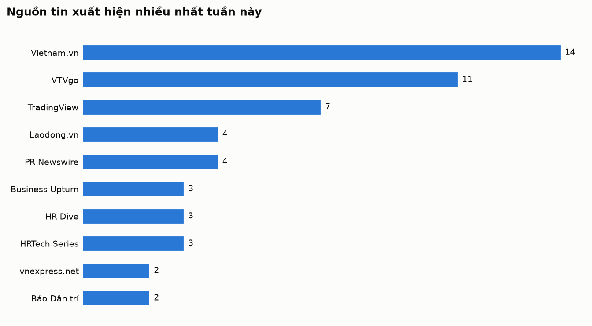

# Research Radar · Tuần 39/2026

> **Ngày chạy:** 24/09/2026 · **Cửa sổ tin:** 30 ngày · **Thị trường:** Việt Nam, đặc biệt Đồng bằng sông Cửu Long; đối chiếu Đông Nam Á và thế giới

**Bản PDF khổ A4:** [tải về](pdf/2026-09-24.pdf)

## Tóm tắt điều hành

**5 điểm đáng chú ý nhất tuần**
1. Ngân hàng số — Ngành tài chính định vị lại dữ liệu và AI làm nguồn lực cốt lõi thay vì chỉ là dự án CNTT (Báo Công Luận, 24/9/2026).
2. Thanh toán số — Thanh toán xuyên biên giới qua mã QR mở rộng mạnh mẽ cho bán lẻ và du lịch (VnEconomy, 24/9/2026).
3. Bảo hiểm nhân thọ — Cơ quan quản lý Ấn Độ (IRDAI) đề xuất áp trần hoa hồng và bán chéo bảo hiểm gắn với khoản vay dưới 5% (Reuters, 24/9/2026).
4. Quản trị kinh doanh — AI xâm nhập vào quản trị nhân sự tạo ra vùng tối quản trị và lo âu mất việc làm tăng lên 27% (HR Brew, 24/9/2026).
5. Công nghệ — Doanh nghiệp toàn cầu bùng nổ tích hợp Agentic AI vào tự động hóa tài chính và chuỗi cung ứng (FinTech Global, 24/9/2026).

**3 việc nên làm tuần này**
- Cho luận án: Rà soát các biến số về tác động của chuyển đổi số dữ liệu và siết chặt quy định bancassurance đối với hiệu suất định chế tài chính.
- Cho đội kinh doanh: Chuẩn hóa dữ liệu khách hàng tại Đồng Tháp và rà soát mô hình phân phối để dịch chuyển sang các giải pháp bảo vệ minh bạch, bền vững.
- Cần kiểm chứng thêm: Biên bản đề xuất khung pháp lý áp trần hoa hồng bancassurance dưới 5% của IRDAI để đánh giá tác động lan truyền sang thị trường Đông Nam Á.

## Mục lục

1. [Ngân hàng số / Fintech](#digital-banking)
2. [Bảo hiểm nhân thọ / InsurTech](#life-insurance)
3. [Quản trị kinh doanh & nhân sự](#management-hr)
4. [Xu hướng công nghệ, kinh doanh, thời trang](#tech-business-fashion)

## Ai đang đưa tin nhiều nhất

---

## 1. Ngân hàng số / Fintech

| # | Xu hướng | Tín hiệu | Một câu vì sao đáng chú ý |
|---|---|---|---|
| 1 | Chuyển đổi số ngành tài chính dựa trên dữ liệu và AI | ●●● Mạnh | Ngành tài chính đang định vị lại dữ liệu làm nguồn lực cốt lõi thay vì chỉ là một dự án công nghệ thông tin đơn thuần [9][17][19]. |
| 2 | Thanh toán số và thanh toán xuyên biên giới qua mã QR | ●●● Mạnh | Hoạt động thanh toán số tiếp tục mở rộng mạnh mẽ với trọng tâm là mã QR và thanh toán xuyên biên giới cho bán lẻ và du lịch [10][25]. |
| 3 | Tài chính mở và hệ sinh thái bán lẻ nhúng | ●●● Trung bình | Các doanh nghiệp bán lẻ và tổ chức phi tài chính đang tích hợp sâu dịch vụ tài chính vào chuỗi giá trị giao dịch [24][34][38]. |
| 4 | Trí tuệ nhân tạo (AI) và quản trị rủi ro, bảo mật trong ngân hàng | ●●● Mạnh | Các ngân hàng quốc tế và trong nước đẩy mạnh hợp tác công nghệ để ứng dụng AI, đi kèm với việc hoàn thiện "lá chắn" an ninh mạng và chống lừa đảo [2][15][29][30]. |
| 5 | Biến động lãi suất và chiến lược huy động của ngân hàng | ●●○ Trung bình | Thị trường ghi nhận các mức lãi suất huy động đáng chú ý đi kèm với các chương trình khuyến mại lớn để thu hút dòng tiền [1][4][36]. |

#### 1. Chuyển đổi số ngành tài chính dựa trên dữ liệu và AI · ●●● Mạnh
- Diễn biến: Tại Hội thảo và Triển lãm Tài chính số Việt Nam 2026 diễn ra ngày 24/9/2026, các cơ quan và báo chí (như Báo Công Luận, Thời Báo Ngân Hàng, Báo Chính Phủ) đồng loạt nhấn mạnh yêu cầu lấy dữ liệu làm nguồn lực và nền tảng quản trị tài chính công cho giai đoạn 2026-2030, đồng thời khẳng định chuyển đổi số cần vượt ra ngoài phạm vi của một dự án CNTT [9][11][12][16][17][18][19]. Agribank cũng ghi nhận nỗ lực chuyển đổi số để hiện đại hóa hệ thống vào ngày 24/9/2026 [3].
- Bằng chứng định lượng: Chưa tìm thấy nguồn xác nhận cụ thể về quy mô ngân sách hoặc tỷ lệ tăng trưởng chuyển đổi số bằng số tuyệt đối trong các tin bài ngày 24/9/2026.
- Insight xã hội/khách hàng (diễn giải): Khách hàng và doanh nghiệp ngày càng kỳ vọng vào sự liền mạch của dịch vụ công và dịch vụ tài chính, phản ứng tiêu cực với việc dữ liệu bị phân mảnh hoặc phải cung cấp thông tin lặp lại nhiều lần cho các cơ quan quản lý và ngân hàng.
- Câu hỏi nghiên cứu tiềm năng: Việc ứng dụng quản trị dựa trên dữ liệu (biến độc lập) tác động như thế nào đến hiệu suất vận hành của các tổ chức tài chính công (biến phụ thuộc)?
- Hàm ý kinh doanh: Đội ngũ kinh doanh cần chuẩn hóa và làm sạch dữ liệu khách hàng hiện hữu để tích hợp vào các công cụ phân tích tự động, từ đó chủ động tiếp cận đúng thời điểm khách hàng có nhu cầu bảo hiểm.

#### 2. Thanh toán số và thanh toán xuyên biên giới qua mã QR · ●●● Mạnh
- Diễn biến: Vào ngày 24/9/2026, VnEconomy đưa tin sắp diễn ra Hội thảo “Thúc đẩy thanh toán xuyên biên giới qua mã QR: Động lực mới cho bán lẻ và du lịch” [10]. Trên bình diện quốc tế, InvestorTrust ghi nhận Bank Indonesia đặt mục tiêu đạt 69,3 triệu người dùng QRIS vào cuối năm trong đợt triển khai thanh toán số [25].
- Bằng chứng định lượng: 69,3 triệu người dùng QRIS mục tiêu tại Indonesia tính đến cuối năm 2026 (theo InvestorTrust, 2026-09-24) [25].
- Insight xã hội/khách hàng (diễn giải): Người tiêu dùng và khách du lịch chuộng phương thức thanh toán không tiền mặt tối giản qua mã QR vì tính tiện lợi, nhanh chóng và giảm thiểu rủi ro mang tiền mặt khi di chuyển xuyên quốc gia.
- Câu hỏi nghiên cứu tiềm năng: Sự gia tăng của người dùng thanh toán qua mã QR (biến độc lập) ảnh hưởng thế nào đến tần suất giao dịch tài chính bán lẻ (biến phụ thuộc)?
- Hàm ý kinh doanh: Tận dụng các điểm chạm thanh toán số và hành vi quét mã QR của khách hàng để lồng ghép các gói bảo hiểm ngắn hạn (micro-insurance) gắn liền với hành vi mua sắm hoặc du lịch.

#### 3. Tài chính mở và hệ sinh thái bán lẻ nhúng · ●●○ Trung bình
- Diễn biến: Tạp chí Công Thương và Thời Báo Ngân Hàng ngày 23/9/2026 đưa tin về việc tài chính mở thúc đẩy đổi mới dịch vụ trong hệ sinh thái ngân hàng số và mở rộng theo hệ sinh thái bán lẻ tại Việt Nam [34][35]. Điện Máy Xanh mở rộng mảng tài chính và hai doanh nghiệp bắt tay làm dịch vụ tài chính với mục tiêu doanh số giải ngân tỷ USD cũng được ghi nhận vào ngày 23/9/2026 và 24/9/2026 [24][38]. HDBank nhận giải thưởng "Ngân hàng bán lẻ tốt nhất châu Á 2026" vào ngày 24/9/2026 [6][39].
- Bằng chứng định lượng: Mục tiêu doanh số giải ngân tỷ USD từ sự hợp tác của 2 doanh nghiệp (theo diendandoanhnghiep.vn, 2026-09-23) [38].
- Insight xã hội/khách hàng (diễn giải): Khách hàng hiện nay xem tài chính là một tiện ích đi kèm ngay tại điểm bán lẻ (như siêu thị điện máy) thay vì phải chủ động đến ngân hàng, phản ánh tâm lý muốn giải quyết nhanh nhu cầu vốn tại chỗ.
- Câu hỏi nghiên cứu tiềm năng: Mô hình hợp tác tài chính mở với các hệ sinh thái bán lẻ (biến độc lập) tác động ra sao đến tỷ lệ tiếp cận khách hàng mới của tổ chức tín dụng (biến phụ thuộc)?
- Hàm ý kinh doanh: Thiết lập liên minh phân phối chéo với các hệ thống bán lẻ điện máy và tiêu dùng lớn để đưa sản phẩm bảo hiểm nhân thọ tiếp cận trực tiếp tệp khách hàng có nhu cầu tài chính trả góp.

#### 4. Trí tuệ nhân tạo (AI) và quản trị rủi ro, bảo mật trong ngân hàng · ●●● Mạnh
- Diễn biến: Các tổ chức tài chính quốc tế liên tục đẩy mạnh hợp tác AI trong khoảng thời gian này như TD Bank hợp tác với Cohere (25 triệu USD qua Layer 6) và BNP Paribas mở rộng thỏa thuận với Google Cloud cho agentic AI (24/9/2026) [29][30]. Tại Việt Nam, VTVgo đưa tin về nhận diện lừa đảo ngân hàng và Vietnam.vn ghi nhận ngân hàng hoàn thiện lá chắn từ chính sách đến công nghệ vào ngày 24/9/2026 [2][15].
- Bằng chứng định lượng: Khoản đầu tư/hợp tác trị giá 25 triệu USD giữa TD Bank và Cohere thông qua Layer 6 (theo konsulteer.com, 2026-09-24) [29].
- Insight xã hội/khách hàng (diễn giải): Sự gia tăng của các thủ đoạn lừa đảo công nghệ cao tạo ra tâm lý bất an ở người dùng số, đòi hỏi các ngân hàng phải nâng cao lớp bảo mật sinh bi trắc học và AI để duy trì niềm tin khách hàng.
- Câu hỏi nghiên cứu tiềm năng: Việc ứng dụng các công cụ bảo mật dựa trên AI (biến độc lập) có mối quan hệ như thế nào với mức độ tin tưởng của người dùng ngân hàng số (biến phụ thuộc)?
- Hàm ý kinh doanh: Đảm bảo mọi quy trình xác thực trực tuyến của đội ngũ kinh doanh khi làm việc với khách hàng đều tuân thủ nghiêm ngặt các tiêu chuẩn bảo mật dữ liệu, tạo sự an tâm tuyệt đối khi khách hàng tham gia hợp đồng tài chính/bảo hiểm trực tuyến.

#### 5. Biến động lãi suất và chiến lược huy động của ngân hàng · ●●○ Trung bình
- Diễn biến: Báo VietNamNet và Laodong.vn ngày 24/9/2026 đưa tin về diễn biến lãi suất ngân hàng, trong đó lưu ý mức lãi suất chào mời lên tới 14%/năm và kỳ hạn 12 tháng lên đến 9,6%, song song với thông tin ngân hàng chủ động giảm lãi suất hỗ trợ tăng trưởng từ VTVgo [1][4][5]. Laodong.vn cũng ghi nhận việc ngân hàng tặng nhà, tặng tiền cho khách gửi tiết kiệm vào ngày 23/9/2026 [36].
- Bằng chứng định lượng: Lãi suất chào mời 14%/năm và lãi suất kỳ hạn 12 tháng lên đến 9,6% (theo VietNamNet và Laodong.vn, 2026-09-24) [1][4].
- Insight xã hội/khách hàng (diễn giải): Người gửi tiền thể hiện sự thận trọng trước các mức lãi suất quá cao bất thường nhưng vẫn bị thu hút bởi các chương trình ưu đãi hiện kim và quà tặng giá trị lớn từ ngân hàng trong bối cảnh biến động.
- Câu hỏi nghiên cứu tiềm năng: Biến động lãi suất huy động ngắn hạn (biến độc lập) tác động như thế nào đến dòng vốn nhàn rỗi dịch chuyển sang các kênh đầu tư thay thế (biến phụ thuộc)?
- Hàm ý kinh doanh: Theo dõi sát sao biến động lãi suất tiết kiệm để tư vấn các giải pháp tài chính kết hợp bảo hiểm tích lũy như một kênh giữ dòng tiền trung và dài hạn an toàn cho khách hàng có nguồn vốn nhàn rỗi.

#### Tín hiệu yếu cần theo dõi
- Các cuộc thi nội bộ và chương trình thử thách công nghệ tại các ngân hàng nhằm giải quyết bài toán nhân sự đối mặt với áp lực chuyển đổi số [7].
- Đề xuất tăng cường giám sát đối với nhóm khách hàng quan trọng (VIP) của các ngân hàng nhằm quản lý rủi ro dòng vốn lớn [8].
- Các nghiên cứu và báo cáo quốc tế về mức độ sẵn sàng của Credit Unions (Quỹ tín dụng nhân dân) trong việc vượt qua các ngân hàng lớn về đầu tư AI [27].

<b>Nguồn tin (40 tin, Google News)</b> — số trong [ ] khớp trích dẫn, ★ = được trích

- [★ [1] Lãi suất ngân hàng hôm nay 24/9/2026: Thận trọng với lời chào lãi suất 14%/năm - Báo VietNamNet (2026-09-24)](https://news.google.com/rss/articles/CBMisAFBVV95cUxPWUI5OTZ2c2tTN1hBQ0NRcFFPZFdQcGVJQjdvVmVSSWlkMklvQ1RnM19SU3Z3a20wNGdGc0tHN3FEcExZemxlZllNdlVGMEtlaG5HeXdvRmtWTXg4VlNISHNjZFFqbE9lRXVacDR3V1pnNTNHemd2SlFMbnA4YWQ4UlNhV3RxQ281Y1ByazVYdDBwMzRkQ0dVN2R6UTJlNzhtdUhOMUtXNFB2UWc4NnRQXw?oc=5)
- [★ [2] Nhận diện lừa đảo ngân hàng - VTVgo (2026-09-24)](https://news.google.com/rss/articles/CBMiQEFVX3lxTFAxbXZOaDc3MVNqcExkLW54cGJtN2dpdnd5dFF0aDVKTEtuUk11bHo4ank4czJZVnVDUlFaNVY1YVk?oc=5)
- [★ [3] Agribank chuyển đổi số, hiện đại hóa hệ thống, tăng khả năng tiếp cận vốn và phụng sự khách hàng - Agribank (2026-09-24)](https://news.google.com/rss/articles/CBMigwJBVV95cUxOM1RveHhuZnVSQmljX1BvYWZqQzdiVXBGZjkxVkhKbjBSb2RUa2I2Z0NtRDc3M3BFMHJSME00OHFFLWtCeVd3QVM5OENneDdHeWRyYWU1YWJXR3N5azd1a1I4Y3o1Vjd5d2M4WS10SURyelFHZjJ0Z3ZtVDFCVkVPcVNEU2cxSkMyaHFpYVoyU3czeklTVVNzRHV2QXFjczF2eXRZNUJ4Znp2MUpEblZLRjFLWTZkWVphQ1JUX0NReDNYQm4tY3FQYTdza1ByeEc0TmdpeHRmX19Zd0EtVVYyVGJ1UUdHbmtIc2dkZmJOS2FIY0NGRGU0dXZEZkdyUFpKZWFR?oc=5)
- [★ [4] Lãi suất ngân hàng hôm nay 24.9: Tiếp tục tăng, kỳ hạn 12 tháng lên đến 9,6% - Laodong.vn (2026-09-24)](https://news.google.com/rss/articles/CBMiswFBVV95cUxPdU80WHN3STFodzdDM1VqcXRkTEFOU0dHaDRFLXJJNHJfYU1hTTFEWVVpZHIwZGRxYVRCVGIyWWRRWnJIOG8tZmNsLUlody1TRURoU3hyOHpTSkxjWnV5Qi1yeWVyUTN3U21mTlVra2J4cmJlNnZmUzNtQlY3S1poby02WUNyZ3hJaDdIYm1xZEM1UE5OeGtCTUpmUG5OMUVrSWJqeC14M2YxT1NOazgtV29mTQ?oc=5)
- [★ [5] Ngân hàng chủ động giảm lãi suất, hỗ trợ tăng trưởng - VTVgo (2026-09-24)](https://news.google.com/rss/articles/CBMiSEFVX3lxTFByOGNPTzJsUTZzR2RsT1Z2bXFfUmVWUUk3Y1plZW85UTliMkYxbkZtTWUzc1Y4Z3ZmVXd4c2dfRm5tV1h2R3R3RQ?oc=5)
- [★ [6] HDBank nhận giải 'Ngân hàng bán lẻ tốt nhất châu Á 2026' - vnexpress.net (2026-09-24)](https://news.google.com/rss/articles/CBMikwFBVV95cUxNVUdJTWxxS1FqbTBIdHk3RGpGRWd2dUE3ejBQeFk2Q1U3VzdTTWh3aWkwVVJHWklmWnJqeHd1SkVDRTJVb3N2UktXYTg3akttaWFEbUl0bnVkal93VVlJTkwxMmhyb29mcHJ0OEpBd0NrcHcwdUtnMndhV0pyaWZQM3JGMjNKX3hqVVdwcHg5QWREdE0?oc=5)
- [★ [7] Tech Challenge: Khi nhân viên văn phòng đối mặt với câu hỏi công nghệ - VTVgo (2026-09-24)](https://news.google.com/rss/articles/CBMiQEFVX3lxTFBKNm9PVk13YkoxUjlvSjR0RDdFclJMTE9PaG0xVi1ncmw1ZU5jR3BDX3l1Z0tvZ2VmUmIyQ2MyNGs?oc=5)
- [★ [8] Đề xuất tăng giám sát khách hàng quan trọng của các ngân hàng - Báo Dân trí (2026-09-24)](https://news.google.com/rss/articles/CBMitwFBVV95cUxPQThrSUZ6dUN1M1BPRzNOSFAwTmlZbGhTZDJ6U3pxRTMxeU5FNWp1QVcwc19xY3IwdWt1X2x1UnpMWXhyWFp1b21ORTBQUHdLcDh5RzBvR1JTQXFTc0dqVFpiTUlKRjhwN01oY1BhdXZIZDJwWElucmVReEV1ZjE4QXdYVHF1dF9VX0JMQm45cnlTa0lVUVM1a21PUWNmeHZZVkJ1MFg1dGlkaVF6N2gyVjVoWDh1VjA?oc=5)
- [★ [9] Chuyển đổi số quốc gia: Khi dữ liệu chưa được “đánh thức” - Thời Báo Ngân Hàng (2026-09-24)](https://news.google.com/rss/articles/CBMimAFBVV95cUxQbHNFT1dVOFRSa1Uwc0xMTjdkZXNXNkZ0blplc1FMTUZRTDJNdnd2WUFIWUZ2bUJjMC1UR09pWjZUTC1ya3JfcXJRT3NLczQtWW1BcWowUVNLWTQ1cU5XNDRQd2d0dHZGOW5uOUZoU3F6emdHQjY0dzZOaWZiYlUyTk9FcW9sRXpBZFJxd1pETkd5ZHYzZXloQg?oc=5)
- [★ [10] Sắp diễn ra Hội thảo “Thúc đẩy thanh toán xuyên biên giới qua mã QR: Động lực mới cho bán lẻ và du lịch” - VnEconomy (2026-09-24)](https://news.google.com/rss/articles/CBMixAFBVV95cUxPVHhCSzhOd2pMVmZ1LW5QRHhvaEtEZTl3aGxVYTBPOEFVdEFzYnRibHdELUlZSnZyU3N2N3lzb3gtZ00wbUtoMldTMDVMQzBYSmQxUTdVdDYxUzFKUU85RG8yTWNmN2VFUkpXRnBOaVlnLS1sZl8tT0xrb2UtVUhDT0IzTmFYaTJmUnBiQmpNRUFISmotUHFWVGdVRnViZVZDRG5VNzdBSERiQ19tY3RjWTIwT3pzNUtPcS1CX1JvZ2hHaG84?oc=5)
- [★ [11] Dữ liệu và AI mở hướng mới cho chuyển đổi số ngành Tài chính - baochinhphu.vn (2026-09-24)](https://news.google.com/rss/articles/CBMiqgFBVV95cUxPWndHU08xUl9WcEFiRDZyMDFkajdnZ29pRTFxTEZtNzFzRV9vaDAyTXRiSnFJcGRqWEVSSEw4Tkppb2FtZnlOTk0zMDAzZzFVQmpLSXFwMTh5RGZTMVRaR0RDSTBIMzg0SGdlaklwa3UtdG43UmVoVno4eGpONXhsRnY2NXptT1NueEkxYmZTWGgyR3BmNWxLOTF2LXpjMlR4Slh5aF9nQnlWdw?oc=5)
- [★ [12] Ngành Tài chính: Từ số hóa quy trình đến quản trị dựa trên dữ liệu - Mekong ASEAN (2026-09-24)](https://news.google.com/rss/articles/CBMioAFBVV95cUxQa2FDU0lIU1BrNUJtWm02U0FnVnJvOG9NZU1SNG82ejhkR0ctNlpSNUNVaHVmUnhtNGR5b3lEUzQzSHhSaktzcWxlcUxQMUtjVmYtaEFQOWdVQ3hfcFBkRnZrMUZkSkFfQXp2OTQ1am5meHhXZTlXY0FDRFZ1WUFBcU1MSVFJR0FTSkRERUNvUGNTSHp0ekZYNUZqUzd3Wmt1?oc=5)
- [[13] VDF-2026: Chuyển đổi số ngành tài chính với dữ liệu và AI - Báo Thanh tra (2026-09-24)](https://news.google.com/rss/articles/CBMiuwFBVV95cUxNa0UyREtrTFJYRGpKR0dDZGQybDN3azJJZFpyNnhoTy0tbTJqT05kbVM4NVI5NGU4ZEcteDZhZG5hOU5KTHFQWVY5SEdBeFFpa1BpMjVYUGtIeEhRREV5R2c1VG9qRjZXNmxhcFNLQ1BreXJjSmdIMk1ZRjFtU3JBZnBOUWthVm5vVWpvWHVsaXUyVi1uT0hIbTBEeHI2WVF5MmJzYkV5QUJKdmNsTUp6bTJlb082UVlraUZB?oc=5)
- [[14] Hội nhập và Phát triển - Báo Thế giới và Việt Nam (2026-09-24)](https://news.google.com/rss/articles/CBMi5gFBVV95cUxQSUV1bHdIcTBqV3hyY0d3Q05fQkpLWkRma281VW5BbmYzVnpUMDhzS1RyY012WG1TVExJZ2RjYnA5a1g0NERCYXZoQnhLRHpBVmtHUzRRdUQ5VHdmNW5qNFEzdEJDanBMQjVCYmhFUUw3QVNNVXR2T1c3SmpQazZXYmR4S0Y5UVhnN0pNcXBwUTFOaXJqU2JHM2N1LXh3ck90VUEzSF9xNW1WMndlSk1hdWxDa2FkS3EwNnJDYUxXcnNNeHhtTW9WUXFXZmdVWU1TSDltYkd3TEJCZjJwaHdhQ0ZqVmNQQQ?oc=5)
- [★ [15] Ngân hàng hoàn thiện ‘lá chắn’ từ chính sách đến công nghệ - Vietnam.vn (2026-09-24)](https://news.google.com/rss/articles/CBMihgFBVV95cUxPd0ZObUtuNlR2XzN5bXlkbVR5WERCQUZ3U2k3LVRuREFPQVBFU19Eb2d6SmE2cUYtM05Cb01xaGE4WUR6aXFHWWY0NmtGS2ktUGZkTklYTVhMVTNGYjBhcmZfeU5ZV01Kb1JDakhZdTBkS1RXa1g1cHZnSHZsSzlIZUhKTkdqZw?oc=5)
- [★ [16] Sáng nay (24/9), khai mạc Hội thảo và Triển lãm Tài chính số Việt Nam 2026, thúc đẩy chuyển đổi số trong lĩnh vực tài chính và ngân hàng - Vietnam.vn (2026-09-24)](https://news.google.com/rss/articles/CBMi6wFBVV95cUxOVTZ2blVUMi1SN3lVQjFIbWk1VXFuS2JTenpQN0lFZl9QcmtrOUU2djF6dkc3WFgtVVdlOHZXVVppODItV2xVb2dHS2NHOUp3M0hjMHVoS0hORmVNQm1pbHIxaXg4a0p1MTg1Q0ppZ2g0Qko4RlpYTkpiZ05wb09TMGlEc0hlNTlMZnVkc3lGSXAzYVRhenhnSk5yUFNLNU82S3VPbVVyTG0tLVJjYURQaVJTNV9aWG5DYlRsWXZkNXJpa0Y0UXMwYzNLU2ZNTi1HTEFzejVDVGVxVVM2RFNld0tzRXRIUXZFQ2M4?oc=5)
- [★ [17] Bộ Tài chính: Chuyển đổi số giai đoạn 2026-2030 phải lấy dữ liệu làm nguồn lực - Báo Công Luận (2026-09-24)](https://news.google.com/rss/articles/CBMiswFBVV95cUxOTTdReFFPS04xczJ1a2M5dWhIcW82a3VoYndyU21mV3RxMTF1c1g0YUdLVTI1bXBKaTNkTG93dU54WGdJYmdweFRNOEZUNlhSZW5oMDdfZ3NUdkhlRllRRG5sQUlOWHh3enZrQ0ZKT1FOdFJ4SXVIWEQ1YTRqajV3NVdQTi1zN2NtaVZRNkFpa0FjZXpmdUUxZnZoQnNMYTBaSnZFaDVvbVhOdXBfODJmakEyaw?oc=5)
- [★ [18] Lấy dữ liệu làm nền tảng quản trị tài chính công - Báo Kiểm toán (2026-09-24)](https://news.google.com/rss/articles/CBMijAFBVV95cUxNWEpVYUl3cXFGd0hEUTBQQ2JHakJiNmhVcGlvU21yVy1Qb1QxQzk3OHRMbXRVV3JkcnpWLTUwMWpvX0s1c0JIemlFNGxHY2FVVkJULTdacGRsWXU0MnhtMWZ6RHlxNFZ6bEtWUlYxVTQ5TFB5SlRaX2pJcVJ3eXdCSVY2M1NKOFRFdzBrUA?oc=5)
- [★ [19] Chuyển đổi số ngành tài chính cần vượt ra ngoài phạm vi của 'một dự án công nghệ thông tin - Báo Dân Việt (2026-09-24)](https://news.google.com/rss/articles/CBMivwFBVV95cUxOWDM3UkdRbjBWRU1ndlBla1ZNYTBhUnBheEVWaHJvYkprNHhVN0JQQm9XOHkxWkpmbWdYRG9abzgzdTJRSnNPck9LTGlrRDhlVU1pdlJfVEhmM2JMVkt6aG9iWXNkT3VRWmdZLWRQMllhcE1XQjBmRE0xSkF4NklsYUJYb2o3ajgzd3dZNnJkdVJCcFBrb0ltWDJtTGZmTFFBMUZQT2NoY01QWXRtaXVwZ0FxVWZyMnJuZ25nMTlaOA?oc=5)
- [[20] Ngân hàng MB lần đầu vượt mốc 10.000 tỷ đồng nộp ngân sách, củng cố vị thế ngân hàng hàng đầu Việt Nam - baoquankhu4.com.vn (2026-09-24)](https://news.google.com/rss/articles/CBMi_wFBVV95cUxNdGEwc1prbDdrX1FXaENqeEFyT0txUUFvaDdDX3c4N3B2eEF2aHZrQWNXTjRsVjhhaDNudWpFTkhFWXhCTFc2Q3ZjNnBiWUNVaXJkQWtJejlKVUJaTERlWDlkREc2dDZGaWp0VHh6VHRXSW9qemJKX3ZCMDNLZmFpUFdMaGZhUGZVNmx2R1JPWjNQTUl5cVZsV0lkRTJDcjAwRjViaGpXcUFfelhUQlhvajg0cFkteTR5b19EZlRoZC1jMEh2OUFjTTljdTljSUVTZTVUa3haM014cnlGU0tzSVU0U3RTc29zeGhvWndkbEJWLVZSOUFqdHEwbE94b3M?oc=5)
- [[21] Tài chính số: Tập trung vào dữ liệu và trí tuệ nhân tạo - Vietnam.vn (2026-09-24)](https://news.google.com/rss/articles/CBMigwFBVV95cUxObjQtU3VocG44VlNYeGEwaGdfQkZKaVJZS3lGRjZuUERJd3RFMXN1Q0tseUpMOVVadEVnaVpvVnVHbV9WM3doSzV3UDRqajRWME02WG5YNWlBa3Y1NzVyZy1odWxNVkkzeXduSDBSY2pzNU9YQkxaU1pQdm5DMEVjTU5CTQ?oc=5)
- [[22] Nhận diện đúng điểm nghẽn chuyển đổi số và giải pháp tháo gỡ - Tạp chí KH&CN Việt Nam (2026-09-24)](https://news.google.com/rss/articles/CBMikgFBVV95cUxPUEtwQ25sN3JzVnhWTWpxbnBBc2VIRWRyclBRUFdpTFRuNjJISUVnVXdHYjQ2QU91MXJFRXB3MHJKRmNlTjdST3JsakM2TE8wdTktLWEwdG5BcXE3YzZnRFY4dVdjX2s5X1QxT3JfdFdFYkp4bDY1b0RVcFMteTFUV0dic3VKSUktUHFKSEVzOXRmQQ?oc=5)
- [[23] Finance finds its way into every retail transaction. - Vietnam.vn (2026-09-24)](https://news.google.com/rss/articles/CBMie0FVX3lxTE1WcTcxLVBxVWxDZ2tJbTBkbTVOeGg0UnNBbjBzaGl0QnVQdEEzcWNaektRV0Q4SE9OZHJPRlFTdGw1ZkVfZlhoaGxRSkQtVVBlbm5yZEV4WkxaM1ROZ1NtMThRLVgxTDlSem96QU1sQ0J6cmxyZERYeFVUNA?oc=5)
- [★ [24] Điện Máy Xanh ngày càng mở rộng mảng tài chính - Vietnam.vn (2026-09-24)](https://news.google.com/rss/articles/CBMieEFVX3lxTFAxNDc4QzlrNWxVOUZFRmdYQmhjd28ybmJxa1ZYVjNJMlpnY0ljdkpKaUhlYVVsY3psNmxkRm1pZ2pmNGJFVjdtZE0yekkxRE5ENzJ0QXFOTUlaTFk3Rzg1NnhYVFhiQXVCTm52dWtURHpIajNkVHgyMQ?oc=5)
- [★ [25] Bank Indonesia Targets 69.3M QRIS Users by Year-End in Digital Payments Blitz - InvestorTrust (2026-09-24)](https://news.google.com/rss/articles/CBMi0gFBVV95cUxOdnVPZllienJyUDhEdXM5MWJ6MDQ0cnhlUzk5RGNpQm9fUHlYdGo4ZUg0SzI5ZkhZZVB3d1Mtd0tOTDJVai1pS25HeU9kMEZVQzV0MTVnblFEYjZuZmpkelhRQ1ZmNExvWEF1NFk0RmRkXzhJTFlxQ3gxZDZCV2RqblFnaHV2YV9XeWwtX1Z6Mzduek5MSy0yajlxYjB6UTZzTTFzNnpkZG9JMGMycVRwbE1TSllxQmdOOGd5TGlRcXdZa3gyNWdqSHJCUTRZOF9mekE?oc=5)
- [[26] IDFC FIRST Bank enables Direct Tax payments through UPI, cards, net banking and branches - indiasnews.net (2026-09-24)](https://news.google.com/rss/articles/CBMixwFBVV95cUxQSWt2VkZROXFnNkR6ZXdsR1FnOTRSS2hNeGphVjEtb29DcXJwMEVBb010aW1PS2ZUaFlBSm13MjQxSWs4d3I5NkVHMlNGWDdvMzZxa2M1YXVTeS1vUU50X1YtbmJhcU81SGtjZjZSbVBmdXgzUUpwUEpKUFhfdjA5Qy00R1VUTmk2VUp4NFJqbUtMVkVMc1RxT3BBV0taUm9UeVNyN0Z4cmF1TjlzQXpsMlJSNWl0TVF0WjR0cFEzT0x6SkV2TXlz?oc=5)
- [★ [27] How Credit Unions Lead Banks in AI Investments - CUTimes (2026-09-24)](https://news.google.com/rss/articles/CBMiigFBVV95cUxPcXI3bnZWcWJvVWVqSHZob1ktLU5kVXJ4VnpLVy0tUUwwWTZ1T2NPLUJfVE1LTzNjNWIxbGlaS0xFZ1pDaFNJRFkzMHc4aGZUTUxZai1hM2VpRC1hWVAzZFB0ZUk0azBVNlBsNmkxZkxOWk1QckkxblNOa2p5QTVlOWlCS3owZXo1aHc?oc=5)
- [[28] Deep Dive: QA’s role in scaling AI at banks - QA Financial (2026-09-24)](https://news.google.com/rss/articles/CBMidkFVX3lxTE5WWHBleGo3WW1hMnc1R1RsUW9tTk1QRkZMRHhJaTlMcmpVcEQtdGhhbEdJU0NqclNkM0NmY1dOcUFWcHIxWjRCR1VMSDZGUy1wdFpESDlHa05fbWs0WlA4dEhCLUJKZkF3NkFudGRZa1hPZmZTOEE?oc=5)
- [★ [29] TD Bank and Cohere Launch $25 Million AI Collaboration Through Layer 6 - konsulteer.com (2026-09-24)](https://news.google.com/rss/articles/CBMipwFBVV95cUxPUEU4Ylo2UU5NRUJlODY5Vk5SRHZmSTFzcjI3LV9Wb2pkRWRHU0thdTlORXZFLWVYM0lSWFppWm5YNm5OOUQ2Ukxvb2c4cVFDMWpXRzQ5ZUExMlBTYUtoRGRMZTJNUUY4a1lDZXBqX1RIUXRKbkF4NXdmaFRYNUVYN0RYejBmR2FlUEJ4aURVNTZyd0Q2bWlwWmdHdGJFRkRRcDdCcnlxdw?oc=5)
- [★ [30] BNP Paribas expands Google Cloud pact to support agentic AI - TradingView (2026-09-24)](https://news.google.com/rss/articles/CBMivwFBVV95cUxPcjFhRG5HTkpCSTIxNFk2SjYxeDhldzJoNDV2Mkgxb2JqSEZPMDVNYzV1S01nLXFSbFBZWTgtdWtFTV9sS3A1WVF6b2ZmeDNLN1gyckVKMzBJQV82SXVKal9BUUJfQS1CWXI3dHV0Mjg0RlVLa2ExWlU3a3VHSVhpbTFlbU94WnhhRDBOWGdQWlFVcmh3VURyTGhQTmk5ZHFhVVdmWmpHOXo5aWgtNFJYdE9YVWJMNDdoRGJoa0Rpdw?oc=5)
- [[31] For intelligent banking, AI must sharpen decisions without taking choices away from customers - Express Computer (2026-09-24)](https://news.google.com/rss/articles/CBMi2gFBVV95cUxQT1pxT2ZDdWpoNXB4bEpmaFc5dVFfUFVvcWtlZWg1MDF5YnJqeGlDWFNfTzk2RGxhekpsMnhzSl8wVTd5XzFZQzRXNEZVMUx2TkhlUUZRSVBrbEMtNm84Z3JTREJJMW4zeE8zZnJ6Q1BMTGJRQWRfeUlmTGd6dHM4QTlfNl9CV3ZDNUNwU1ExUC1tZFVFamhIWVVEbUdScmdoRk5IVG5PVXNxVmd3Q1NMVkJjTjlyNXc4OW9hUEw3eHF2WW9fcGlrQkUxZjdkbnJRNnQzYWtTZE9XUQ?oc=5)
- [[32] From Banking Legend to Tech Champ: Arundhati Bhattacharya on AI, Ethics & The Future of Work - The Economic Times (2026-09-24)](https://news.google.com/rss/articles/CBMi6wFBVV95cUxQdWdXZGRfdGdCWlNkUzM5cTkzWmlETm4zYlJHbDJHWHY4YTdCQzZZY2JVQ08wYUZNWkJwQUgtVlJzeG5ESlhfcWoyOUdENHdWdkpVS3ZpdG9xSG41SFNnbjIwcDN3NWV6eU9FQnZtS25FOGdxNV84NmFCYkxFOHRlYTBlQ3JnbHdjY2NGM0lFdDlaV2x0NHVkcE8zYVJVM0RUOERPdk9rUTNQLWE5dGh1RkU1b3pzcm9DYTQ2cVB3aERGT3FGMjJQY053VUxXNk5UTEhtNVF3ODRLX0FxMFBhMXd2SXNIbTB5aDJF0gHwAUFVX3lxTFBwYnlveGh1SGZKbVplUTRSVVZtTmRvcTVUemNlX2I4OFd4b1BtQkRzWXY2TU5PQ2UxOWNsSzFxVDRGdnBzZmRUSExvaDQ2OUQ1VEZ2VzNQZ0lLMVZ5amd2SGUydnlQRWxxVkk0aHVhZHNjZVFMWDBMSnNuN1FqWW4zbEYwWG5QSV9SLUg4V0E4YUNGd253VW9XZ3l1V2lOZERsNDVlbmdSVDFwanktMllvTEJHX3l5QkJvWDdXeW94eWVzREU5WTY4Mm9LT3JtTnVyQm9RdjFhV2pqQlBGTHhuRjhKTm0tOFBsMkxrUFRCXw?oc=5)
- [[33] Gartner Names Whatfix Across Future of Work and Banking Hype Cycle Reports - SMEStreet (2026-09-24)](https://news.google.com/rss/articles/CBMitgFBVV95cUxOZEd4aHFZSWlnTURzSmswcjJvak9QVGlseHFqbU4xaTdyRGN0c2d6ZnRzdFhHZENqRVJQaER2bXZqOEZ5WVM4SWpQdWFSSElCWVdralllbkJTaHpfNllXQlJKVDROeFZjS3A0Umx2WEJfYlAzRU9icF9jUk1HMHhnZkhYWWxOMXBrV1FMT0NnMno2OGdOZ2Nhb1E2MktDdXg2NnlDck1EUE92cThkNlJQNV9ybHA5Zw?oc=5)
- [★ [34] Tài chính mở thúc đẩy đổi mới dịch vụ trong hệ sinh thái ngân hàng số tại Việt Nam - Tạp chí Công Thương (2026-09-23)](https://news.google.com/rss/articles/CBMivgFBVV95cUxPV3FseHZ4Vk1sWXJINndCNWJGSmVjbldWQ2lEb2dnX2hsMHg2cUZRQS1Lcm5Ma2YtM0ExZ0tsVURJbVR1MlVZU01YUk1id2F5elc3OVg1OWNicjBIWFdpWkV4aGxmRzJBMDl2Y0ZTa2lIQ2lCVUhmNzRpYmxkSXRFMmxYbUdZQTk4RUF2d0lkTm1jeS1CWE9pdnJTWWwtaS1xSDhFVVNsTUNOUFFlRGc3RVVFdkRtblY5QlYtMHF3?oc=5)
- [★ [35] Dịch vụ tài chính mở rộng theo hệ sinh thái bán lẻ - Thời Báo Ngân Hàng (2026-09-23)](https://news.google.com/rss/articles/CBMikwFBVV95cUxOdFFNWWt1RU1FYkZWd0VscE0xZjlhY21xcmVPaWd0UDFPU2RlS240NnpNN1lTMUgxeFBFMHFtbkVEdGhuMWNjc3lLaTRGU2UwY194aDNNejZtOEJXcjFmWmpoSzUxXzZyZzBrQzBYUC1DTzE3NEhRbTVfV0ExMC1IdGNVUHY0U28xT0dVdGVDZjNycm8?oc=5)
- [★ [36] Lãi suất ngân hàng hôm nay 23.9: Ngân hàng tặng nhà, tặng tiền cho khách gửi tiết kiệm - Laodong.vn (2026-09-23)](https://news.google.com/rss/articles/CBMiwwFBVV95cUxOTC00b2VHQVFPZENtdVhzbjgzUHV1ZTZoeEFUZFhNREtIT0ctTlRySHY2dUZ2NjVHWFpQcDJBWXZJUkRhaktkOFJnZHh6a2pUZllKLWs5UlV4Vm43elRTNTRScDhrLTVQX29oYnpaWGpfUDB2bGljSHZoejQ5TUtfVkF5ek9SaUxEdDUyMG1uTkpaZVhTeGw4UDhvbjVjSUN4VDlkdUJlNkxTcnJlZUJwRHJSVURMZHd2czlkU0toOVp0UWM?oc=5)
- [[37] AI và quản trị dữ liệu trong hoạt động ngân hàng: Từ hành lang pháp lý đến niềm tin số - thitruongtaichinhtiente.vn (2026-09-23)](https://news.google.com/rss/articles/CBMiywFBVV95cUxPSEk5MDRZU3d3WEo0UmpKZ0MwcXZaN2pMR1RlTjEyc0dwUk1uaFVIbHBlVjJlMEV4RUd4ZUJvRWlqX0NFN21TQ2ZoYjRzZjYyS3QyS1VtY2J4cENtSVVSTnB4VGcxeUpTWDJCYmU5dkNXbEg0T2EzSXk1b3hrbnpsMWNVZW5LR2JPV0J0NlNIZ1ZEM3hrNzY1WFNzY3BELV9ZSTdnMWs2Nk5JNXBCTXM5Q1NpTmRJZzhiLUFnU2xfN0FTbXNYTExhV3ZiYw?oc=5)
- [★ [38] 2 doanh nghiệp bắt tay làm dịch vụ tài chính, nhắm doanh số giải ngân tỷ USD - diendandoanhnghiep.vn (2026-09-23)](https://news.google.com/rss/articles/CBMiuwFBVV95cUxOeGlJU0lVa1BXWUt0LU5Ya29yOUYxOUVOcWQzMVhLUFkwWG40WURONDUxZEpmZ0FFWTBEOWszeHpPT0dXcThXYW1xSjVwbU81T3VvdmZGZzdhNERyMXQySUpDSElxQkxjZE1xWmYyMWh0MmFFTlpKbVN4emR6X2RYZlRxSW83aHBIY251Z2p4TXBzNDhhQzZEVmJqOGNyYmIwYlFVT2E3ckJRQVppWFB1Z21rUzVodFAzdmow?oc=5)
- [★ [39] HDBank: Ngân hàng Việt Nam đầu tiên được vinh danh “Ngân hàng Bán lẻ tốt nhất châu Á” - Baodautu.vn (2026-09-23)](https://news.google.com/rss/articles/CBMitgFBVV95cUxPZTl3dy1HNVczQUY0dzh6bW5aN3huODdwVm9lbnBXTWFISGpnd2d3VkNyZzBUSjlWcEE5RDV1WHgyZW9VdlBLRkQ4cTVqTE5hRjl6QklKWi1abEVIT29CbE12ckZ0a1pVRURidDdkN1U5d0Vha0d0YThsbkFUQmJSLS1fZ1NmSzV2cjBIT0xySTlRSHdsVTlEakFUMjhiT1dBOXhtbWdrdzNkNHdiQjZycXpkNGh5QQ?oc=5)
- [[40] Tác động của công nghệ số lên đời sống? - VTVgo (2026-09-23)](https://news.google.com/rss/articles/CBMiQEFVX3lxTFBXX1B3ZWd5Y2ZvSEZvYTF6Q1U4SUluNlhYdVM4d1BpOVVuNzVyZzhXVHdFYVN4SGNwZFp4cDBtM0I?oc=5)

Mô hình: gemini-3.5-flash-lite · Truy vấn: ngân hàng số; chuyển đổi số ngân hàng; fintech Việt Nam; digital banking Southeast Asia; generative AI banking

### Học thuật đang nói gì

> ⚠️ OpenAlex lỗi: 429 Client Error: Too Many Requests for url: https://api.openalex.org/works?filter=title_and_abstract.search%3A%22digital+banking%22+AND+%22customer+experience%22%2Cpublication_year%3A2020-2026&group_by=publication_year

[↑ Về đầu trang](#top)

## 2. Bảo hiểm nhân thọ / InsurTech

| # | Xu hướng | Tín hiệu | Một câu vì sao đáng chú ý |
|---|---|---|---|
| 1 | Siết chặt quy định hoa hồng và phân phối bancassurance | ●●● Mạnh | Cơ quan quản lý Ấn Độ (IRDAI) đề xuất giới hạn hoa hồng và bán chéo bảo hiểm gắn với khoản vay dưới 5%, làm chao đảo cổ phiếu tài chính, tạo tiền lệ chính sách toàn cầu đáng chú ý [19][29][37]. |
| 2 | Hoạt động trách nhiệm xã hội và sản phẩm thích ứng thị trường | ●●○ Trung bình | Các doanh nghiệp bảo hiểm như Daiichi Việt Nam và MB Life triển khai các chương trình hỗ trợ học sinh và sản phẩm mùa giải (World Cup), phản ánh chiến lược tiếp cận cộng đồng [3][5]. |
| 3 | Bối cảnh vĩ mô toàn cầu và áp lực thị trường tài chính | ●●○ Trung bình | Thị trường bảo hiểm toàn cầu năm 2026 chịu áp lực từ lạm phát, lãi suất và địa chính trị, trong khi Việt Nam chú trọng giữ dòng vốn ngoại và vận hành sàn carbon [2][7][8]. |
| 4 | Ứng dụng công nghệ, dữ liệu và xu hướng M&A ngành | ●○○ Yếu | Các tổ chức như Lendistry mua lại Windsor Life Insurance và thị trường nhấn mạnh tầm quan trọng của nền tảng dữ liệu cho AI [34][38]. |

#### 1. Siết chặt quy định hoa hồng và phân phối bancassurance · ●●● Mạnh
- Diễn biến: Vào ngày 2026-09-24, Reuters, Moneycontrol.com, và nhiều cơ quan báo chí quốc tế ghi nhận IRDAI (Cơ quan Quản lý và Phát triển Bảo hiểm Ấn Độ) đề xuất khung pháp lý mới áp dụng mức trần nghiêm ngặt đối với hoa hồng và việc bán chéo bảo hiểm gắn liền với khoản vay (loan-linked insurance bundling). Cụ thể, Citi cho biết bảo hiểm gắn với khoản vay bị khống chế dưới 5% [29]. Động thái này khiến cổ phiếu của các ngân hàng, NBFC (như PB Fintech, IndusInd, IDFC First, AU Small Finance Bank) và các công ty bảo hiểm giảm mạnh, xóa sạch hàng lakh crore giá trị vốn hóa thị trường tính đến ngày 2026-09-24 (theo TradingView, Free Press Journal, và các nguồn tin Ấn Độ).
- Bằng chứng định lượng: Theo Reuters (2026-09-24), PB Fintech sụt giảm 3 tỷ USD; theo TradingView và NiftyTrader (2026-09-24), thị trường chứng khoán tài chính Ấn Độ bốc hơi 1,12 lakh crore Rupee; theo Business Upturn (2026-09-24), bảo hiểm gắn với khoản vay bị khống chế dưới 5%.
- Insight xã hội/khách hàng (diễn giải): Động thái can thiệp sâu của cơ quan quản lý vào cấu trúc hoa hồng và bán chéo qua ngân hàng cho thấy áp lực bảo vệ người tiêu dùng trước tình trạng ép mua bảo hiểm kèm khoản vay, làm thay đổi hoàn toàn hành vi phân phối của kênh bancassurance.
- Câu hỏi nghiên cứu tiềm năng: Việc áp trần hoa hồng phân phối (biến độc lập) tác động như thế nào đến tốc độ tăng trưởng doanh thu phí mới của kênh bancassurance và giá trị thị trường của định chế tài chính (biến phụ thuộc)?
- Hàm ý kinh doanh: Quản lý kinh doanh cần rà soát lại mô hình phụ thuộc vào hoa hồng bancassurance, chuẩn bị kịch bản dịch chuyển sang các dòng sản phẩm thuần túy và minh bạch hóa chi phí phân phối.

#### 2. Hoạt động trách nhiệm xã hội và sản phẩm thích ứng thị trường · ●●○ Trung bình
- Diễn biến: Vào ngày 2026-09-24, các cơ quan báo chí như Báo Tuổi Trẻ, Vietnam.vn và VTVgo ghi nhận các hoạt động của doanh nghiệp bảo hiểm tại Việt Nam. Cụ thể, Công ty Bảo hiểm Daiichi Việt Nam trao 300 triệu đồng hỗ trợ chương trình "Tiếp sức đến trường" (được ghi nhận vào ngày 2026-09-24), trong khi MB Life triển khai sản phẩm/món quà gắn với mùa World Cup (ghi nhận trên VTVgo ngày 2026-09-24).
- Bằng chứng định lượng: Theo Báo Tuổi Trẻ và Vietnam.vn (2026-09-24), mức hỗ trợ tài chính là 300 triệu đồng từ Daiichi Việt Nam.
- Insight xã hội/khách hàng (diễn giải): Các doanh nghiệp bảo hiểm tận dụng sự kiện thể thao lớn và hoạt động an sinh xã hội để duy trì nhận diện thương hiệu và kết nối cảm xúc với khách hàng trong bối cảnh thị trường đang tái thiết lập niềm tin.
- Câu hỏi nghiên cứu tiềm năng: Các chiến dịch tiếp thị gắn với sự kiện thể thao và trách nhiệm xã hội (biến độc lập) ảnh hưởng như thế nào đến mức độ tín nhiệm thương hiệu của doanh nghiệp bảo hiểm nhân thọ (biến phụ thuộc)?
- Hàm ý kinh doanh: Đội ngũ kinh doanh có thể lồng ghép các câu chuyện an sinh xã hội và sự kiện lớn để làm mềm hóa quy trình tiếp cận khách hàng tiềm năng.

#### 3. Bối cảnh vĩ mô toàn cầu và áp lực thị trường tài chính · ●●○ Trung bình
- Diễn biến: Vào ngày 2026-09-24, thitruongtaichinhtiente.vn đưa tin thị trường bảo hiểm toàn cầu năm 2026 chịu áp lực lớn từ lạm phát, lãi suất và địa chính trị. Cùng ngày, VTV戈 phát sóng các bản tin cập nhật về việc Việt Nam giữ chân dòng vốn ngoại sau nâng hạng và chính thức vận hành Sàn giao dịch carbon trong nước (từ mốc 29/06/2026, được phát lại trên VTVgo ngày 2026-09-24), song song với thông tin về học nghề từ bảo hiểm thất nghiệp (VnEconomy, 2026-09-24) và đề án cải cách tiền lương (dangcongsan.vn, 2026-09-24).
- Bằng chứng định lượng: Chưa tìm thấy số liệu thống kê chi tiết về mức thiệt hại cụ thể do lạm phát toàn cầu trong các bản tin; chỉ ghi nhận định tính áp lực từ thitruongtaichinhtiente.vn (2026-09-24).
- Insight xã hội/khách hàng (diễn giải): Biến động vĩ mô và các chính sách an sinh xã hội mới (như bảo hiểm thất nghiệp và cải cách tiền lương) tạo ra sự dịch chuyển trong cơ cấu thu nhập và mức độ ưu tiên phân bổ tài chính của người dân đối với các sản phẩm bảo vệ dài hạn.
- Câu hỏi nghiên cứu tiềm năng: Biến động lãi suất và lạm phát vĩ mô (biến độc lập) có mối tương quan thế nào với tỷ lệ hủy hợp đồng bảo hiểm nhân thọ trước hạn (biến phụ thuộc)?
- Hàm ý kinh doanh: Tư vấn viên cần bám sát các yếu tố vĩ mô và thu nhập thực tế của khách hàng để điều chỉnh giải pháp tài chính linh hoạt, tránh tình trạng khách hàng mất khả năng đóng phí.

#### 4. Ứng dụng công nghệ, dữ liệu và xu hướng M&A ngành · ●○○ Yếu
- Diễn biến: Vào ngày 2026-09-24, Pulse 2.0 và citybiz đưa tin Lendistry thực hiện thương vụ mua lại Windsor Life Insurance Company nhằm mở rộng nền tảng dịch vụ tài chính. Đồng thời, Asia Insurance Review đăng tải bài viết nhấn mạnh nền tảng dữ liệu tốt là yếu tố cốt lõi cho sự thành công của trí tuệ nhân tạo (AI) trong bảo hiểm (2026-09-24).
- Bằng chứng định lượng: Chưa tìm thấy giá trị tài chính cụ thể của thương vụ Lendistry mua lại Windsor Life Insurance trong các bản tin công bố ngày 2026-09-24.
- Insight xã hội/khách hàng (diễn giải): Sự thâm nhập của các nền tảng tài chính phi truyền thống vào lĩnh vực bảo hiểm và nhu cầu hạ tầng dữ liệu cho AI cho thấy xu hướng tích hợp công nghệ đang định hình lại năng lực cạnh tranh cốt lõi của các định chế bảo hiểm.
- Câu hỏi nghiên cứu tiềm năng: Mức độ hoàn thiện của hạ tầng dữ liệu số (biến độc lập) tác động như thế nào đến hiệu quả triển khai các giải pháp AI trong dịch vụ khách hàng bảo hiểm (biến phụ thuộc)?
- Hàm ý kinh doanh: Quản lý kinh doanh cần thúc đẩy đội ngũ làm quen với việc khai thác dữ liệu khách hàng số hóa để nâng cao độ chính xác khi tư vấn sản phẩm.

#### Tín hiệu yếu cần theo dõi
- Triển vọng thị trường bancassurance toàn cầu được dự báo đạt 2.50 Trillion USD vào năm 2034 với tốc độ CAGR 5.17% (theo openpr.com, 2026-09-24), bất chấp những cú sốc quy định hoa hồng tại từng quốc gia.
- Các tổ chức quốc tế như IUMI (Hiệu hội Bảo hiểm Hàng hóa Quốc tế) dưới thời tân chủ tịch Sean Dalton đang định hướng tập trung vào tính đa dạng, hòa nhập, giáo dục, AI và tính bền vững (theo InsuranceAsia News, 2026-09-24).
- Sự dịch chuyển nhân sự cấp cao trong lĩnh vực tái bảo hiểm tại khu vực Đông Nam Á, đơn cử như Miller Malaysia bổ nhiệm nhân sự mới cho mảng treaty (theo InsuranceAsia News, 2026-09-24).

<b>Nguồn tin (40 tin, Google News)</b> — số trong [ ] khớp trích dẫn, ★ = được trích

- [[1] Bảo hiểm thương mại mở “cánh cửa” mới - Tin nhanh chứng khoán (2026-09-24)](https://news.google.com/rss/articles/CBMiigFBVV95cUxPN1d2V0ZLUXRQbTZzVHM2bmFac1I4WXh6OXpET2hWODBxMzBMQ3BDb2kxMHNYZ0Z1V0J5YzMxM0dHUzljWjVCMEJoeDNiU2RrdTNjUXVCS25sak5LT215VjU4d2phZlhYU2RrU0EtOExkaklFMUN0YjU2Z3ZiclJHNmw1VHhHWkJRX1HSAYoBQVVfeXFMTzdXdldGS1F0UG02c1RzNm5hWnNSOFl4ejl6RE9oVjgwcTMwTENwQ29pMTBzWGdGdVdCeWMzMTNHR1M5Y1o1QjBCaHgzYlNka3UzY1F1QktubGpOS09teVY1OHdqYWZYWFNka1NBLThMZGpJRTFDdGI1Nmd2YnJSRzZsNVR4R1pCUV9R?oc=5)
- [★ [2] Bảo hiểm toàn cầu năm 2026 chịu sức ép từ lạm phát, lãi suất và địa chính trị - thitruongtaichinhtiente.vn (2026-09-24)](https://news.google.com/rss/articles/CBMivwFBVV95cUxQVURrZmJQX2M4WG5STURra1VwTjh5cTBmNTM1cnNELW1TaHlLRHBZaGhCVW9vTHFmTERTYU1VSWJFcldVaEtjN0ozZGNMUGlGN0U3WXpUaWFwWVlwMk11X21SMnRfTFhRMGlyM3g3dXVoTTNlVEQ4V2NJNUFxLXJaSjVRWF9aSF9hWHJZYXZ0dmZCdFIxM29ZcWJZOHpWQXpJNkhwZy1OTUtmT0JsbzU0RU9UMFpxUGIwZXBscFRvQQ?oc=5)
- [★ [3] Công ty Bảo hiểm Daiichi Việt Nam hỗ trợ 300 triệu đồng cho Tiếp sức đến trường - Tuổi Trẻ Online - Báo Tuổi Trẻ (2026-09-24)](https://news.google.com/rss/articles/CBMi7wFBVV95cUxONk82ckxGdHloVlY2SHJvVkEyRUpWUHc3VGFvU0dVbWdVR0tSZ0dZQWtHNzZaczlSOElYOHBYekVRQ2V0R21TRmRLN0VjOHBBVHZqa3ZpMEplYzVsTTV5RS1WLVlRSU5MblBuT0xKS3J5QmNMWEJYS3RzSDYwaFhLeE5Xc0hXNnVTQ1B3OHlyTDREVVZENDJ4VFJvR0JuY1V0d005UGY3REdjMmd1Y0lkTkt3N25haV9EdE0tWW9JSnZEbldiSzRlR0tkSG5PU1VfTVdDTG5GVFZXX2tWdjFmY2NBZGZ2RDhMVGc2MDdPUQ?oc=5)
- [[4] Công ty Bảo hiểm Daiichi Việt Nam trao 300 triệu tiếp sức đến trường: Mong các bạn trẻ đón nhận và vượt qua thử thách - Vietnam.vn (2026-09-24)](https://news.google.com/rss/articles/CBMi1gFBVV95cUxNVW4ySi1vMzZLNTRCRUpSbk1hSG9odnhXdVhKYmxEc1lIYmJqNUpqNk9UZE94Tk1WbEJGYWF3TUJVa3hob01Td2Z1dzZVU0YxMXVxMlFZRy1iT1hLNWMxQUdlcEpucndEUXZyd3RMUXdTYlZiT1l2YVJhaDRNUlZDVDVmb1dtUWVaRHBaMzc3WVBPbi1hNzNBNzc2bDlMd1Q2MjUtd3kxZUFVZWYzVEZlNEMzenJsTkVmRG9DeTJIdTJWLVZpUUVtMDIwN2otVHZnS3NUVllB?oc=5)
- [★ [5] Món quà đúng chất mùa World Cup từ MB Life - VTVgo (2026-09-24)](https://news.google.com/rss/articles/CBMiQEFVX3lxTE9FWm50dlZlVmc5LVBIbUFhQU9hLXNZRDNfaHoydFM4TFd5cDNfY2RCRWJ5bnBaRkc1V0hvZVJqYU4?oc=5)
- [[6] Học nghề từ bảo hiểm thất nghiệp: Mở "cánh cửa" trở lại thị trường lao động - VnEconomy (2026-09-24)](https://news.google.com/rss/articles/CBMingFBVV95cUxPbzVVbVhoeEdMOXpiNGJDTkZ1TEc0QmNmRVNyaTBaYVhzTmJRNmZUVXBRSDRjOW5yVk5TTVp4N0VpanNTd1pDZlZQVEw2Um9GaUl5MUlGaGVKUzFGN3JBYUp0aEtScC1pbHZxcExZcnNhMW96VG1nYlBnZmtFS2d6TnV4QVNaZnl6TUxfVmNTV29USWlnay0yWmF4a1ROQQ?oc=5)
- [★ [7] Chuyển động thị trường: Giữ chân dòng vốn ngoại sau nâng hạng - VTVgo (2026-09-24)](https://news.google.com/rss/articles/CBMiQEFVX3lxTE1CYWtkM2dZRTVsTDI4R2ZfMWNDS3NBcmNfSmtFUFFmY29yRS14LS1nbVBFNmhiWXNhOHBOTnpOTjk?oc=5)
- [★ [8] Chuyển động thị trường: Chính thức vận hành Sàn giao dịch carbon trong nước | 29/06/2026 - VTVgo (2026-09-24)](https://news.google.com/rss/articles/CBMiQEFVX3lxTE5ZWGVZQVVWekxial9qWUlTWU9QQnAyZFkyd1BtOXdMc1VndzkyczVLQ0lOREdMNktzNTB4SGliRnU?oc=5)
- [[9] Phó Thủ tướng Phạm Thị Thanh Trà làm việc với Bộ Nội vụ về xây dựng Đề án cải cách chính sách tiền ... - dangcongsan.vn (2026-09-24)](https://news.google.com/rss/articles/CBMihAJBVV95cUxNaU03eGlEdVhEV2Y4N211dlctVEZ1aGpoQ3hCOWRiOGkxSDVfUUVZMWdWNWdqaDF3NEJNNk1EUy14X0ZETlFTSHdxeDVyTUxUYmdWWHJmeTY4UnBfZEhpQmR6UEZ3aDlFa2pCYUNmSFFjcjJ2UUNvTVM0UG9QMkthREw5ajRZem9fV3NETjFOTTBiS3ZGVVl0MWNXa2NXT09vTGQ3MU1oQS01cWw0QkVCbDFCUTA2TmRSal9kVFh6LUptMGx5ZVRYbG5tZ2wwWm02dVNhaFVRV0ViOUZ1SUo1TXhUTHVqR3V6bWR4RGNNc0ZhQm1yb25HeUZjNkdqYkRNbE1wRA?oc=5)
- [[10] PB Fintech's $3 billion rout leads Indian insurance sector's slump on commission-cap plan - Reuters (2026-09-24)](https://news.google.com/rss/articles/CBMixgFBVV95cUxPa0FOMkFvc2Y2SkhlaFBldk1IeHIyei1OVTZXeVJVRWlVaEs5UnZQSjM2dloza0tvR1RNcVplc0xKOG9UYXRxWmlROFVuWmtFMjZ4ZllCamliZ21mTmJRcWtQY2NLYm5tT1JHNXRnLXpHMjhiWmJ2c185UzA4cHZVc1hXMDh5NDdGalI5eE1aUnJtanRoV09VN3RRcENIX29ZSmR5U0tLaUdDYzcxX1NYNmZGaGhydWpYdmdEZTVBdmxvRDZ6Snc?oc=5)
- [[11] Financial Stocks Lose Rs 1.12 Lakh Cr As Insurance Rules Weigh On Market - TradingView (2026-09-24)](https://news.google.com/rss/articles/CBMiyAFBVV95cUxPT3lRWHp4NGd3Yk12QzV5QkZ3UDdqOWZrNlROTlpjeURFWVdOcHB2VGR0RnZGelVMendHeVk2clJnZmJ6ZEtMcXkxdFAycGNUcWpETkcwU1RMV29qcTBISGg2eHdGSGx4WGQzRlptemNJbnl5T3Z6eVg1UWlFbXNOblcyLVNpcHZUZ1d0TmUydHpqYjdfNFJFekdPQTJxMl9KbTBTWHNzQ0xISEdJckNOajVmbGt5Vll6WHN1aHVQWUhuRFlBMWhlVA?oc=5)
- [[12] IRDAI shocker! From ICICI Bank to PB Fintech - A look at most and least impacted bank, NBFC and insurance stocks - TradingView (2026-09-24)](https://news.google.com/rss/articles/CBMi-AFBVV95cUxOUVc5ZG82WF9ZQ3NXWDhPWjVEczcwSFpXRGFFREhfeEdzd0UydGQ2Y3VpQl9sS0pJQVAzWTFOdkJQdnF6U200Tkh2WldfenVQTjM2MlZMTl9TNkk2c2hzLXppRWpVQ1cxd2dRZUo5bVk1VlBxOGNLSlpLLXdaaFdKRWZqX010eVJaLU5jcmZsanMteTF3OGd6bnBlWmswWk1sSGxDM0pWV3VuWXJhbjFIMTJoVENCdHhoVGNYSVdWM2VMbThaT3VhN2F3UmhwLUVYMEY1blBXa0RHRzMtdFZWWWpfS3dJTjZ3WktjZXRFaVVYOHpfbVVmNg?oc=5)
- [[13] News by CNBC TV18 on TradingView, 2026-09-24 — cnbctv:ebbb6c26e094b:0 - TradingView (2026-09-24)](https://news.google.com/rss/articles/CBMiZ0FVX3lxTE1fcldub01kUmtQRGZhZGhOcEFfVFJKZ3lSdmFsbmtta2NKV293MkxiWTRBRFM2X0xqNnQzZFlPaGNVeE9ROERXNXMtd1FLYkhxX01ZUTNaN3BOWWt6SXg1S212Z05zU2s?oc=5)
- [[14] News by CNBC TV18 on TradingView, 2026-09-24 — cnbctv:cd5b3255a094b:0 - TradingView (2026-09-24)](https://news.google.com/rss/articles/CBMiZ0FVX3lxTE9rRGVvaTRKbHptVmxEa1ZDWE9VLUZDU0dpSzJfSC1IQlBzdkF2V3lNVVJjeVV2SVpNQkNxc1dwbTR1RTJBNW1tRmpLelVZQnFhZWdJMFBlTXpoOTRiaGp1S19uZGpYN1E?oc=5)
- [[15] News by CNBC TV18 on TradingView, 2026-09-24 — cnbctv:8c99c32bb094b:0 - TradingView (2026-09-24)](https://news.google.com/rss/articles/CBMiZ0FVX3lxTE55WE4tbEdrN0NGYXJ5T3lHdnVFeE9VSEFBZ0x4TVdJemk1a1VKb3ZwZFdXRzNuVElhWUVLbk9KMnFRTy13V19rRTdPR25QQTI3SXM5blhOX01BZ29aXzJaUnYzcm9jVzg?oc=5)
- [[16] Insurance Stocks In Focus: SBI Life Among Motilal Oswal's Preferred Picks After IRDAI's New Framework — Details Inside - NDTV Profit (2026-09-24)](https://news.google.com/rss/articles/CBMi7gFBVV95cUxPV3RwV1hHempKdDlWVFIteERTY0MwdnItZ3VzU19zNU55VUV2WnZ2LXRLZHhfdWd5TnFTS2NDQWRqNkJ1N2RuTk1MakwzNWtja1pTdll2WUduVzNFYlRKVjJDOTltZ3p1N08wR0tJWG1ZbVllQ3ctV1hNcXZNQ0FSWGppWUlWMUNLakpfUFJVWjB4bkdVSlF2NWpHLTUwNVpLYUx4MUNGT3YyZUpPcWd2QnFWVlozZTc1VG9lekdxWDdJdUZWcGVBRV9aR0p3M1lZcXNDUHdvOTdJRFpkMTByVjI1cGt1ZUlWTktNY3dR?oc=5)
- [[17] IRDAI commission curbs: IndusInd, IDFC First most exposed; ICICI, PSBs less at risk, says Jefferies - bfsi.economictimes.indiatimes.com (2026-09-24)](https://news.google.com/rss/articles/CBMi6wFBVV95cUxNYW5BWXNIczBmNjI3UXFkeXR2THFXcjFKOGNfWEJKM1k0aGtmVzVsX0ZuVFlSc0ZrZUNDQjk3cXlrUS1DVHZPZTRFV0ZSRVRzY0tBRUxZU1FxT2VwZGlnN1ByV0Q1c1BhRUNaSTRmV3NxU0V4enF2aW0zWXBGQ0xrOTF2a2Z5Q0Nwa3BvRHdTZkN1WFpIaFBha0hKeDZ0cVVFVTBjTzZKbXRPbFNibm9tbkF4elV0R3FBRndIMHdMTUg0OHlDUHpaUlZBWVlraEpGOXVUYzBRU2RrVXRBQTRPX2thdERmUjV1Z1VB0gHwAUFVX3lxTE9waVFpWnlmd3E4YXNZYS00VXVzc1huMmFrSjlLZ1hiV1FrbFlUWHZWekFIYzZWVThoVElXTWN4N09jLV9ZWkU2Ykgwc0FScjNwNzFHU0VpdDlGUUpJWEt5bXpvNzdNTXJqS0pwRHdBMF9idlVocXQ3dFZpVVczaFBVa1lKLVl3bGM4Rk1oakw3ZkM5WERUYmg5WHNwUTAwSG9VX1BnS0hDaG5vMTFzRThhNUtTZmpqc05SNmdKdG5OUHBKWDdIQlphelFhdzFJOG9QV3l1dEp2Y2NKOHFBd2dfdmFuZGlwUnN6R1gwQjh2Tg?oc=5)
- [[18] These banking stocks are impacted the most by the IRDAI draft guidelines - CNBC TV18 (2026-09-24)](https://news.google.com/rss/articles/CBMiuAFBVV95cUxOZFJ0Ty1BMHBiaEc4dzF0eXh5Vjk3WXdDVHV1MDFlTzE3aENZNFIzdERNWlFxaDZLM21MaHNhbjNGVlk5SnJYakFNZW1CNmthdWcxQmMxT01fay1DdmFadzZDdG9NVkRjV1VFbEtMYmZHbXBsejlma2M3RzlIaHRDdFVEcHJ3bWlBNUllejV1c2dvc1pQbmpPLTJBV3pyWXVvTElzYWFOWHp3VV9RdDZxYnc2LWdxdkFV0gG-AUFVX3lxTE1mUjNLdjMzWFFSaC10bWxObTRGZWVDLTM4T0p5WVFoa01meTlibEtocGFVTC1WcHFRME1oVGI1Ml9ZeVUxS2VvbTVEWVdxY0VOdU9vSkpNXzVQVUIxdG9lWkFfaVRPMWRfeERLdGFjUUp2RzEtZG5NTWRVNlFLdmRzaUxCc1dqdHhpRlJnNmtUYTJqTi1VdS1oSnBvSmZxWUZNYkktMjVPR0MwTkNkZ1c3d0kyd0l2RWpLelBxa1E?oc=5)
- [★ [19] Bank, NBFC shares down up to 4% as IRDAI proposes strict cap on loan-insurance bundling and banca... - Moneycontrol.com (2026-09-24)](https://news.google.com/rss/articles/CBMi-gFBVV95cUxPZk5VT3ljRTd1aUFTc1QxSFAzR3ZjbEFWZGI2VWZMcTRkeHhDYzZEYms4c3UxMFp5U1E1c3RXaWdDOVNxQndoVzlfb3dBYXo3ZUM5UGtuX293UG1lSmliNk1QQ2hfTGRyV1A4aWw3Q1FQSjFFU0YxM2R6Nk5xS3M1eUdTZmR5cFdXNWN4WG1RTVo4Wjh3azNTVi0zYW9LT0tGemJFMjVoUzNYYkpwSTg2ZW5Kdzh6R2tybWlMTHI5QUd4aUxkLVN6UmdWeGpZNllaZ2l1RUZ6ay1fcDVBeWVTeTFuRzlwbmEydjRUNk9GdTB6aTFtMVdkMi1R0gH_AUFVX3lxTE1SMXc2NmxFMHBOUWYwc2RaZGsySEFpSzMtbjdWUVVGejRublJmbzdRWk1ramlBNFg1d2YzS2k1TS1NSXBMVmVXNXZIU29EV3U1eFUyVXhSeVh3eHBrY3l4NFFWcXljMnJNVTNhUjZ0SEtjU01Ed2U3bGVvN19lS2VfdGNkV3BBbjRrcFVUc0ZpWUYtQ1cxVFJBRWxJTlJYZ1ZxOHBaWDNLNmFpQThzNzJYd0NaUHNuaXJIYnVIUjRGaklLVl9qZkxSbG96aWNmNGswbHdaMVc1NGJjdzdLbDR3N01lamtQWW42aW5QWkRYamxKOFlvVFlCV3VvcXRNbw?oc=5)
- [[20] Irdai's distribution reforms may disrupt insurance growth in near term - Business Standard (2026-09-24)](https://news.google.com/rss/articles/CBMi3wFBVV95cUxNcVdjOEVjSDhWNDd0QXVCc19JU0VtSGtOZUdFajhNWndsak5PSmcwSVo4eXNwcTRMUmxWa1pOanlUMGwzU0dwRjBZdjNwWEs2aDJRTEtNNkU4WnEyTzRyU2FMY05xSlNVYXRQNkpEZE9XZTMzdGhPSW1BOGtBZk9FNEl6M2Q2M2NRSVVpVmp1Zm9CSzkzY3FfakxYczNpUHhoc1d5c1RFY0hjR2dzb01ISUo3c0JkTWVSakdXVEc3Vk9JV2hseVh6QzFoRmh0U1Bnd3JReksyNjc2LVRPR0Mw0gHfAUFVX3lxTE1xV2M4RWNIOFY0N3RBdUJzX0lTRW1Ia05lR0VqOE1ad2xqTk9KZzBJWjh5c3BxNExSbFZrWk5qeVQwbDNTR3BGMFl2M3BYSzZoMlFMS002RThacTJPNHJTYUxjTnFKU1VhdFA2SkRkT1dlMzN0aE9JbUE4a0FmT0U0SXozZDYzY1FJVWlWanVmb0JLOTNjcV9qTFhzM2lQeGhzV3lzVEVjSGNHZ3NvTUhJSjdzQmRNZVJqR1dURzdWT0lXaGx5WHpDMWhGaHRTUGd3clF6SzI2NzYtVE9HQzA?oc=5)
- [[21] AU Small Finance Bank, IndusInd Bank, IDFC First Fall Up To 5% — Here's Why Bank Stocks Are In Red - NDTV Profit (2026-09-24)](https://news.google.com/rss/articles/CBMi8wFBVV95cUxObm1SX2ZVZmdPSHp3M0RMSEN4dUVGcVJuSTU5U3FyN0s1b3RNR1NzRWF4MGg5SnZzUngxX2t0eG5DNzgyclltV3BLTHVIRXBEV0YyX2s3bFZFYWxzTjQyMEQ2OEg2aU4wamE4V2UwMWY1dmpnWlVSTk1ZQmx3Sm9CUjB1WVQ2cDBEamRIQ1pPandQVjdlbDM2eHhDVjBBUFlORkFiX0xCTmhMOHdkU0x3dF9yR3Q3bngxNHZ3WUxwWmNGSXJXQ3ZCTGhURWU5M2ZPNmVHWC0taEtjWkQ2MU9NRU55bFJybFJtbFZaVDY3UnhZaVHSAfMBQVVfeXFMTm5tUl9mVWZnT0h6dzNETEhDeHVFRnFSbkk1OVNxcjdLNW90TUdTc0VheDBoOUp2c1J4MV9rdHhuQzc4MnJZbVdwS0x1SEVwRFdGMl9rN2xWRWFsc040MjBENjhINmlOMGphOFdlMDFmNXZqZ1pVUk5NWUJsd0pvQlIwdVlUNnAwRGpkSENaT2p3UFY3ZWwzNnh4Q1YwQVBZTkZBYl9MQk5oTDh3ZFNMd3Rfckd0N254MTR2d1lMcFpjRklyV0N2QkxoVEVlOTNmTzZlR1gtLWhLY1pENjFPTUVOeWxScmxSbWxWWlQ2N1J4WWlR?oc=5)
- [[22] Rs.1.12 Lakh Crore Erased in Financial Stocks: Bajaj Finance, PB Fintech Among Key Losers - NiftyTrader (2026-09-24)](https://news.google.com/rss/articles/CBMif0FVX3lxTE9tVVp0MnZPVjczVDJXa2hMc0I5OUhkUldQeVRXR2xCaWtiQnZjOHVYTXFNYUlwcmJtZXhHRzMzSTM4bk13QTJvTFhzWVluSmtqSlFEM0RKVGlldGlDb0o1U3pzTmNRUEVGbndwd1NTV19PTU9nNmp0R3NXRkktdnM?oc=5)
- [[23] Bancassurance Market Outlook: Value Expected to Reach USD 2.50 Trillion by 2034 at 5.17% CAGR - openpr.com (2026-09-24)](https://news.google.com/rss/articles/CBMingFBVV95cUxOSmRPM1JDekliekR0UGNCTUxTTzBsM2tKMnpkRUd5WjZrSmZKZmVVZXZ4Nk5FaFhlVzBVRWlMcHJCVEQ0a0dCQjZSWTZYNE9Vc3pHaDhHT0FZT3AzdDhxM0cxRVpWSzV3UFBLN0FiQVNVZWhVTkk2QkREZ2o1U19VME9FY25ybmw1dHZ6QzVKNGJVM1Rud0hDSGdMbWFZZw?oc=5)
- [[24] Banco Desio’s ESG Score Jumps 21 Points as Sustainability Strategy Advances - TipRanks (2026-09-24)](https://news.google.com/rss/articles/CBMixAFBVV95cUxPMEJiUXl2eVhHRV84d2JYNm4tX0JVNndPNlNJZDZZM0hFMUl3NkxxbW1KNkdpRHhXcXNzbnlxZzdwb2xkWmlJWTFvX2pGS0NkZExKdE9UT3ZIOFRwYkc1d1FwcnEzWHh0LUpGdFBzenZ0cEpUSFBZc3RRUG56Q211SmtKM0xiZjJhZVFJcmY5OEEwakljVmNEVm9TS3JzWGhpQjVPS09ITUU1VVlRTmlaaV9ScU1TVDRJWUpRUTdPa1VNVWpx?oc=5)
- [[25] KCB Bank and Jubilee Life Launch Bancassurance Product in Uganda - Serrari Group (2026-09-24)](https://news.google.com/rss/articles/CBMilAFBVV95cUxNRHQ0VzVNamRqY1hhUGRmdVlzVGNJZndqVmJ5dGd6R1prb3VxbzY1MkdEVlB3RFl2Y19Lel9rTUFSTkVvNVF6U3FNX3hmSWI4OG4xcDJnc1pTY1E5MEZvcldLUkJMVFR4NmVGMXRuRWc4aEhwbC1HU0tIeGlaVkg0eXBnNEdFSklJaTdmZy03VDVBU3Zp?oc=5)
- [[26] Tighter insurance commission caps could pose earnings risk for banks - Asianet Newsable (2026-09-24)](https://news.google.com/rss/articles/CBMiygFBVV95cUxQY2NNY3hWRTFDcE14aV9MTjV3blM5dHBkWnJxSktQbmVKenlpNUJHWUNIVWJ5Uzl6ZnFkMmFQc1E3U3Rubm9wLVVpSVRYUmJueEFmbVkxZzZJQ0FtUmx5UUdXLWJOMmZTUnFPNklZTHdlNTNEVlFLWW5xSDI2WnFLNk5RWWpmc2pJZDlhR1pqaHRPMVUxb0c2QWY4dFdqeDVWaVgwWjZVVFd3cmpvd1NaemdFeVRmR2dDR3VXMnFVOHdEYU1ELURwMnZ30gHPAUFVX3lxTE5nczZPVTYydUV2R3BCMUt6NElrNzFvUnY1ejJrdHRpWS0zZG5ndERTSlJ0SzBoMHQtMThPaDBJaThyODJZaEZXVVIzbVlYbmlEMHJDMkFVVHg5bUhUaDVFRnVYV2t6XzZGMnRyTkRjTjBfYmxKbVNadlBnUzN3eGI5aTZuUGhTbzZ4cER5OWMyc0Z0S0d2bDk1ekZobUFTaXV1emlZUUpYRVZQempwMXNPRlEzcXlGMnhOQTVHQjNXUTZGUnNGVGpfOVFqRmlCMA?oc=5)
- [[27] Bank, NBFC Stocks Fall As IRDAI Proposes Curbs On Loan-Linked Insurance Sales And Commissions - Free Press Journal (2026-09-24)](https://news.google.com/rss/articles/CBMizgFBVV95cUxOd01WT1RrNjhFUGtLZWJ6RDVlWmU4aDB0SEoybHFCdF9ZNmJFNVhxZWhQdjlwWlFXMk9zQTBaa0NzUEdwOC10ZGdVRXJOQzhpbDN1dnd2SmRnckhaaTRUM1pON2pLNFdnWHA4cllia1p2NDFqdjM1S215VHNOckhqMi1EZVhmUWVhdnlUcmdOTmFfZXFyQzBSMnV2eW5VMHdwdzJEdzh3dGJvQ0RLbDhqWHFEY3dVRl9qLWdxWW9aTmpPUGpUSEdJdlNZSE5qQdIB0wFBVV95cUxPZmtOb1l1RHpfSDBsZ2hjdGlOTHdrR01rRmtPWHd4aHVzSE5Ga0pZaWhvQXJiczBJa2xxMWhxcmY1N2RkQTVOR3pfM0VhRmx5R3RLNERpZU1ieWo1RE9Xd05KaHJEa2xLXzVGVk1MTURKUVNDTjVPVkNod3VrTzNNSER3LUpLcDh4d096RjFoamxhc0EyYlpoVk0xbHJJeVVZbmVsaDMtV2tOMDhIemQyMVhvNkYyUzJYcnppYm9na1dUa2JPc2doUGw0Y3JCM3JmVy1R?oc=5)
- [[28] IndusInd, IDFC First most exposed to IRDAI's bancassurance hit - Business Upturn (2026-09-24)](https://news.google.com/rss/articles/CBMi0AFBVV95cUxQWHNqY2t3LUJTMDNVYWdqMGQweFZuYkpzelh4eUgzUk9PYWRFRk9NWGtxN2F6R2FDRWdBM3EtMDYtSXhsenEyak1SWVFRejkzZHUtaFJNY3BsLTVQTnlCa3pRNU9DNUdWVU85cll5b2FvU3F0ZC1EWXI4Qk1mQmtkWlpNckd5blRKcjNGTkoyUUlXRFVWV1E0NGZSVGZIa245VWJPQUtqY1lTZGZQY29lUDBiZFFRbHRKbGUyNjkwczNEdUl4YkptcUtVQWdrUnZK?oc=5)
- [★ [29] Citi on the commission crunch: loan-linked insurance capped below 5% - Business Upturn (2026-09-24)](https://news.google.com/rss/articles/CBMi1AFBVV95cUxNLXFLU1c0d1FqTEQ4c2VZdlFHR21weExQazQ4Q2FIODBiVl9WYXVrUzg5SG5GcFBac2ZyWjdZNERVT25uYzFjQ3RMMlpOZ2xEWVpWZzBiU1VBMVZQNHVmeDh2T1hSWFN4UERzSFZ2NDIwd01tYmdveHotZEdFMm5JVFBQdWFUOWc3c1ZkRFQ1a2hZNFNYclRlUm42YzNsQTk5dUJuOTFiQ21UMnRLcW9OVXA0ZUl4bUplLXJwMGNwcDdtTzVJb2ozU2I0UFk0bmdVeU8yeg?oc=5)
- [[30] Bank and NBFC Shares Fall as IRDAI Proposes Tighter Rules on Loan-Insurance Bundling and Commissions - Thekanal (2026-09-24)](https://news.google.com/rss/articles/CBMi1wFBVV95cUxPT2M1Zm84MmRvelBGMkM5ZC1NNUtmYlR0czhBY0pSNXBXOXhpUHprdGtrNFBlTlJEQ1JwbzV1dEhqN2l2UGk3SkltN19MLU16Rzl6X3JNX2p2OG9HWDhuR0RPd213b3lncGxOa3ozdTNKWUZGSFlubU9aTVVvbmVqUEVtRmxKSjZrQ0daLXRsQndKbzVFWk1jeDg1Z3lTTlgwWEhuSEFwc2RGYmJON0VwWEVhc0pudVJZOVNPeVBLemtUUmkwZS1zV01RWnhSVV9fem1DVWJDUQ?oc=5)
- [[31] IRDAI’s New Insurance Rules Explained: Impact on Insurance Stocks - Trade Brains (2026-09-24)](https://news.google.com/rss/articles/CBMi2gFBVV95cUxNNEdBRk5QVFdfdmktdTNzUVpCaC1ibEUzS0NicHhJdF9QOG9EWTRoUDh3MnFmb1RMcnhaRXJxSWk1OE04M09tVjhRUmFfcm1JWGU5dXF3SHNyTEwtcWNMUDk1QkxWTHQwaEFFcEVhbl91SXkzVVlvT21WLWVfcGJUbHRFRXFtcUxTcHRCTHBFbENpMGF6Qkl2NEotTC05SVlWZ1VNTmctcGZkMmtBVjAtQWJFWjBEWjNaa3BCU1RtdUMzaEVFUGhDUDZONjhzemNock94RmhrTWxNZw?oc=5)
- [[32] LIC, SBI Life insulated as IRDAI caps hit insurance distribution - Business Upturn (2026-09-24)](https://news.google.com/rss/articles/CBMizwFBVV95cUxQV0lzWEZBZV9pOUJlajIwNmxQYXRSaXF6eGNINjM2NlBkM256Z19VNlV3UVhaMFlNY1VkY2gyaDA4UHp4aHFPOTBNVGFZa0VYakpXVllnQUI0QVlDZEtONkdFZWhoeUJUMllOSFZoRkFLOGRHTXE3dmFYcWdFTzZ0U0J3WWIxbkFWWkEtaWVoUEJ6THU2Z2xFSlpmbUhWTzN4VDYyMG9tOXRxamkwWFhjR2xlZ2xIUzdsVUxxMXdUcjVabzN6RFprRmNVNzY3ZE0?oc=5)
- [[33] New IUMI president Sean Dalton sets course for diversity and inclusion, education, AI, sustainability - InsuranceAsia News (2026-09-24)](https://news.google.com/rss/articles/CBMiyAFBVV95cUxPVGhFYmU0YkY2VTdZMFJyajd4UWgzcTkyV3Q1MzI2RFNzWmNqeUU0M1l4TzJ3YTFvcVVYV09zNHpuSjdKVTB2c0V2QXd6SE1yM1J3dFN2SVJkOVNYdjR4c3dOdkU5Y18tSjRweUpja3F0V1ZESlRmbmMteFR6S3pOZVhaWHFTN1hjbUdOZXJ6TTVHRzVzSjJDSnppZ2FRVUdDaU05RkdZTXR1ZXJPVTdjTlI2akpEbU5USmY1ZzhabDZDSmJFR00wWg?oc=5)
- [★ [34] Good data foundations are essential to AI succeess - Asia Insurance Review (2026-09-24)](https://news.google.com/rss/articles/CBMikAFBVV95cUxOTFdVTWxaZlBLTnB1WlRlUTY5QmhPVFcyZ0Y2WDhRWXFkcDlFTERUSE1wbktMWkJCSG1hRWQtVzdFVjdEbW1CS2JjNUo3OE1lMU5kaTNJczF5RDJSNUJBU0dCd3NpY2ZBSkRsQl8ya2cwbVJEamw1dlJ1emRXUjFKY0JJT1RTQUxtdHJBTjF3VnA?oc=5)
- [[35] Study identifies 18 high-growth economic arenas that could create new insurance opportunities - Asia Insurance Review (2026-09-24)](https://news.google.com/rss/articles/CBMijAJBVV95cUxPeDhxQkNWaHUwcWdZYk0zbFE3TEpvRTgyd1FYSU1rbUdKenFoa1J2X1hLZUNIdDhrSWpBRWdza0t2WGQ2cVd2NFhJd0dXZWRscGE2cmFjZWVYWjBKaGZkQmJyT2NOa3ZiVURVbHl1eXBUZEtOS1pERUJUbGNVLXowekJuVVBQQ3JFTFhqU0xHdElfWV9ZZ0JNblFJQ1BtRVFUamNvcmtrbk55Q1VMdkJqaWY1ZWVOekxpVWsxUm82NHdQbkhCMGo5aGx1NW5uNmJJZzR4VUd0UXZacDFmdGtqczhFLTBuZEQ0UDNhbG1VQ3N1X2tQQWttdk41UmYyR1hvSkpQaGJFZkFPd0xO?oc=5)
- [[36] Newly-launched Miller Malaysia appoints Vinnisha Chandrasegar as associate director for treaty - InsuranceAsia News (2026-09-24)](https://news.google.com/rss/articles/CBMiwwFBVV95cUxNWGN1UGRwT0NudThoU0dBblpzcHJiYnVIMU13cDR2c0NyVzM1WXRYeGJlaVh2SFdWakFfcy1oYXFpOVEwMXF2WU50QXZxRzZ1S2NwaUd1dkdvQ1gySmhtZzJodjNiVDhzV3hUX2sxVENOdVM5STVuUi1hOG5YTTJzczhSNV9oU01SUGJiX2MxWENHSzRxTV9yNkxnS2lqbEtrN2I2UF94VjAtdHBZSFRrU291Nk9ZWlk5RGlYcUVVOU1PRW8?oc=5)
- [★ [37] Explainer: India's insurance overhaul: What changes and why it matters - Reuters (2026-09-24)](https://news.google.com/rss/articles/CBMiqgFBVV95cUxNNklCOVpFMkV2X3dFOGwxTFZ4TkQ3UW9sY1lMYk1sMC15QmlTd0VuTHBtM3ZVdU0yVVJpTHBIMG9HTmdDN0dUNXZRWmhOMU5VN1N1VWRQajlCbEh0VklzT2NjQTFLVzM4YTdweU9jdllqLUtwZDJ6THF5dTdvM25GLTZEZWh3Ry00LWlGbWxTTnJoMmpWWDVhUjE3U1d3UVY1REJmTlRzYS1oZw?oc=5)
- [★ [38] Lendistry Acquires Windsor Life Insurance Company - Pulse 2.0 (2026-09-24)](https://news.google.com/rss/articles/CBMieEFVX3lxTE5jMThZcm9XRVUwWHE1Nzc4N1VOX29ZWXl2czIycENSN1dacWZCZlBfSjl0c3dEaXIxMURXVFVSZ1dMNERiVTFzMl92bWctSWZ2MDVrdTAwaTVGUVZURTRyWWdxRzFoVV80eEtkSkZ3ZzRTZGdpR3VvUNIBfkFVX3lxTE1KcHM3YWI2ZUg5U1RiUGhDRFY1VTNrNUlpSHRlQm5rWkllRm1MWVJGNWlPV3hSU2RwVzZIOGlKTDhkUzJudnZMbmJJclNhakVYSUZ5SVl6STFMN1JuSUxmdDlsRGZRT3JYc3dCZ01MTHdGbHMzeWJVaHJDQldhdw?oc=5)
- [[39] Lendistry Acquires Windsor Life Insurance, Expanding Financial Services Platform - citybiz (2026-09-24)](https://news.google.com/rss/articles/CBMiugFBVV95cUxNdEpiY0ppOV9ySUNrZ0REMUVkWHkxam5UMG4wdmR5aXFhbjU3X2Jrdjdvcl9sRTBQcTBWZFdqOXNzdXFZLUFoa19QZy1EVVJ1c1FnN3FUV0F0UmdDaFhqVFpwbDVwZEZCTlhsWlo4ak05X3FsR2RYREZBYWhpT1YzaExnSGk1QTlrLWI5cjI1cUVSQmpEb3Nzb3BvTVlfbnI5NHp6aUV6bHZsX2NScVJMQXZua0Y5UUx2alE?oc=5)
- [[40] IRDAI proposes sweeping overhaul of insurance distribution, stocks dive - PRESS Insider (2026-09-24)](https://news.google.com/rss/articles/CBMipwFBVV95cUxNUVNRZ1Z0Q210NG9aVkZnUXFrdTg4TFFRSUktVkhBVGZJTEdMMnBYckJtVHhfYXdIcjBWY0tta3RJbTV2NEs3LWtXb3pCNXd4a0ozaU9GSV9URVk1T08wa1NGWXBvZWFOWWJwRzZZRm5oVkVQNTFPeVJ4cG5OVzU2eU9WRVlqWmZwLW1oS243TVlYZXlwNXk5OWFCNVlTclBnWUc2YWxSVQ?oc=5)

Mô hình: gemini-3.5-flash-lite · Truy vấn: bảo hiểm nhân thọ; thị trường bảo hiểm; bancassurance; insurtech Asia; life insurance distribution

### Học thuật đang nói gì

> ⚠️ OpenAlex lỗi: 429 Client Error: Too Many Requests for url: https://api.openalex.org/works?filter=title_and_abstract.search%3A%22life+insurance%22+AND+%22purchase+intention%22%2Cpublication_year%3A2020-2026&group_by=publication_year

[↑ Về đầu trang](#top)

## 3. Quản trị kinh doanh & nhân sự

| # | Xu hướng | Tín hiệu | Một câu vì sao đáng chú ý |
|---|---|---|---|
| 1 | Biến động nhân sự cấp cao và tái cấu trúc chiến lược doanh nghiệp | ●●● Mạnh | Hàng không, ô tô và sản xuất liên tục chứng kiến sự thay đổi lãnh đạo cấp cao gắn liền với M&A và chiến lược toàn cầu. |
| 2 | Ứng dụng AI trong quản trị nhân sự và lo ngại an ninh việc làm | ●●● Mạnh | Sự thâm nhập của AI vào HR tạo ra "vùng tối quản trị", đồng thời làm gia tăng lo âu mất việc làm và phân mảnh cấu trúc tiền lương của người lao động. |
| 3 | Đào tạo nhân lực gắn kết với nhu cầu thị trường và hợp tác quốc tế | ●●● Mạnh | Các bộ ngành, địa phương và doanh nghiệp đẩy mạnh chuẩn hóa đào tạo nghề, bán dẫn và lao động kỹ thuật cao. |
| 4 | Mở rộng tuyển dụng và an sinh xã hội cho lực lượng lao động mới | ●●○ Trung bình | Các ngân hàng và doanh nghiệp tăng tuyển dụng song lao động trẻ vẫn chật vật, trong khi chính sách BHXH được mở rộng cho lao động nền tảng số. |

#### 1. Biến động nhân sự cấp cao và tái cấu trúc chiến lược doanh nghiệp · ●●● Mạnh
- Diễn biến: Báo Dân trí ngày 24/09/2026 ghi nhận biến động nhân sự cấp cao ở hai hãng hàng không Việt. Cùng ngày, Báo Pháp Luật Việt Nam và Cộng đồng Kinh doanh Việt Nam thông tin về việc hai sếp ngoại rời Hội đồng quản trị Dịch vụ Hàng không Taseco (AST) sau thương vụ nhà đầu tư Nhật thâu tóm vốn nghìn tỷ. Baodautu.vn ngày 24/09/2026 đưa tin Ford Việt Nam có nữ Tổng giám đốc mới từ tháng 12/2026.
- Bằng chứng định lượng: Thương vụ đổi chủ nghìn tỷ tại Taseco Airs (Báo Pháp Luật Việt Nam, 24/09/2026); bàn giao 30 xe Dolphin cho Vinasun (vnexpress.net, 24/09/2026); chưa tìm thấy nguồn xác nhận các số liệu định lượng cụ thể khác.
- Insight xã hội/khách hàng: (Diễn giải) Việc thay đổi nhân sự cấp cao phản ánh quá trình tái cấu trúc sở hữu và chiến lược thích ứng với dòng vốn ngoại, tạo ra áp lực định hình lại văn hóa quản trị tại các doanh nghiệp lớn.
- Câu hỏi nghiên cứu tiềm năng: Biến động nhân sự cấp cao (biến độc lập) ảnh hưởng thế nào đến hiệu quả tài chính doanh nghiệp sau M&A (biến phụ thuộc)?
- Hàm ý kinh doanh: Đội ngũ kinh doanh cần bám sát các thay đổi trong cơ cấu ra quyết định của đối tác lớn để kịp thời điều chỉnh phương án tiếp cận dịch vụ tài chính/bảo hiểm.

#### 2. Ứng dụng AI trong quản trị nhân sự và lo ngại an ninh việc làm · ●●● Mạnh
- Diễn biến: theleader.vn (24/09/2026) cảnh báo AI xâm nhập tiểu ngạch khiến doanh nghiệp lộ vùng tối quản trị. Hàng loạt tổ chức quốc tế như HR Dive, HR Executive, HRTech Series, HR Brew, Workday Blog và Macau Business ngày 24/09/2026 liên tục cập nhật các xu hướng: AI Agents hỗ trợ nhân sự, ứng dụng quản lý từ tuyển dụng đến bảng lương, phân mảnh tiền lương do kỹ năng AI, và báo cáo lo âu mất việc làm của người lao động tăng lên 27%. Staffing Industry Analysts ngày 24/09/2026 cho biết nhóm ba bên tại Singapore kêu gọi sử dụng AI có trách nhiệm trong HR.
- Bằng chứng định lượng: Mức độ lo âu của người lao động tăng lên 27% (HR Brew, 24/09/2026); Ema huy động 77 triệu USD vòng Series B để đưa nhân viên AI vào doanh nghiệp (HRTech Series, 24/09/2026).
- Insight xã hội/khách hàng: (Diễn giải) Sự xuất hiện của AI trong môi trường làm việc vừa mang lại kỳ vọng tối ưu hóa hiệu suất, vừa làm trầm trọng thêm sự bất an về việc làm và sự bất định trong định giá năng lực lao động.
- Câu hỏi nghiên cứu tiềm năng: Mức độ ứng dụng AI trong quản trị nhân sự (biến độc lập) tác động như thế nào đến tỷ lệ giữ chân nhân sự (biến phụ thuộc)?
- Hàm ý kinh doanh: Tích hợp công cụ trợ lý AI vào quy trình chăm sóc khách hàng và tư vấn để gia tăng năng suất đội ngũ bán hàng trước áp lực chuyển đổi số.

#### 3. Đào tạo nhân lực gắn kết với nhu cầu thị trường và hợp tác quốc tế · ●●● Mạnh
- Diễn biến: Vietnam+ và TTXVN ngày 24/09/2026 đưa tin Việt Nam - Singapore thúc đẩy hợp tác đào tạo nhân lực bán dẫn. Báo Bắc Ninh và Vietnam.vn ngày 24/09/2026 giới thiệu mô hình đào tạo 1+1+1 gắn nhà trường với doanh nghiệp. Báo Lao Động ngày 24/09/2026 phản ánh việc đào tạo nghề gắn với nhu cầu thị trường ở Phú Thọ. Các hội nghị trao đổi quản lý lao động giữa Bộ Nội vụ, Bộ Lao động và Phúc lợi xã hội Lào với Hà Nội diễn ra ngày 24/09/2026 theo dangcongsan.vn và Thời Đại. Báo Tin tức và Dân tộc ngày 24/09/2026 cho biết Hy Lạp mong muốn tiếp nhận thêm lao động Việt Nam.
- Bằng chứng định lượng: Chưa tìm thấy nguồn xác nhận các số liệu định lượng cụ thể.
- Insight xã hội/khách hàng: (Diễn giải) Nhu cầu nâng cao kỹ năng thực tế và hội nhập quốc tế thúc đẩy các cơ sở giáo dục và cơ quan quản lý tìm kiếm mô hình liên kết chặt chẽ hơn với doanh nghiệp và thị trường lao động nước ngoài.
- Câu hỏi nghiên cứu tiềm năng: Sự tham gia của doanh nghiệp vào mô hình đào tạo nghề (biến độc lập) ảnh hưởng thế nào đến chất lượng tuyển dụng đầu vào của doanh nghiệp (biến phụ thuộc)?
- Hàm ý kinh doanh: Thiết lập chương trình đào tạo thực chiến kết hợp với các trường nghề và cơ sở giáo dục để xây dựng nguồn nhân lực chất lượng cao cho kênh phân phối.

#### 4. Mở rộng tuyển dụng và an sinh xã hội cho lực lượng lao động mới · ●●○ Trung bình
- Diễn biến: Vietnam.vn ngày 24/09/2026 thông tin ngân hàng bước vào đợt tuyển dụng lớn nhất từ đầu năm và đưa tin về việc mở rộng diện bao phủ BHXH với lao động nền tảng số. Laodong.vn ngày 24/09/2026 phản ánh thực trạng doanh nghiệp tăng tuyển dụng nhưng lao động trẻ vẫn chật vật tìm việc. Vietnam.vn ngày 24/09/2026 nhấn mạnh việc chuẩn hóa thông tin để mở rộng cơ hội việc làm.
- Bằng chứng định lượng: Chưa tìm thấy nguồn xác nhận số lượng cụ thể về đợt tuyển dụng của ngân hàng hay số lượng lao động trẻ tìm việc.
- Insight xã hội/khách hàng: (Diễn giải) Khoảng cách giữa nhu cầu tuyển dụng của doanh nghiệp và năng lực đáp ứng của lao động trẻ vẫn tồn tại, trong khi hệ thống an sinh xã hội đang phải thích ứng với sự bùng nổ của lực lượng lao động phi truyền thống (nền tảng số).
- Câu hỏi nghiên cứu tiềm năng: Chính sách mở rộng BHXH cho lao động nền tảng số (biến độc lập) tác động như thế nào đến mức độ gắn kết với công việc của nhóm lao động này (biến phụ thuộc)?
- Hàm ý kinh doanh: Xây dựng các gói giải pháp tài chính và bảo hiểm linh hoạt phù hợp với đặc thù thu nhập của lực lượng lao động nền tảng số và lao động trẻ.

#### Tín hiệu yếu cần theo dõi
- BSR kiến tạo hệ điều hành quản trị từ văn hóa doanh nghiệp (Báo Đại biểu Nhân dân, 24/09/2026).
- Bưu điện Trung tâm Bình Dương phát triển sản phẩm Tài chính bưu chính (Vietnam Post, 24/09/2026).
- MEDDICC ra mắt chương trình lãnh đạo bán hàng T5 (PR Newswire, 24/09/2026).

<b>Nguồn tin (40 tin, Google News)</b> — số trong [ ] khớp trích dẫn, ★ = được trích

- [[1] BSR kiến tạo “hệ điều hành” quản trị từ văn hóa doanh nghiệp - Báo Đại biểu Nhân dân (2026-09-24)](https://news.google.com/rss/articles/CBMinwFBVV95cUxPbGh2X19SRC12Vk5yd21iQzhtRjBuS013b0JHellkc3hjUS1hUzFBZzVWWjZpOTZkRlExR2VsVERUX0NuWmdrRmx4WU5PMDFjTUhPYVh4N2U3NnowcDJ5S3djTEEzM0F1SFlTMktVc1VrVHU5aVFiaUV4a2NmOGxoeEFkVFpwci05dWtNUTR5ay1KeHNWRnVVczRBMjVRWEE?oc=5)
- [[2] AI xâm nhập 'tiểu ngạch', doanh nghiệp lộ vùng tối quản trị - theleader.vn (2026-09-24)](https://news.google.com/rss/articles/CBMikwFBVV95cUxORE9nLXhWaFJ2RjVKZENEVm9YNUNzblJmd05yckgwTExRdmJmeHBTenFYZVRJZFQ5NjBsWFdIa0FmZFVFdHQ3QlJ4Q0p6WDdLV1FoaE00RlVDOEowSEliMmlab3ZkOUdWQmc4bFo0QlJxMF9EU3JuV3N4cG9Fa2xnYk9iZ2dhdk1FT0U2Uy00QUlvWTg?oc=5)
- [[3] Nâng cao năng lực quản trị rủi ro, tăng sức chống chịu cho doanh nghiệp - Vietnam.vn (2026-09-24)](https://news.google.com/rss/articles/CBMimAFBVV95cUxQcTZYWUVFbXVlVjVnS0d1THEtbmNkQVMtTWJlc2hpYjBTd3ZxSkRpRFVuQk5CRVhjbkVqdEZqdW9IQ2RMTmJ1LXltcm5TOGUwcEpaTHRTRTlHNkRsdGE0UERCb2xEU3JtX0FxNF8zaXlZLWlyMVRja2JWSGY3UUZvVXZHRE9uX2JuLS1GTmw2STYxZFZBLWJRbw?oc=5)
- [[4] Biến động nhân sự cấp cao ở hai hãng hàng không Việt - Báo Dân trí (2026-09-24)](https://news.google.com/rss/articles/CBMiqwFBVV95cUxOQTNqYjRHTm5ENktOR1Awc28xOFNTUm5FaV9CX3cxOHhCaGdiSWZZR0U1b3VXVE80ZWtZd1FRdXpuRzhpdnNXOVF4Yy1jRDBndEZRbWRPQ1dmanJXRnZ0NkU4SWpvVXVEa2Y4bnotOUd5NDZfNy14UGY3TkpJaDN5dWppZXhsdGhUejlWc3Z0OVM2eU1nUW9mZzVsVjk4QzRjbTBqckVGMzJGRFk?oc=5)
- [[5] Dịch vụ Hàng không Taseco (AST): Hai sếp ngoại rời Hội đồng quản trị sau thương vụ đổi chủ nghìn tỷ - Báo Pháp Luật Việt Nam (2026-09-24)](https://news.google.com/rss/articles/CBMizwFBVV95cUxOVE9Rc0cxZEhwbVpKNHFoLW94OFYteTBWNHZDRnBUYUNrY0xnWkZGVUc0VUVYQmVJTERFOXJQYnpXZk5nTmpIMmpNMW1OdFMxejFkYWFDWXhKdWs5Skp2dkszczZUNk03cVA4ZmpTQXlfZ2NYRFpwNTRkbmJYYkQ4Yk1sU0ZjRk9iYWVrSEJuX2thVGF2SE91SzFyQllScEdoTjY3amlnMnFJRE5PNFI2aHI5YnZXRDZESVBNMWFXVmJ3Rk5YWm1GdVVvOHlLUm8?oc=5)
- [[6] Giữ vững chất lượng giáo dục sau sắp xếp trường học - Báo Thanh Hóa (2026-09-24)](https://news.google.com/rss/articles/CBMikwFBVV95cUxOTXowV3dMVFZSZ1ZXWkYxZmlkOE1OaEFLb0pmcUJHODFUdFFSM2w3SkV6UkJ0Sjd2T3pXVFlCUXJDNmtRcGRDMm9GN1dRbDZSS2VtTDBzUjRWWlNRelhmRVhtY2JyWE5DQXh3X2xTMjFRY05MdFZoLTVkaGVzcGlxbEdyWTZQNVdIaldBNjA0VC1pYU0?oc=5)
- [[7] Taseco Airs có biến động nhân sự Hội đồng quản trị sau khi nhà đầu tư Nhật thâu tóm vốn - Cộng đồng Kinh doanh Việt Nam (2026-09-24)](https://news.google.com/rss/articles/CBMizgFBVV95cUxOTHlvTnd1OE4yYnJTYVIwVmY2WGZpMmw0WkViWXgwYnI3UEh2VDQzMm5RV0EybWhGS1J6X1V6N3J4TzBNVE9DWHR6ZlNJcXc5UkM5NW5rNWxFVUJSSjdib1JtNmZmMWZtcHJzdFhhcEY3cEJTSWRsS2tRQy1VeTc2VzN1Nk4tLXp4NzJtWkZNam1GLVFRR2h5TmJNdnJ4U1RBZFI5Mm1jR05IUkI3bE1Fd0FvRmFzRlRyR1dDZ0dXaEI3elNGYUlocDZmMm9wQQ?oc=5)
- [[8] Bưu điện Trung tâm Bình Dương ra quân phát triển sản phẩm Tài chính bưu chính - Vietnam Post (2026-09-24)](https://news.google.com/rss/articles/CBMiuwFBVV95cUxNRjZuWmlKMlZFZWxBbjNZU3kwcEFOQzFMNnBUOUJVdlJhNTltWGpGdXgwZThHblFJWUJ6SWhwNHhsUm5FOWQyQ0d5NUtOOGk4UmVNajVmR1JQbDBMazdCWEJGZ1pWS1hoYm5QTFlVTDg1QmgwU1JIajNMdWpiQW1pQXRLdVMzQV90QjB1RUVUN0J2NzhQSEFDemJ4dlZ5d0xoUk9fUGw0Nk5ZVU1INm01RXJqTDJBcWlqSUNV?oc=5)
- [[9] Việt Nam-Singapore thúc đẩy hợp tác đào tạo nhân lực bán dẫn - Vietnam+ (VietnamPlus) (2026-09-24)](https://news.google.com/rss/articles/CBMipgFBVV95cUxQZm1XV29iaUhrQ2Y1OWdoZzJiWFR5TjEzVkJuSWRLX3lseENRd01EcHh1N2xvYTIyUUI1SWV1djRBSkRxS2NzOVRCc3JJSUdLZjlRZ3k2QkpYeDhJTFJnSlpGU1FqaGJOZFg0YWhneWZjTUZ1RGJEYzBiZXVlM0tmeEtmNFRmZ1NYakJqUGw3bzg0MXkxZk5wSXpnbkNEeC1wb0l3Zmt3?oc=5)
- [[10] BYD NEG bàn giao 30 xe Dolphin cho Vinasun - vnexpress.net (2026-09-24)](https://news.google.com/rss/articles/CBMigwFBVV95cUxQLWVJMVRhUkg4SDFMOWQ1NlFKc1VYLTRUZ05pRVpNdFhzRVR4YUM2WmdhOGMzMjd5aWVoVk1sM3UwLW9VZi1YWkxtTlhCSVBLMTdPWkVRYVUtaklJU2cwWjN0U0c2XzdSY0NVNUpGRzlTLXB3VnNHbFY0RV9KbUJHWFlXWQ?oc=5)
- [[11] Ford Việt Nam có nữ Tổng giám đốc mới từ tháng 12/2026 - Baodautu.vn (2026-09-24)](https://news.google.com/rss/articles/CBMijwFBVV95cUxQVl9rMGJHWFY3S0oxbFNTYmxDcEUzenJaRU8zdDhIOTlmcnJlQWhXOXpBSEpBZnZsZFowdV9HdFdxMGhEQVQwUHU3ZFYzc1NFSy0waUJlMVhORHFyZ2l6Q2NkRGRtS0kzUzByaWVveEhKVTZmSE1RWTB1Vy1uMmhJSWFzdlRLYTRlUEJNODYySQ?oc=5)
- [[12] The Privé kiến tạo chuẩn sống “thịnh vượng” từ những giá trị vượt thời gian - cafeland.vn (2026-09-24)](https://news.google.com/rss/articles/CBMiswFBVV95cUxNa2k3OVFuZjE2aHRFZUtMRzhWYVJQLXpzdlhMNTFUM0wtSHhwVTU2UDhRVngwSEloRzdRYU5CaU9Ycmt5WTFrTmplZy1rdGN1Nm94dDNNOHNuaS1hR0poeU1sM2tkaU9Na1J1c3BnR19CdFQ1eE83OXAtaUFid01JLV9WcncyeGQ4Z25SeDh1YlRqbkdTVzY1WXpPUE5jYnVfX29zRWdnY1I0NVE1RkYycUwzYw?oc=5)
- [[13] Ngân hàng vào đợt tuyển dụng lớn nhất từ đầu năm - Vietnam.vn (2026-09-24)](https://news.google.com/rss/articles/CBMie0FVX3lxTE83Qmh2YV9PRmU1RDc2NHBrZ01OQnZRcnBQUEMyU1l1RDFIN3ZWREV2d3FheWRuZUtTUnB6YVlPZWFHbHBEUGlrOXJuUXJhOGhodWxHZlJPUVFxWFc3SHBvM29meDQwMUllajBzc2dVY0FrYlJYWk91ci1KZw?oc=5)
- [[14] Rianlon đưa tham vọng toàn cầu tới Malaysia - PR Newswire (2026-09-24)](https://news.google.com/rss/articles/CBMipgJBVV95cUxOR1NaOTJBOXJJZ1BNQVgxbXlKWFZ1ZjZvTGNUaHBvdzdacmhFOWNsdVZiQmNSOUVkdWlVQ2xxLV90V1NyeElZeURSMzFzcm9aVU83ZVRRX2gtNFU4dzJLVVctX25PeU54TTVoTFdwYkJ4OXBzUk5Db3NIVE1XTG9qcGJWb2ZmbFdQMFJqREtjYVJNbjZFTy1pSUZBUVRVaGJ6cnhLcHZOanVpcUpfbGg4cjBpNE84Qi1LMEpNWHBZdlVSUHJYV1F1Z2JMQzBpNEZwM21mQkVuOVdIRldYMWhHWDBtdTNMcFNZaHNWTm5jM1c2MmRfcWZZV2NXalgwUzJ4bFUxTHh2NFJmQUgxUGJsdDlieUJVR042bF9ZRlpoTFZWQ3RpdkE?oc=5)
- [[15] Doanh nghiệp tăng tuyển dụng, lao động trẻ vẫn chật vật tìm việc - Laodong.vn (2026-09-24)](https://news.google.com/rss/articles/CBMipwFBVV95cUxPYXQ2ZEVNNElLOXM0ZGgtVHg0cFJLNnNuN3g0My1OczgyZ3FfLTA5eXNqcWRIaFV3d2hGLUtXZGs0amhwLUVnZXVTV0VrbFlHNVN6Ym5DLVJWaE1UdmdPazBhSW5hdTZRejFnMlZKZldUMFZ6Rmw5Tm53d1oxc3Frb0lnenE5VHNCU1hUNEhoTWI3bV9IVXJKbTRBbWtnT0lGenIyZVc3OA?oc=5)
- [[16] Hội nghị trao đổi kỹ thuật về quản lý lao động giữa Bộ Nội vụ với Bộ Lao động và Phúc lợi xã hội Lào - dangcongsan.vn (2026-09-24)](https://news.google.com/rss/articles/CBMi6gFBVV95cUxOcE1VNG5nN0dlQjNGSXlrY0poRkdER3dQSzRHeEE1X3VhREJVWDkxWnVUUkVEcS1wNzA1WGVWTE16Y1JST2x1ZlFFOW0wM2dnZkxZTVNobXY3YS05bmczc3Y0cWFrZHJ0Q2tQQlJIVkJNWlNOZVRMUmpSS3NPRVdkWlYtdUZEWng5U1c2YWpidXgzSl80NW1OQnBiNzBISzZjcVc0ckJHWEVyMTctV3dQaG90QlUxb0ZuS1dPT1E2NmhLcnJONU9LbkRUSHFOZXBYV0ZIeE4yMEZLcWpJakVlTVZoZnhOXy1Rc0E?oc=5)
- [[17] Mô hình đào tạo 1+1+1, gắn nhà trường với doanh nghiệp và thị trường lao động - Báo Bắc Ninh (2026-09-24)](https://news.google.com/rss/articles/CBMiuAFBVV95cUxNLVFfOXJtWjBnam9aa3JjNlN4Q0VLamFwYkFJaExIYlZUMUxFVFIyOVpMWVdSUmhYbkdZdnBmb1RCN1lXS0JCV1BMMlRYRmV5UHNOcnVyYkhyVHBWYmhCaXRwb19Ebmk2ajVUYS16WnRnUWNKNUxJaUQxLVFKenN2Vjg0TXktLVpKdVZrSVZjUjF3M3B1SUFiMjBYZmV4R1A0V09ncWpTR3ZwTkc2TnVGRTRrcmJnbWts?oc=5)
- [[18] Chuẩn hóa thông tin, mở rộng cơ hội việc làm - Vietnam.vn (2026-09-24)](https://news.google.com/rss/articles/CBMidEFVX3lxTE1WdldKWWI0c29sUFU3Z09aYjZaOGpxOHZmSC1UVm9Edmt4a3RFenBsN3BITURZTFNESlBMbUJtblRXc0VSSzdJOGt6ZmVnMWt4T2VmTmNfb01pQzJjUlg1MldhOFZuU0wyVGFRN21xSFB6THVm?oc=5)
- [[19] Bộ Lao động và Phúc lợi xã hội Lào trao đổi kinh nghiệm tại Trung tâm Dịch vụ việc làm thành phố Hà Nội - Thời Đại (2026-09-24)](https://news.google.com/rss/articles/CBMi1AFBVV95cUxOV09JRlRiR3ZlRUVVUE5WV1hoeV85ZDgtempIX1puTG1ZNExhTEpnb2JmRHZMVW8wNldQelltYXRuampyNXljN1llMllad0dGcWZDd3pMOTZiaEY4cW1XandBV2F3VFpSM2FQR29oYlhUODhzdUUwblBPa3hLdHdZWlBBWC12TjR3c1A0RElPTXdxZkRJcmdWcTg0dE5reHNrWEhnUlc3Zm1KWWZCN3VjX21CTGRzV2NOc2xmZ1RKUVQ3N01EeUc0YVJoNEhFSHROR2dlZw?oc=5)
- [[20] Đào tạo nghề gắn với nhu cầu thị trường ở Phú Thọ - Laodong.vn (2026-09-24)](https://news.google.com/rss/articles/CBMilgFBVV95cUxQUlRaMG81b3diemV6dTMteEtSYmUtQVROUG9RM1lzbUpyZnZjYmd0a2JSYlhwbXVMUlpsLV9wMk15eEtxUkZiVUEtZEYxakp4ZGFkTEM3allzcjlnaFRkcXBnMWZ2VDZFVF9nMDRSRVhpWFBBS0ZWWG5KMC10NkM3djR4eHNDWnlCWFlTLWthVW84OWZrNnc?oc=5)
- [[21] Mở rộng diện bao phủ BHXH với lao động nền tảng số - Vietnam.vn (2026-09-24)](https://news.google.com/rss/articles/CBMifkFVX3lxTE9OVTVuZ1FJTFljbWpTNk1VT0ZibHBvMTZ2dVpSWXFZcEFnT3FPcVBKOWIxUjhPVndPaVkzWkhrMXBWS2I3WGZpVXJQMG5ZZWZBMmdJLS1kcnBnS3pUNzgyNmZXX2VjVkhKRHJYRDh1dUY3dlZvamRLNlF6YmI3Zw?oc=5)
- [[22] Việt Nam - Singapore thúc đẩy hợp tác đào tạo nhân lực bán dẫn - Thông tấn xã Việt Nam (TTXVN) (2026-09-24)](https://news.google.com/rss/articles/CBMiuAFBVV95cUxONmNsUVJFQXIyN0Q1N1Q3RGYyU00zMUJsWEJBNFhOS1NvRXBPSmN5Z0hZbDBpaktEY2tSV255b0N6bS0tZ2NWUkRDQktxVjgwSVNhQmVtTk53aXY3UjhncC1qcWU0aHkyYWRTdlhnY1EyVTJKdTc2RTBfQVR4M213R3VVc2pCLXNOU25saG40bVhvRGVCcWY5OEJRQ2t2VE14cXhIeUZJcmllc2QtMUxoVEw2SnJiaFpR?oc=5)
- [[23] Hy Lạp mong muốn tiếp nhận thêm lao động Việt Nam - Báo Tin tức và Dân tộc (2026-09-24)](https://news.google.com/rss/articles/CBMikAFBVV95cUxQWTVSSlNXMVRUZmNkbzBKc0tRdE9zRE9qTkYyUFphZE9aMmVtZXJ1WnpEeUxrMTBSM1UtNVpNc0x0VGZhQk15dU9xc0U5aUVPa1pPOWRGQ3BDVXBtWkNCS254cFRZV2RRSTdXRVMxTHRGazBuZE5Takg5OGcyWmx6LVJNYWN6SFFuZW01bWZGTC0?oc=5)
- [[24] Mô hình đào tạo 1+1+1, gắn nhà trường với doanh nghiệp và thị trường lao động - Vietnam.vn (2026-09-24)](https://news.google.com/rss/articles/CBMioAFBVV95cUxPclpQTkdZN21raFhGTzUwSUltM281V1BobWQ2TE9wdUhDWDBmaC1xX0JFcnFJTHJHMGNXRTBtSE44OUhVS2VFS2EtZTB6YXNVWWxVZHRkdU9Ba28zcGNpVDRQUC03T0h1ME1qbG5TeWVQaEFjSmdkZ0dRTmFNZkZuS1JQSERJQjFnTG5ST3NteTFSVDdpNWVvaFcwRjJlcXgy?oc=5)
- [[25] Singapore tripartite group calls for responsible AI use in HR - Staffing Industry Analysts (2026-09-24)](https://news.google.com/rss/articles/CBMiuAFBVV95cUxOV2QtcXg5Ri1zRkVtakRYem9BVFRWOHowUXFLRWVQRnRoV2NZd1RRcFlQWXdMdXNzSk5xUklNeDhTeXdKejV2QjZ2Q29DS1F0Q0ZQMHFBWVFNMl9uMS1HeVNQQ2ExTTBiUUZNbTFHQ3l6Rkw1ekNXRzZtLXNSdHRnUjRSTkZ6b2lCSGRINXdtVU8wMTU0cHR0UTMzY0s1c3o5bTFkWVd5dmR1QjJtN3VmUmxUNEVvODEy?oc=5)
- [[26] Employees report performative AI use amid role changes - HR Dive (2026-09-24)](https://news.google.com/rss/articles/CBMiekFVX3lxTE1HM0Z6bkxocXIydV80bkZKdzNRTG92cVhNcldYODBkVkc0Z0NMdl9GdGN0c3h2Nk1jWkxUdkFuanJpN1cxWEhPYlhIZHRZSEZMUWRNMTB2My1Ec3U1QzRNNnhoVjN5TzRTY19Da1NOdklza1ZhSE4tMFN3?oc=5)
- [[27] How focusing on skills and tasks at work can help assuage AI job insecurity - HR Executive (2026-09-24)](https://news.google.com/rss/articles/CBMiogFBVV95cUxQcFNOWGVhaHNLbzVHcnZ0NHdvVXJWS0pydTN3MEhwblNDZXhJeFVGay1IVnZ4VDE2VjR5aWVRTUdlZndWSFVfZzY0NGlKR3R0LVJ2NWFxOWxDVEp5TVJLMm13NnR6WkRvdEthUzlVbWxtMkcza3A2V0pheEh2ZS1rVkhpQ0VfZEdqRWlVVHNESUkxaExZY1BqS0o0dHdDajBxcEE?oc=5)
- [[28] Should workers be paid for AI skills? - HR Dive (2026-09-24)](https://news.google.com/rss/articles/CBMifEFVX3lxTE9uLUd6SlNFQ3paTlphd2twT0VXbkEwSzItQmhheXhEdU5WcEZEV3FmdEtYMklSN3hOc09ROEpJRTNpdzhrdnYyeXRvM0xqalhMd2V1d3lzZ005THk1TG1qc2JOQzM1ZW14bTVaaFlSSUhCZUs2d0RlUERZU2E?oc=5)
- [[29] The AI Skills Vortex is Remaking Work and Fragmenting Pay — and HR Isn’t Ready - HRTech Series (2026-09-24)](https://news.google.com/rss/articles/CBMivAFBVV95cUxPdmZEZnk5WkJBXzZqSzFEZENQZ2hyMnZSaFZIdUNRNXppb1FuUlRzbWF2ZEI5ZlpfTnFrYlJPaWNWTDdRenFJVmYza1dXNGJ1Wkk4RXNMeFAwRXYxTG1rM19JcVg0Ym9oc2VvcktJc3dkWEJNbG5MZXUybU95Y2FnOGdIV1dEUUdIekE3ekRfclBJanpyVDZRLUlNOXluNkVQeXBlellGNDFYa1oxcDBLc3ZDWlR2Mm45VkQzdw?oc=5)
- [[30] In the AI era, organizations must redesign work in real time, Gartner says - HR Dive (2026-09-24)](https://news.google.com/rss/articles/CBMipgFBVV95cUxQY3ZIem1UZENRV3BfOG1FM05KbGZoTUFlWDlPbUxaUGxHSV81aTFrNWRsN0RyRFh6N2l5aV9lUXg1dHRCakRKN3c4NEpuaWtEeDZqZVY2TDQtSlRzdGt3SlgyZjU4dE9tV0V2SndMa0JIRTRaOUpoMnFNR1ByY2dFUzY0Vkt6bzlYWjg0M1pnT1BiMnN1RjhHZkdISzFBRi14RGRfa0ln?oc=5)
- [[31] Is AI Telling Your Employees to Quit Their Jobs? - inc.com (2026-09-24)](https://news.google.com/rss/articles/CBMiugFBVV95cUxNNXNPbDVfdnB6LUVVQmNUTVdMY1FxOVM2djBYMWdsWVhqRm1Kd2pJcHFqbnFmbWV0dUlzeXdZU0Z1QnNMVDlfd1JMQ2JqWXR0UFllaGU3bUpPME4yVG1mMzAyVzllaml2RTd5WnItdXk1b0dOenZNSmtsSE5OTFhOUzJjR2NPY0tJVmJVcm8zazNkVU83Z01HWFduRUxBYlNpZC15dFg0OVJrd2VmdlZHT3BJamtnWFdYdkE?oc=5)
- [[32] Worker anxiety increases to 27% over AI-related job displacement, report finds - HR Brew (2026-09-24)](https://news.google.com/rss/articles/CBMirAFBVV95cUxNOTVxRktWTzVKZFowRGs5T21ud2IzWW92Vm5NUFVHMmlTaUdmY0VTYm9wS1liWklKeDBwZzRISDdON0UzeGxUdGlDNXdRU0puQ1phRDNuRVl2dG54OUJDRVc0OWgxS1BuSUFRZ05zTWZERExRc3BIRjNIbzVEc090NXVad19ycDc2dy0zTTZsWVM3cTNka1pWV2tXS1pCaDRrTTEwblFxTFJnc2do?oc=5)
- [[33] Hiten Bhuta Demonstrates AI Agents for HR at SHRM Atlanta HR Forward Summit - HRTech Series (2026-09-24)](https://news.google.com/rss/articles/CBMiwgFBVV95cUxNUHNINmE4U2IwcmtyNmtQUDRQQWktMXc0eXVzZ1V1RWJicWl3RHZXV1ZtT1FncGoxclc0NTdoME4wVnlCRmUwTXpEcjJkUXhBQ2xWX2JVTmpHdngzUVpmRzNZa0tlR3pWd0FqU3hwaGRQT0VqWmtaRTJtemVTa3dydVBnRlA0OC0xeTIwa2ttdHJIUlZpMHIzUjd2UUdhSjljNHROQTdOYlVGTUtmcVhtVWpqNk0xVFpsTnBjbmNlMXh0dw?oc=5)
- [[34] When AI Becomes a Career Advisor - Mexico Business News (2026-09-24)](https://news.google.com/rss/articles/CBMiekFVX3lxTFBpSkJTZEFqZ29EUy1TQnlWZkpYVXYxellPNTdSWDg4ZXl4SWg5VXRLZlNNbVJyc283SVp0ZXVwQWQ3TXFseU9BUnlScC1MSlV6cFIyMGpLVjR1cnVROGdsMzV2eUY1Y1VSRkNTc2R3TWlWenNzVko4ajZ3?oc=5)
- [[35] Ema Raises $77M Series B to Put AI Employees to Work Across the Enterprise - HRTech Series (2026-09-24)](https://news.google.com/rss/articles/CBMiugFBVV95cUxQcXNqLVZPLW53dURPV3B2SUpxY1M0XzFBNVR6NHFCNVllX2NOSnVEclVPRDVsU2Rsc0VNT1lPdUxzNGZHSnh1cUNEMW03REJQMGNqeUdrZUp4dmRtVHRJdWt4c3RmTTZrYzFGSURtUjhPUEpval9OZ1RRZWVHTVV1eHFxZFlKQm4yb18xdjlvdHMycFk5VTVTdGw1NEh3YldXalkzX21tZURFN20zSUMxbVczR0YwWDV2cHc?oc=5)
- [[36] Workday Brings Employee Benefits Into The Agentic Era - Workday Blog (2026-09-24)](https://news.google.com/rss/articles/CBMiogFBVV95cUxNQVRNZkJXM05WUDFDMkF4T19FTFRVRnd2cy1TbVhzSjB2UTVVY20yYTh2SFNrdDFfZmpITGRDazVtV2FsNEdORHVjalJiZkpicnZoUFNzRTlyNm5MUjdpVVI5Y3RjczFFUVByZGRlOVN0a0NLRlZHSUJVYzFNT0FqT2lUMnMyZW44VXgzNElWTEpjYnlUQ3pJazZUUmVuRlpOZGc?oc=5)
- [[37] Zellis integrates AI assistant with Copilot to provide employees with HR support - Technology Record (2026-09-24)](https://news.google.com/rss/articles/CBMivgFBVV95cUxPczVQMVQ5Z0ZieEhGZ2tMU1llWWNPYno1LVF0NmhGaWlxdGNPUExOVnQxSVJReUstSG5rQkhXaV9qNFdHbVNCRW9NS3oxUjdMYTFYRDhJUkJNbnJWVVltWDduU2JVYWNjT19Tdmh3Y0pDc19mdHFXYXFSdzRsSWRqU2Vvc3lhejJlMnkxSlE0Tlo2NUNWdTJBeTJLRDU1WjBQWWx4LXdyZmhYdGhEeFNvSC1rcnRaVktzS2RUWktB?oc=5)
- [[38] Kuailu Launches AI HR Management App: A Seamless Pipeline from Recruitment to Payroll - Macau Business (2026-09-24)](https://news.google.com/rss/articles/CBMisAFBVV95cUxPMlhGdHNWWHVjY0F4QVAxRnh0REphdld5d1lvY2RramlIbWw3dEZQdm9nQlFOTVpkRWNIU0RaVWx4RkY0ZGZ0Tnp3TUxpbUlWQWs3Q2JiSkNyYVZCd3ZhYzQxOUFYOWNZOG90X3VUSVBCejBFeXhYMUVZMGNjSFhwTVVpalc1M2V5M09CckJMVnpUWVhHak8xVUdsVjZ3Q2Z4ekkyVTljNVBXX3lzTnVmOQ?oc=5)
- [[39] HR leaders grapple with AI ethics & performance reviews - IT Brief UK (2026-09-24)](https://news.google.com/rss/articles/CBMiiAFBVV95cUxPcUdoNTFiUW9XRG9WYlBta0p4aGo3N0ZKZkFFUk4zOVMwVm5VNzRPNXMtMXNmWnNBNDM4YjRLM3JDaVJLUzgzdHhsS0FVQlpXeUpxbmp1NDUwNG51akNBMlFpX0t0SVpWenFfUkhiTHlkTDhJazlubEZGNjdlX0tOMnpoQ3RNWEpm?oc=5)
- [[40] MEDDICC Launches T5, Its Flagship Sales Leadership Program - PR Newswire (2026-09-24)](https://news.google.com/rss/articles/CBMiswFBVV95cUxOMV9wdndvcE9hTEQxcGs0YVUyYkxadnRJWi1weWJIdTBGTHBaR1ctOGhwQWtNRVE3a3JuQkl2ZUwwbmgwTi1xaVgwZ01NQllxdnlJSnBoODB1Y1hlZVpIVldYZDVRbm83dWVPVjhtTkg1aDBJZDJjYVpaTmNkaTl3cHNRbjVJWVNHanE4SDE0RkptYkdMM1F0a3JxX0J3cFV6dXNmaDdfUXVpY01pQXJfQ1g3TQ?oc=5)

Mô hình: gemini-3.5-flash-lite · Truy vấn: quản trị nhân sự; đào tạo đội ngũ bán hàng; thị trường lao động Việt Nam; AI in HR; sales leadership

### Học thuật đang nói gì

> ⚠️ OpenAlex lỗi: 429 Client Error: Too Many Requests for url: https://api.openalex.org/works?filter=title_and_abstract.search%3A%22sales+force+management%22+OR+%22salesperson+performance%22%2Cpublication_year%3A2020-2026&group_by=publication_year

[↑ Về đầu trang](#top)

## 4. Xu hướng công nghệ, kinh doanh, thời trang

| # | Xu hướng | Tín hiệu | Một câu vì sao đáng chú ý |
|---|---|---|---|
| 1 | Sự bùng nổ và mở rộng toàn cầu của Agentic AI trong doanh nghiệp | ●●● Mạnh | Hàng loạt tập đoàn và nền tảng công nghệ lớn trên thế giới đang tích hợp Agentic AI vào chuỗi cung ứng, tài chính và tự động hóa doanh nghiệp trong tháng 9/2026. [17][18][20] |
| 2 | Thương mại điện tử Việt Nam chuyển dịch mạnh sang đặc sản mùa vụ và chuyển đổi số nông thôn | ●●● Mạnh | Sức mua trên các sàn thương mại điện tử ghi nhận hàng trăm tỷ đồng cho các sản phẩm mùa vụ, đồng thời mô hình "Xã thương mại điện tử" đang được đẩy mạnh tại địa phương vào tháng 9/2026. [9][11][40] |
| 3 | Tiêu dùng xanh, thực phẩm minh bạch và lối sống bền vững | ●●● Mạnh | Người tiêu dùng ưu tiên sản phẩm xanh, thủy sản ít tác động môi trường và thổ cẩm ứng dụng vật liệu sinh học trong tháng 9/2026. [2][5][35][36] |
| 4 | Áp lực tài chính cá nhân và lối sống độc lập của giới trẻ | ●●○ Trung bình | Người trẻ đang phải đối mặt với việc sống độc lập, tự lo hóa đơn và tìm kiếm các giải pháp tài chính như mua trước trả sau trong tháng 9/2026. [1][3] |
| 5 | Xu hướng wellness đảo chiều với trào lưu phi tối ưu hóa sức khỏe | ●○○ Yếu | Tạp chí Khoa học và Đời sống ghi nhận trào lưu phi tối ưu hóa sức khỏe lên ngôi trong ngành wellness vào tháng 9/2026. [39] |

#### 1. Sự bùng nổ và mở rộng toàn cầu của Agentic AI trong doanh nghiệp · ●●● Mạnh
- Diễn biến: Forrester, Google Cloud, Avalara, BNP Paribas, World Economic Forum, Relex Solutions, Tech Mahindra, AWS, Corpay, Outerlimit, UiPath và 73 Strings đều công bố các chiến lược, thương vụ mua lại hoặc hợp tác liên quan đến Agentic AI trong chuỗi cung ứng, tự động hóa tài chính và bảo mật doanh nghiệp vào ngày 24/09/2026. [17][18][19][20][21][23][28][29][30][31][32]
- Bằng chứng định lượng: Outerlimit huy động 16 triệu USD (FinTech Global, 24/09/2026); Silk bảo đảm khoản hỗ trợ tăng trưởng 45 triệu USD cho nền tảng dữ liệu Agentic AI (Beinsure, 24/09/2026). [27][30]
- Insight xã hội/khách hàng: (Diễn giải) Doanh nghiệp toàn cầu đang dịch chuyển từ việc sử dụng AI tạo sinh dạng hỏi-đáp sang các hệ thống tác nhân tự hành (Agentic AI) để tối ưu hóa vận hành, quản trị dòng tiền và chuỗi cung ứng với tốc độ cao hơn khả năng kiểm soát của bảo mật truyền thống.
- Câu hỏi nghiên cứu tiềm năng: Mức độ ứng dụng Agentic AI (biến độc lập) tác động như thế nào đến hiệu quả vận hành chuỗi cung ứng (biến phụ thuộc) tại các doanh nghiệp đa quốc gia?
- Hàm ý kinh doanh: Xây dựng các giải pháp tự động hóa tích hợp AI agent để hỗ trợ đội ngũ tư vấn viên bảo hiểm trong việc phân tích hồ sơ và xử lý bồi thường nhanh chóng.

#### 2. Thương mại điện tử Việt Nam chuyển dịch mạnh sang đặc sản mùa vụ và chuyển đổi số nông thôn · ●●● Mạnh
- Diễn biến: Các địa phương như Đồng Tháp đẩy mạnh phát triển "Xã thương mại điện tử", trong khi các sàn thương mại điện tử ghi nhận lượng giao dịch lớn cho các mặt hàng mùa vụ và đặc sản vào ngày 24/09/2026. [9][11][40]
- Bằng chứng định lượng: Người Việt chi 160 tỷ đồng mua món ăn đặc biệt trên sàn thương mại điện tử trong một tháng (nguoiquansat.vn, 24/09/2026); hơn 170 tỷ đồng mua bánh và đèn Trung thu trên sàn thương mại điện tử (Doanh nghiệp và Tiếp thị, 24/09/2026). [9][11]
- Insight xã hội/khách hàng: (Diễn giải) Người tiêu dùng Việt Nam ngày càng tin tưởng và chi tiêu mạnh tay cho các sản phẩm truyền thống, đặc sản địa phương thông qua các kênh phân phối kỹ thuật số thay vì chợ truyền thống.
- Câu hỏi nghiên cứu tiềm năng: Năng lực chuyển đổi số cấp xã (biến độc lập) ảnh hưởng thế nào đến doanh thu tiêu thụ nông sản địa phương qua thương mại điện tử (biến phụ thuộc)?
- Hàm ý kinh doanh: Thiết kế các gói bảo hiểm vi mô gắn liền với nhà bán hàng trực tuyến và hộ kinh doanh nông sản trên các sàn thương mại điện tử.

#### 3. Tiêu dùng xanh, thực phẩm minh bạch và lối sống bền vững · ●●● Mạnh
- Diễn biến: Các báo cáo và bản tin từ thuonghieusanpham.vn, Dân tộc và Phát triển, Tạp chí Nông Thôn Việt và VTVgo ghi nhận xu hướng chuyển dịch sang giá trị thực, thực phẩm minh bạch, thủy sản ít tác động môi trường và thổ cẩm ứng dụng vật liệu xanh (sợi tre, tơ tằm, củ nghệ) vào các ngày 23–24/09/2026. [2][5][35][36]
- Bằng chứng định lượng: 78% người tiêu dùng ưu tiên thủy sản ít tác động đến môi trường (Tạp chí Nông Thôn Việt, 23/09/2026); chưa tìm thấy nguồn xác nhận các số liệu định lượng khác. [35]
- Insight xã hội/khách hàng: (Diễn giải) Người tiêu dùng hiện đại, đặc biệt là nhóm có ý thức sinh thái, đang đòi hỏi sự minh bạch tuyệt đối về nguồn gốc sản phẩm và ưu tiên các thương hiệu có trách nhiệm với môi trường từ thực phẩm đến thời trang.
- Câu hỏi nghiên cứu tiềm năng: Tính minh bạch của chuỗi cung ứng xanh (biến độc lập) tác động như thế nào đến lòng trung thành thương hiệu của người tiêu dùng trẻ (biến phụ thuộc)?
- Hàm ý kinh doanh: Đưa vào sản phẩm bảo hiểm các điều khoản ưu đãi phí cho khách hàng tham gia các lối sống xanh hoặc doanh nghiệp đạt chuẩn phát triển bền vững.

#### 4. Áp lực tài chính cá nhân và lối sống độc lập của giới trẻ · ●●○ Trung bình
- Diễn biến: SOHA và VTVgo phản ánh thực trạng người trẻ sống đơn thân, tự lo hóa đơn, đối mặt áp lực tài chính và xu hướng sử dụng dịch vụ tài chính "mua trước, trả sau" vào ngày 24/09/2026. [1][3]
- Bằng chứng định lượng: Chưa tìm thấy nguồn xác nhận các con số cụ thể trong các bản tin.
- Insight xã hội/khách hàng: (Diễn giải) Lối sống độc lập ở người trẻ đi kèm với gánh nặng chi phí sinh hoạt lớn, khiến họ tìm đến các công cụ tài chính linh hoạt để phân bổ dòng tiền ngắn hạn.
- Câu hỏi nghiên cứu tiềm năng: Áp lực tài chính cá nhân (biến độc lập) ảnh hưởng như thế nào đến quyết định sử dụng dịch vụ tài chính mua trước trả sau của giới trẻ đô thị (biến phụ thuộc)?
- Hàm ý kinh doanh: Phát triển các sản phẩm bảo hiểm nhân thọ tích hợp tính năng tích lũy linh hoạt, phù hợp với người trẻ sống độc lập có thu nhập biến động.

#### 5. Xu hướng wellness đảo chiều với trào lưu phi tối ưu hóa sức khỏe · ●○○ Yếu
- Diễn biến: Khoahocdoisong.vn ghi nhận trào lưu phi tối ưu hóa sức khỏe lên ngôi trong ngành wellness vào ngày 23/09/2026. [39]
- Bằng chứng định lượng: Chưa tìm thấy nguồn xác nhận. [39]
- Insight xã hội/khách hàng: (Diễn giải) Người tiêu dùng có thể đang cảm thấy mệt mỏi trước áp lực phải luôn hoàn hảo và theo dõi sức khỏe quá mức bằng công nghệ.
- Câu hỏi nghiên cứu tiềm năng: Xu hướng phi tối ưu hóa sức khỏe (biến độc lập) tác động ra sao đến hành vi mua sắm dịch vụ chăm sóc sức khỏe truyền thống (biến phụ thuộc)?
- Hàm ý kinh doanh: Tạm thời theo dõi thêm phản ứng thị trường trước khi thay đổi thông điệp truyền thông của các gói bảo hiểm sức khỏe.

#### Tín hiệu yếu cần theo dõi
- Nền kinh tế thú cưng bùng nổ (VTVgo, 23/09/2026) [38].
- Sự xuất hiện của các dòng chip và thiết bị công nghệ mới như Snapdragon 8 Elite Extreme Gen 6, Surface Snapdragon X2 Plus cạnh tranh với MacBook Air (GenZ Việt, 24/09/2026) [14][15].
- Tâm lý tiêu dùng Hàn Quốc cải thiện với chỉ số CCSI đạt 106,6 điểm (아시아투데이, 23/09/2026) [37].

<b>Nguồn tin (40 tin, Google News)</b> — số trong [ ] khớp trích dẫn, ★ = được trích

- [★ [1] Tiêu dùng thông minh với mua trước, trả sau - VTVgo (2026-09-24)](https://news.google.com/rss/articles/CBMiQEFVX3lxTE50emRLd3BhVXdCY2F3YkVjVC15dE9yendqWm82cmhvMFRxdmkwTDhSRE9ib21BdXlHZk5XWU5JcEs?oc=5)
- [★ [2] Bức tranh thị trường tiêu dùng thực phẩm 2026: Chuyển dịch sang giá trị thực và tính minh bạch - thuonghieusanpham.vn (2026-09-24)](https://news.google.com/rss/articles/CBMivwFBVV95cUxPbHBNNkFSSFlsUXE2bEJVU28zdnRVaS1oX1F5VEdfTkEzbnFjMGNxRjJhc0t6V3JXcU9TQnVSakY4eWswcHFaYTlxSjFRZEQ3MG1zTW5KSXFEUV9xR3NsbGxyVFFHeXRhanM3WnZSTHBJLUxET2hqLXZMRXVPUUt4aHJoM2dseDlTS2dHMU1kYjRabm9tVmVtVlo5eTJ6MnZZRWJ1eDFxc0hjOTNsdk9hOVdWSnVUMWJ1WTJUTnpmaw?oc=5)
- [★ [3] Sống 1 mình, đi du lịch 1 mình, tự lo cả đống hóa đơn mỗi tháng: Người trẻ đang xoay xở thế nào? - SOHA (2026-09-24)](https://news.google.com/rss/articles/CBMiywFBVV95cUxOTHNkbDBJRHMtT1k2VDdaeVN5LS1VdVhWQU8teXN5akdTYXpIUTJGYWRWcFBCMUVscVpiLVNNOGpFbWppWk5nakRqRWh3SzhZdUprc3Z2YjFhUUxFWDB4LUlxaW9haGN6cUlMczBCSUJFWHhPV1lUYkFkSW1CMTFVYlFiMVBSbU5TMnB0VHo0YmZqY2NHc2I1RTlsdEJRVWRWQXFlTzJoYTM3Z3ZRUDcxb2lDNkFBTzRtYk5aM1diOFlFNUVPZmwtTHBOVQ?oc=5)
- [[4] Để hàng Việt có thêm cơ hội vươn ra thị trường quốc tế - Vietnam.vn (2026-09-24)](https://news.google.com/rss/articles/CBMigwFBVV95cUxPTm1fQl8xMzVlRDg2SDZXYUN6M3pmRnRaaG1tQ2k1WERfSWtYek1lSlFOY0RWUW90dTBwMDdGNkhQSjM4TENFZlFlNk4tS3dkQ1RpVUF3SURHUHpnWUFHeUYzX3RIejdyeTNsWkwwLXlxVUN0SV92TVJKelZEMEgwYUZ4Yw?oc=5)
- [★ [5] Sợi tre, tơ tằm, củ nghệ... đưa thổ cẩm bắt nhịp xu hướng xanh - Dân tộc và Phát triển (2026-09-24)](https://news.google.com/rss/articles/CBMiqgFBVV95cUxOcEVyVkI4bVVBMXZWbWZ0RDBheWFSZThzaFlWcm5sVXFHU3VONlh1RktTTHN0WWU5QjJDalhUM3NUZU5mN1ZLLTFPSEI3UXN5TjVoNURqQ21LZmRLZWFDeGpFRnNvYUppa0k2SEJVdldqbk14bDlzQldkX2s2a25pUWNpOWJsMldkM3hOVm4yc19zOGx1VjhsWHoyMF9vbnFXZl83cmtHNEgyZw?oc=5)
- [[6] Để chợ truyền thống bắt nhịp chuyển đổi số - Vietnam.vn (2026-09-24)](https://news.google.com/rss/articles/CBMic0FVX3lxTE80cm9YREhnWjYyVGxwTjNJMGlvSlFFSDNubVY2dmdYeWxDTmI4U0h5X0ZjWXFuSm1oRVRfMXlNZC1pR3F3WmQxSlVtQjhpMDFyTk0wZkpfOEdwc25qeFk4R1hXZklaaTJwNF9JanlnSTNoOWs?oc=5)
- [[7] Quản lý thương mại điện tử ở Việt Nam trong bối cảnh mới - vass.gov.vn (2026-09-24)](https://news.google.com/rss/articles/CBMitgFBVV95cUxOMkZSMDA5TGVEU1JCbEMybWJyUEMyeW1vdUdOMF9naVhMYkhtR3RmbDRRNUI3QnZJNV9fUkZyMV8yNmMyZEpXcHJPVGdvaGJIX2hRZEdmc29lVjlFV2RrY1M3bmIzVUVpczFGQUxVWTREOXJmb1JIaWNSS01nbGg3VTctUnVnNU5VU0o1d1lPU0R0Wk1XTm9ycWR5azMyRHFxRGhfODVqR3hRN0xXaC1NTXBkenNZdw?oc=5)
- [[8] Thương mại điện tử trở thành thước đo chuyển đổi số - Báo Công Thương (2026-09-24)](https://news.google.com/rss/articles/CBMikwFBVV95cUxQQ3FuVS05cTZTeGRJYlFSSVdkRk1zSDBkVFVJdXhOZTBfVGw2UzBRM21aS1ZkMERXSkRiSXQzaVVpUFNXM2tnRWszR1g3OHlKc3RqdnJGc2RoZWc2MXZNQ211X09LSmRNUmhLam5QajJ4elgtdVZLZU1ySm5SZ3ZmbG5aNFgxdHVwdkYyWEowRm1JZ0E?oc=5)
- [★ [9] Chỉ một tháng, người Việt chi 160 tỷ mua món ăn đặc biệt trên sàn thương mại điện tử - nguoiquansat.vn (2026-09-24)](https://news.google.com/rss/articles/CBMiuwFBVV95cUxOcnF1NEV5SmxLQThTLXZPMF9XN2VTaUdQaHB3SlRQTzdmSVVmNmVldUlkdGFOY3hwV3ZPYXNfNUx5aFExN19EWVRxNjl3eVhWekRjaU85cXU5RnowdXhKZXhGc1E4ZTlRUTJrYlBoTE9tMThsLWpHaUNXbUZjajFzLXJHd1QzMXRJS24wcDdTYlYyYlBmTFRvTzZyS2JXYVg4V0VuUXVvNWh1REo0cV9FMzRzcDJsQ0IzMVQw?oc=5)
- [[10] Quảng Trị: Thúc đẩy thương mại điện tử, nâng giá trị sản phẩm địa phương - Vietnam.vn (2026-09-24)](https://news.google.com/rss/articles/CBMimAFBVV95cUxPNUVRSHBKeXlJaGE2N3ZSX1JtMWxzQl9kbFVLUmVIWGtOX3FMZTlBd1I3WVowRjFvTFlYNWxXRHJQc1NYRGJ0OVlTaG83TDQxQTBqMy1fVENZYmtvMWxBUXpuVGV6MkpXZEhTc0ZZa0xWUEZVSFRjQTFzMElzc0RRV1YxWlNua1BtX2U4NlN6b2pFeTl0eW1lMA?oc=5)
- [★ [11] Người Việt chi hơn 170 tỷ đồng mua bánh, đèn Trung thu trên sàn thương mại điện tử - Doanh nghiệp và Tiếp thị (2026-09-24)](https://news.google.com/rss/articles/CBMizwFBVV95cUxNMFRjb2dWamlwVDRqRlNQbjdVeVhBTnl0OVUzQUVzYnRzdnYwZzJkTUVVVUZJREd2QjRreF9sbFNXcEhxaUdreVRlRk9PUTM4ZHZWZW5YaXp0TUZLTk53a29ZaWNOVVotOGFJa0FoMHpsUTdwWTZGdVBNTjJNdlczaEJCWWdJVHBTc1V1QmV4UUVET3JkUF81Qkw2VDVsM29HZjZVS0laVVB3SDdwMjNPVFlTWDV1UDdXUGF1N2UyOF8waHBnVnhuVTBnYzJRY0E?oc=5)
- [[12] Một Hà Nội khiến Gen Z tò mò - Báo Đại Đoàn Kết (2026-09-24)](https://news.google.com/rss/articles/CBMiZkFVX3lxTE9SNHhXUEJJd1JtdGp5djRFbkFKUzQxNnRrVlBLNk4wWWF5azZNRVhNVE5FQmNqOEgxbHd2UmF5MmFaaUR1U1pOZDlhcGZSRzZOcnVvaWpjbEtfYkNVbllfSHZLRUI4UQ?oc=5)
- [[13] Gia đình Gen Z sở hữu kênh TikTok triệu view: “Con dao 2 lưỡi” khi vừa là vợ chồng vừa là đồng nghiệp, kết hôn sớm không phải rào cản tự do - aFamily (2026-09-24)](https://news.google.com/rss/articles/CBMiiAJBVV95cUxOaVFNbkdfMXZGOHBtaU81dFpSS1l4b1RxcXAxZGRLMkRXeVVCdXRpMXJNVjR6cGxuQzlyYkdmVUg5VFhJZ1QwS2VOaEU5ai0tN3pPUkF6X0FONzJFbGRnSW9NUXBCdVhDWm91MmNKelV1WFB5dWtFNkk0QWJPemU3SGV6TUlWMTB0ZGZ6MVV5Rjd6UndTQnFZeWFxNGFFbl9zQm1YOENsMkRxZFJiOWI3V3RTenQteXQzYmRlRVlja1pqdVdkNXd3Nnh2TloxS0VGMW9STVl5b19ELTVNZDFvLUZHVG1CNjliTUFTeE1ZbG5lMnZQMS0tRnNEakF5cmxaZ0UxRVNQVVM?oc=5)
- [★ [14] Đọ sức Snapdragon 8 Elite Extreme Gen 6, A20 Pro và Tensor G6: Một chip thua đau! - GenZ Việt (2026-09-24)](https://news.google.com/rss/articles/CBMioAFBVV95cUxPLUpkMWJUdWh3eGtjTXVidVpQM1IxS1hGc3JUWjRxb2ZWY2w0WlRTYlpsdlpLVHQ4WVN3WHc3UlVnam1kbFA5S2R0cVJCcUo3VGpWLXc0SXF1T3BGLWZzTW42ekNQajNRX09XcUp3aV8yU28yalhwdk9oR1RPMGJUeWVXT3pickhfNVpuWUhfR1BTNDNCWkVnYzgzSzRXeERP?oc=5)
- [★ [15] Surface Snapdragon X2 Plus sẽ khiến MacBook Air run sợ? - GenZ Việt (2026-09-24)](https://news.google.com/rss/articles/CBMigAFBVV95cUxPckhPZ2tHMDlFWUdRVHNzNXZRaGdTT2ZVZTJfakFYZEdsMjF2QllBTnBMcHVOejJtWWpLN2pubS1jdHlpOW1LNVBuR1lKTDd4RGM1Mmk1TkpLNGw0aGRhVUluM0hFVWtnYTk2MkN4WmRXWUYtd3l4WVdBQjBOY200Mg?oc=5)
- [[16] Q3 2026 Cox Automotive Sales Forecast Update - Cox Automotive Inc. (2026-09-24)](https://news.google.com/rss/articles/CBMikwFBVV95cUxOVW5DUmFES2JrbDdwWnZ3YVNwZFFSS19iTHFIT1FLaVB0MlA4bkVBSV9ES2x0NnF0SzBfY3V5V2ZrOXJvWDUzNEw4YmpUR3Fha3JTeHpkMnpUTG1ibC04TjFmc1kwR1k5QjJYalU4Q09haWRTbGhpME41SFFnaWNxTndLRHlZZnFnMWdOTEExeVFNbEk?oc=5)
- [★ [17] Context Is King: How Identity Context Will Drive Agentic AI Success - Forrester (2026-09-24)](https://news.google.com/rss/articles/CBMioAFBVV95cUxQNUV2RkEyLWhzWFZITjJpVnJ3U2JiZjlPNzE1c0JLWDB6dDQ1Qmx5VU5vb0xtanBVN0VYNC1aQTBRQVNtOGRLUmNfcE5iLVpVZ3h4WkFOVlM0Z3BDWU5fdE94dWRFbzRxdzdKWkE3b3JDWjlJNzFvR1N3UnNxdE05aXo0U1BoZ0RGR2lJcVBUTklUVURrbmVQXzFHbE1Wbm82?oc=5)
- [★ [18] Google Cloud Expands in Brazil to Power the Next Generation of Agentic AI - Google Cloud Press Corner (2026-09-24)](https://news.google.com/rss/articles/CBMiwAFBVV95cUxNWkNsdXZ1aHg0WnR5LVBRU2gyY3NYVUpHNlNkQTJEQnFtQXVUSndSOXNGWGEwb2h6N3Y0eWZiYWpjZmVWYzhvMWRFd2E4cVVkSGZPRG1WdkYyekVwTjdXV0pEV3czbEJYVVZXdlI2SkNjelV1b29XbWRmYnRxM0lMeUtSV3hFT2k0ZUFpUnRtQTZSOTJqanZxLWhSUkhxWHI4bUhfYm50dVFpVVZhblQwNEJneGZmNFAzMHk4S3Z1ME8?oc=5)
- [★ [19] Avalara Brings Agentic AI Speed to Enterprise Integration with Versori by Avalara - PR Newswire (2026-09-24)](https://news.google.com/rss/articles/CBMi0wFBVV95cUxNWkxkMzcxdDk4T2U5dWNkc0dKeklkUllPUk53bWsyTGw4cG9Rd2NTc2ljNzhWYnY0eHY2VVU5eE12akJ5bm5neXNUVjNrYzRZanRZQzRPWFdhUTFiRi1oN2JhNE1RVThPUVRSN2RuWVVaX2NxNm45aDduUDhUN0RoQ2dKOFMxOUFoNmVQMWdmbnRqbnlyRHBzSFBjMGRYbFpwM3R6NHRRcW5hNjJPamJwZjBiYXIwSkJ0YVVZblNmeEhVbEM0SlJqb0tPNUdDRjQzaG5J?oc=5)
- [★ [20] BNP Paribas and Google Cloud Announce New Partnership on Agentic AI and Cloud Innovation - PR Newswire (2026-09-24)](https://news.google.com/rss/articles/CBMi3AFBVV95cUxOOFBnUlh0WFQ3RHhsVEtLNFdseVZsdDUwVkN3d1lZZDVBYWxOT1FGM09zVS0wY28xdWtxNDhTQ0tBalY4N3Z5dUFjbkFHTjZZM3plM05Lc1YtMldySnR1enZDejFkX1VjODNnUHd5eTdRSDRfbkplV0FPY0R0bUlvNmJManUzaXFkOFNQRDctX3RqSXowd2Z1QXQ1VmZnQVVVaWRBMEZ0ZmNjYUxVYWx4NjhPLUMyT3JGMmxrTjJtbVNONW9mZDRWcG9HREcyQml6eGI2Wmd5UERlOWxU?oc=5)
- [★ [21] How agentic AI is reshaping supply chain resilience through a new generation of start-ups - The World Economic Forum (2026-09-24)](https://news.google.com/rss/articles/CBMirwFBVV95cUxPRk9EV0hSblg1LUJxYlIxYVBqVjNGN1JlV1AyUGx4aTNEb00tWUhLbEtUU0pvakRkVVZ6SHVlQnZnOFFJZmZZdkEzcmdkdUJMbUR2emVwYVA4eHlhRkNPLWNVSmF0Y1ZBR2g0T0VGdU1teVJXeFAyS3pGRkNZMGtLcS04VjcwSGVWQ1V1TFRyM0t5VVZjS1RoZEJOaFlBUGRRa2NGTUZRRmFhamkyWFVr?oc=5)
- [[22] The human side of human services modernization - Deloitte (2026-09-24)](https://news.google.com/rss/articles/CBMivAFBVV95cUxOR2NkVk1YQzV5eUhXbWdBeG9JY0VrWXdxWEV4c2xqQ2VBeklVbl9Jb0xlVTJMdENyd3JlRGpIOERYemxCWmhNMkY3OTVTR1g3Zlhlenc1d0Q5cTJFUWRQcDhrZkFQckp4WDFWLTN1dUhKSmFCcjVUX2s2Q1d2WjFSRlN2dkQzQWJXbGVjQkZBRnZKSXNHaGg3S2lMWWFQZVhjdVk5MkZMaGg2ZTFLam1fdWUzSjFqS24xOHpEcQ?oc=5)
- [★ [23] Agentic AI in manufacturing supply chain planning - relexsolutions.com (2026-09-24)](https://news.google.com/rss/articles/CBMigAFBVV95cUxPRTlHVWdCYjByUkdKRzhPZkZIMTFxVUJQNGJfeFdsRG9fa3pZR3FDNUpGTE45MzhLa1BlazVGOXlyZG5XR0ExcWJFbXQwV2UwWlVlVmlHVTVWM0JmcVU5eFB6M2hSakhtUWdxcVhJaVdKajFIemdUR0JrR2JTa3l6Mw?oc=5)
- [[24] Promo Insiders: Isar Meitis on Going From AI Slop to AI Magic - asicentral.com (2026-09-24)](https://news.google.com/rss/articles/CBMitwFBVV95cUxPelZCR3pkNTlwX200Wl9ncEszYzMxaDVZS24xeVJJQnRSVHd5QUpiRW5oQWp5MWhwWUZ4VU1JY3BrdDlWLUw5ajBnMkZVR0xTZVJUTEpvMTRPLVpOUWZwXzNac1M4eDNMV0RCOTZtd2JiU25fV3A3RTJ3bUFiSGJYWXhhYU9odGtMdkFIRUlJVTN6X0dZYVVGMEtuT3I2S2J6Y2dOVnEwM3o1WTBBcWhlVXJEMUE5VDg?oc=5)
- [[25] Hexnode Synapse Brings Agentic AI Orchestration to MSPs - Channel Insider (2026-09-24)](https://news.google.com/rss/articles/CBMilgFBVV95cUxOenQtVWNYLXZUYi0wM3J2Zk5BV0JUTDlvTkVmdVhKRnJSUGtmWDNnWVhZbXlMYnBxMDFiZWs0UnJ6eTg3MmNxWG9XeXRza3o0ZFZ4bTZLZHZiWVd3T1R3OTR3UU1kZHZHRVdtRzVWbERITDhRWkRCZ3Z2d2FrWE1vWi12N2g4b1k0ekZBV0Q4SS14SHl2Mmc?oc=5)
- [[26] Will Amazon's Agentic AI Strategy Unlock Big Upside for the Stock Now? - TradingView (2026-09-24)](https://news.google.com/rss/articles/CBMiwwFBVV95cUxNdHRnR01idURxcHJPZ1RUM29wTDNkTEZPRU12RnhJOXVzSmVPNUVjNW5UM0ZPdktjTm1Eajd0dDhSbUE3SGctRTNTOHJRSl9GcFlxVmhDQlZEbGt2UUpTb3NOVVZteUJld2RTRnRwcW9wa1IyMF9ZUXU0VTFwWnUwQm9wbDNsdGdKWEhtLTdZemtoNUhQSUNiU01BWTZxY0JqaWd1ME12UFpPOFY0TTd6XzZ5b19NSURodXJINkdtRUxFdlE?oc=5)
- [★ [27] Silk secures $45 mn growth facility for agentic AI data platform - Beinsure (2026-09-24)](https://news.google.com/rss/articles/CBMikwFBVV95cUxQOWxxTnNPeGhXbmlDM3lsckY3TXI4OGY5NFc2WF9tOEFTQTdNWTgzMWdaYlBQQ19OZXltVG9aUGNRWWdMazl1UmFHZEVmdFRfRW9uRXYwN2Q1UXlHeG1ONnBzS1JEdUdVcjdWLWphelVsNmxMUEFTOURyRXhPQzlydi13eHJyNDAzSVRoTER1Nzk3Tk0?oc=5)
- [★ [28] How Tech Mahindra & AWS Operationalise Agentic AI at Scale - Technology Magazine (2026-09-24)](https://news.google.com/rss/articles/CBMilwFBVV95cUxNWVFtWnAtSnM1ZndCSWJTN3EyTVpvNU1iOVh5cm9GbVJwRVhsTTN5Um5naDA2Njc5cTBkZHpfVkVZZ2tKTFZKUkZESU5OU24zOXkxc21RWWdfeVUzbHA1eTlyME9wc0hva2hYMFRzdzlueVdxRkU0OXVDZEhDUHFiT01IeklDQXpIdHVlQjF1UDVoYzNjZFJB?oc=5)
- [★ [29] Corpay Expands Its AI Agent Team to Give Businesses More Control Over Spend - Yahoo Finance (2026-09-24)](https://news.google.com/rss/articles/CBMilwFBVV95cUxQWE92cHBTM3MzNXc3Z0dqY1k3dGRWRU1hMlpFRTJYcmJPQVVHWi03MXZmQkllUUtYR2pZT0c1RGFsR2x4Q0ltWXpzYW9QRmJtZEZoRnZtTlF4QnpFY2tlSm44VUJTN2VKWlN1clJKSXVyREVZeG9oZE1EMjhEWnBndmdLVlVLOEFtYnc5bVBjQTctQ3FWb0Vv?oc=5)
- [★ [30] Outerlimit raises $16m as agentic AI outpaces security - FinTech Global (2026-09-24)](https://news.google.com/rss/articles/CBMikgFBVV95cUxQNC1yNjEtREV3aXdwWGlHUWpoZUVuLTVCM2YtSGQxZGRpZXdIOF94cHgyT0I1cWdtRUd2cWR6TVo3TWExOXR0ZUdyM004TlhQZkxDenp3NXZqeFVkZjhVZTBmWkxvWmdfb25DSEhVWmc3RXBfQnEtUmpEb2NrZUU3TXZpRkk0Y1NMY2ZZM1lSSWdiZw?oc=5)
- [★ [31] UiPath Announces Winners of the 2026 Geekwire AI Breakthrough Awards, Recognizing Enterprises Running Agentic AI at Production Scale - Yahoo Finance Singapore (2026-09-24)](https://news.google.com/rss/articles/CBMikAFBVV95cUxOelp1clJpNF9WUWpaQmFjU0RFa0ZtbG03eWZTMlkwNjUzUlhrV3ZBemJwSFBxQjVUVWVoYlpNS0NidTJSakJUcDBhNFMwYzZLSGdfcTR0UEJYNFNQNjhkdllsT2FOYlBiN3pnZ0dFdFlsYlhOdEJ5YzRrTHppNUFxMzh4VFhPVWxEYV94MXkwUUc?oc=5)
- [★ [32] 73 Strings Acquires Callisto To Expand Agentic AI Capabilities For Private Markets - Pulse 2.0 (2026-09-24)](https://news.google.com/rss/articles/CBMiXEFVX3lxTE1NRnd1YjNDenQ4TDN6WnpPUTNucTVCckFlOHN6dXljLWVZcTVDTHh3LWZyMWlxS3hUTWhPNXJqSXhQTjc4cWdqWEFSdDdHSDM3ODlWZFBxUXI4cURR0gFiQVVfeXFMUFl4c3hxeUJSOFhjaFk1Q2Q3NlBycHRlUDlLN0tQSllzeXVnTHpBQ2t6NDA4aVpDSjFIYkhlaTMwbVhRRWYwc0s4TkJZcm5QOWVqeEE1b01DLURrMS00a3d4UUE?oc=5)
- [[33] Xu hướng tiêu dùng dịp lễ tình yêu - VTVgo (2026-09-23)](https://news.google.com/rss/articles/CBMiQEFVX3lxTE9QYmN1ZXdjbUtqWGxWeXVHdDlQVkMtR1ZFTzVrVXpuS3djN1VvSjkxRXFLZkNRb1pBWVE1TFIwMFI?oc=5)
- [[34] Kích cầu sản xuất, tiêu dùng cuối năm - Báo Phú Thọ (2026-09-23)](https://news.google.com/rss/articles/CBMid0FVX3lxTE1qNGFpNGpvNDItQW1zUE81eGpvbldoQzhlc1dUdnJIbEEwTDUwTUp3NFh0dC1ucHZLOE5lQ05SN1p4ZHp2Zmk0YVhEUnFkUEhtdGJsTHNuV1dqclJ3cldNQ2pJZWN6OENxTXpNYzcxaXhDb2lfaExZ?oc=5)
- [★ [35] 78% người tiêu dùng ưu tiên thủy sản ít tác động đến môi trường - Tạp chí Nông Thôn Việt (2026-09-23)](https://news.google.com/rss/articles/CBMingFBVV95cUxOQ1RkT0NjNXVhWXI5UUVEdjM4MEp2dU96Q0xQX3FMcVUtQWZIN2l5ME9nTjFDV2NDbEg2d3BYY3NEZjJ5alUtQXZTYnZtME5iU2o2emdsYXgxc2NWOVpjTTc1VVhBX0h1dVhtWE1pV21USk5HQy1PTTByZUNzelp6WkpxTEhHR09ReUJRcXQ0RHdtM0lxaWNCOF91SC1Sdw?oc=5)
- [★ [36] Người tiêu dùng ưu tiên sản phẩm xanh, sạch - VTVgo (2026-09-23)](https://news.google.com/rss/articles/CBMiQEFVX3lxTE1SSGtfbENOdE1zX2VsVGJ5UUltUDNRUExmc1VMbVhCS2YtMU1MNW5Nc2dYS3RGTG9qZE9nSlNDM2o?oc=5)
- [★ [37] Tâm lý người tiêu dùng Hàn Quốc bật tăng sau một tháng, CCSI lên 106,6 điểm - 아시아투데이 (2026-09-23)](https://news.google.com/rss/articles/CBMiaEFVX3lxTE9QOUlPdXA3ZFBmTkRlNE9UcjNJVFJEc0lqRUJFMjR5eVpPZkFmakxmSHBGV0lqQjRBa0NUOUsxbjZ5dFppU0tqb3JjaG5vUkZiWHROOFJpM2hhRFhReldqTjNBWG9ock1i?oc=5)
- [★ [38] Nền kinh tế thú cưng bùng nổ - VTVgo (2026-09-23)](https://news.google.com/rss/articles/CBMiQEFVX3lxTE1OUHdzeHVjYV9IamhJb1lYNmlhX2NiTFJWbkx4YzlyWWQ5VG5Da2hSTDNZNERnUG5DSUhOeDAydlg?oc=5)
- [★ [39] Trào lưu phi tối ưu hóa sức khỏe lên ngôi trong ngành wellness - khoahocdoisong.vn (2026-09-23)](https://news.google.com/rss/articles/CBMirAFBVV95cUxPQ05LdzhCb3JMLWw5UElKRmw4YkJzazRBT3FLR1hWMk1neEVmbjdYSksyamlkRkR3a0lqcG43aHF2c0lDckJ5TWRtOVpIVF9qZUtuTVpyMHlmTnhkLVJKZllxUlJRTHJhR1M4Q1Z6SGt4R1RyUmxmc2hZaE9ZdDZMSHNiMWhLRE03bjYwY2E0aU1mWWlWN3FGTUYzb2pfNlh1enVuRDJxcngyR3Aw?oc=5)
- [★ [40] Đồng Tháp phát triển “Xã thương mại điện tử”: Cú hích cho nông sản địa phương - moit.gov.vn (2026-09-23)](https://news.google.com/rss/articles/CBMiqwFBVV95cUxOWVZnRWtpRVRJekVzMFg5TWlCcnpJY3YzN1pOcU1IT2JEdTgyVHNYXzJmUExtdmxEVU1kX0Vxc0pjcDRUQTFiQ1lqa3IwcUlXMEtNX1JOYXh3UjB5bVJLQTZ4TG1Db3ZVOU1QaHhmZFlNbmhiYUd4VlczOVJ5TGJJeVBTRUhPNUZNZ1Bkd3VRRnNLYWhZRUQyMm1rWEphSTRoVkloOHRGckVfOUU?oc=5)

Mô hình: gemini-3.5-flash-lite · Truy vấn: xu hướng tiêu dùng; thương mại điện tử Việt Nam; thời trang Gen Z; consumer trends 2026; agentic AI business

### Học thuật đang nói gì

> ⚠️ OpenAlex lỗi: 429 Client Error: Too Many Requests for url: https://api.openalex.org/works?filter=title_and_abstract.search%3A%22social+commerce%22+AND+%22consumer+behavior%22%2Cpublication_year%3A2020-2026&group_by=publication_year

[↑ Về đầu trang](#top)

---
*Báo cáo tự động từ Google News + Gemini + OpenAlex. Mọi số liệu cần mở nguồn gốc trước khi đưa vào luận án hoặc tài liệu chính thức.*