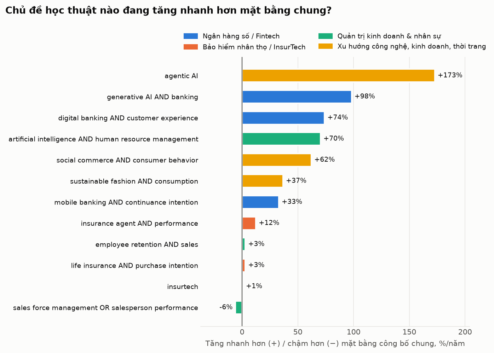
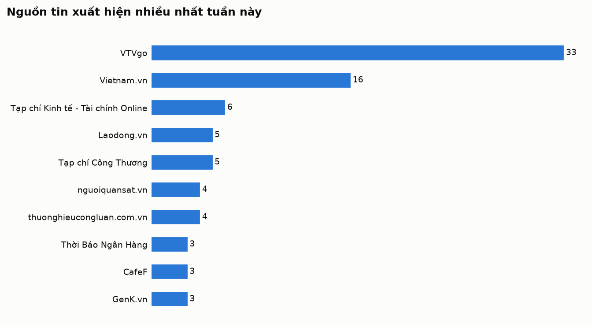
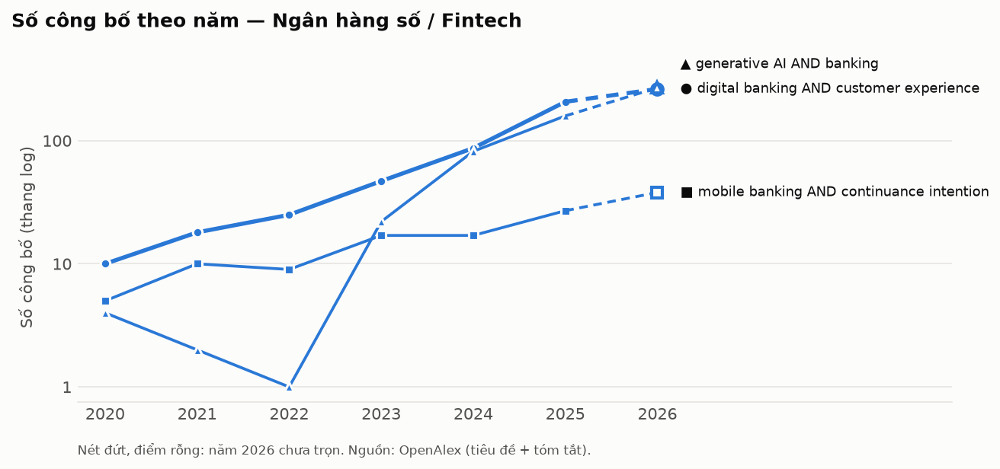
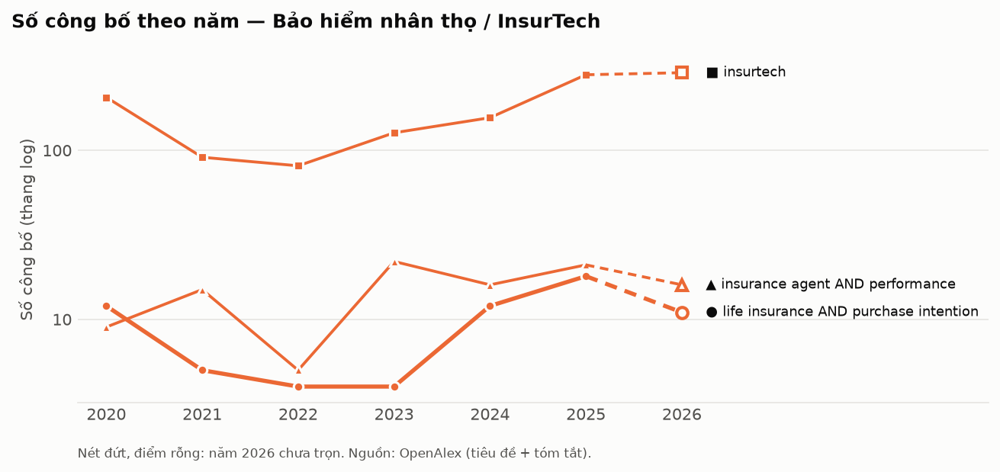
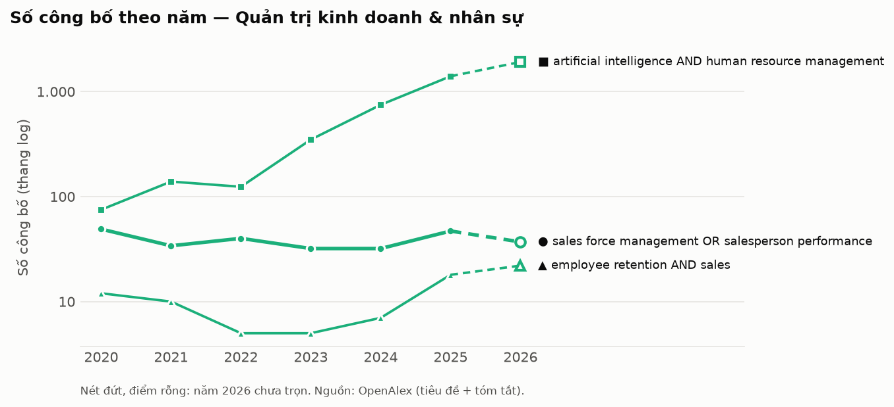
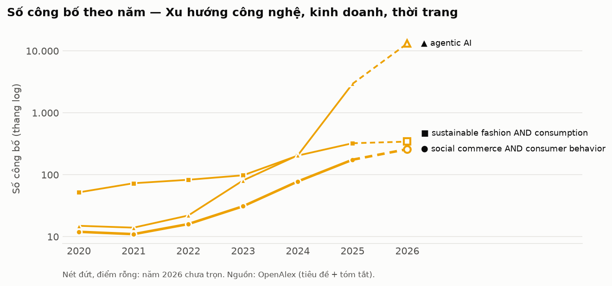

# Research Radar · Tuần 40/2026

> **Ngày chạy:** 04/10/2026 · **Cửa sổ tin:** 30 ngày · **Thị trường:** Việt Nam, đặc biệt Đồng bằng sông Cửu Long; đối chiếu Đông Nam Á và thế giới

**Bản PDF khổ A4:** [tải về](pdf/2026-10-04.pdf)

## Tóm tắt điều hành

**5 điểm đáng chú ý nhất tuần**
1. Bảo hiểm nhân thọ — Doanh thu phí toàn thị trường 9 tháng đạt 175.800 tỷ đồng (tăng 2,4%), nhưng mảng nhân thọ tiếp tục hụt hơi trong khi bảo hiểm phi nhân thọ tăng tốc (Vietstock ngày 03/10/2026 và Vietnam.vn ngày 04/10/2026).
2. Bảo hiểm nhân thọ — Làn sóng tái cấu trúc và mở rộng phân phối trực tiếp gia tăng mạnh với kế hoạch tuyển dụng 1.000 nhân viên kinh doanh của doanh nghiệp FDI Nhật Bản cùng thương vụ mua gom 5,5 triệu cổ phần tại PHL (nguoiquansat.vn và Tin nhanh chứng khoán ngày 03/10/2026).
3. Ngân hàng số / Fintech — Ngân hàng Nhà nước và các nhà băng siết chặt hàng rào bảo mật, ngăn chặn 1,8 triệu giao dịch gian lận trị giá hơn 6.000 tỷ đồng và áp dụng quy định dừng chuyển khoản trên 10 triệu đồng tại một số đơn vị (nguoiquansat.vn và congdankhuyenhoc.vn ngày 04/10/2026).
4. Quản trị kinh doanh & nhân sự — Thu nhập người lao động 9 tháng tăng 9,9% tạo dư địa cho tài chính cá nhân, song thị trường ghi nhận thách thức lớn từ 1,6 triệu thanh niên thất nghiệp không tham gia học tập (Việt Báo và nguoiquansat.vn ngày 03/10/2026).
5. Xu hướng tiêu dùng & công nghệ — Lực lượng 20,5 triệu Gen Z đang thúc đẩy hành vi quản lý dòng tiền thận trọng, chi tiêu có kế hoạch và yêu cầu điều chỉnh các giới hạn tín dụng, tài chính tiêu dùng (CafeF và VTVgo ngày 02/10/2026).

**3 việc nên làm tuần này**
- Cho luận án: Xây dựng khung mô hình nghiên cứu định lượng về tác động của rào cản xác thực thanh toán số và biến động thu nhập đến quyết định duy trì hợp đồng bảo hiểm nhân thọ của khách hàng cá nhân.
- Cho đội kinh doanh: Hướng dẫn đội ngũ đại lý tại khu vực Đồng Tháp chuyển trọng tâm tư vấn sang các sản phẩm bảo hiểm có quyền lợi sức khỏe thiết thực, đồng thời chuẩn hóa quy trình thanh toán phí qua tài khoản ngân hàng số định danh để bảo đảm an toàn dòng tiền cho khách hàng.
- Cần kiểm chứng thêm: Mở nguồn gốc văn bản từ Ngân hàng Nhà nước và bài viết trên congdankhuyenhoc.vn (ngày 04/10/2026) để kiểm tra chính xác điều kiện và phạm vi áp dụng của quy định "dừng chuyển khoản trên 10 triệu đồng", tránh tác động tiêu cực đến quy trình đóng phí bảo hiểm số lượng lớn.

## Mục lục

1. [Ngân hàng số / Fintech](#digital-banking)
2. [Bảo hiểm nhân thọ / InsurTech](#life-insurance)
3. [Quản trị kinh doanh & nhân sự](#management-hr)
4. [Xu hướng công nghệ, kinh doanh, thời trang](#tech-business-fashion)

## Bản đồ độ nóng học thuật

| Hạng | Chủ đề (từ khoá chính) | So với mặt bằng chung |
|---:|---|---:|
| 1 | [Ngân hàng số / Fintech](#digital-banking) | **+74%/năm** |
| 2 | [Xu hướng công nghệ, kinh doanh, thời trang](#tech-business-fashion) | **+62%/năm** |
| 3 | [Bảo hiểm nhân thọ / InsurTech](#life-insurance) | **+3%/năm** |
| 4 | [Quản trị kinh doanh & nhân sự](#management-hr) | **-6%/năm** |

CAGR chuẩn hoá = tốc độ tăng số công bố của từ khoá chia cho tốc độ tăng tổng công bố OpenAlex, giai đoạn các năm đã trọn vẹn.

## Ai đang đưa tin nhiều nhất

---

## 1. Ngân hàng số / Fintech

| # | Xu hướng | Tín hiệu | Một câu vì sao đáng chú ý |
|---|---|---|---|
| 1 | Siết chặt an ninh, phòng ngừa gian lận trong thanh toán số và quản lý tài khoản ngân hàng | ●●● Mạnh | Ngân hàng Nhà nước và các ngân hàng đồng loạt áp dụng quy định hạn mức và bộ lọc kỹ thuật để ngăn chặn giao dịch lừa đảo [1][6][19][21][22][29][30][37]. |
| 2 | Khơi thông nguồn vốn và cơ chế đổi mới sáng tạo trong hệ sinh thái tài chính - ngân hàng | ●●○ Trung bình | Nhiều diễn đàn và cơ quan quản lý cùng tìm phương án giải bài toán vốn và đo lường hiệu quả đổi mới sáng tạo [4][9][11][13][16][17][20]. |
| 3 | Chuyển đổi mô hình ngân hàng bán lẻ "digital-first" và vai trò nền tảng của Fintech | ●●○ Trung bình | Các ngân hàng lớn cùng trung gian thanh toán liên tục nâng cấp hệ thống số và khẳng định năng lực qua các giải pháp thanh toán số [2][24][34][39]. |
| 4 | Định hình khung pháp lý quản trị rủi ro và khai thác dữ liệu số ngân hàng theo Thông tư 50 | ●●○ Trung bình | Quy định mới tại Thông tư 50 và cơ chế kết nối dữ liệu số đang tái định hình cách thức vận hành nghiệp vụ của các nhà băng [8][22][40]. |
| 5 | Tích hợp bảo hiểm nhúng (Embedded Insurance) trên ứng dụng ngân hàng số | ●○○ Yếu | Hình thức đưa bảo hiểm trực tiếp lên app ngân hàng đang vấp phải sự thận trọng và băn khoăn về trải nghiệm từ người dùng [31]. |

#### 1. Siết chặt an ninh, phòng ngừa gian lận trong thanh toán số và quản lý tài khoản ngân hàng · ●●● Mạnh
- Diễn biến: Ngân hàng Nhà nước cùng các ngân hàng thương mại tăng cường nhiều biện pháp kỹ thuật và pháp lý nhằm bảo vệ tài khoản, thẻ tín dụng, ngăn chặn tội phạm mạng và rà soát tài khoản không hoạt động [1][6][12][19][21][22][29][30][37].
- Bằng chứng định lượng: Hệ thống phòng ngừa gian lận thanh toán của Ngân hàng Nhà nước ngăn chặn 1,8 triệu lượt giao dịch với giá trị hơn 6.000 tỷ đồng (nguoiquansat.vn, 04/10/2026) [21]; xuất hiện quy định dừng chuyển khoản trên 10 triệu đồng tại một ngân hàng (congdankhuyenhoc.vn, 04/10/2026) [6]; đóng các tài khoản không phát sinh giao dịch từ 03 năm trở lên (VTVgo, 04/10/2026) [19].
- Insight xã hội/khách hàng: (Diễn giải) Khách hàng mong muốn thanh toán trực tuyến nhanh gọn nhưng mang tâm lý lo ngại rủi ro mất tiền bởi các chiêu thức lừa đảo tinh vi, buộc họ phải chấp nhận việc xác thực danh tính phức tạp hơn để bảo vệ tài sản số.
- Câu hỏi nghiên cứu tiềm năng: Rào cản xác thực bảo mật đa tầng (biến độc lập) tác động như thế nào đến ý định duy trì sử dụng ứng dụng ngân hàng số (biến phụ thuộc) của khách hàng cá nhân?
- Hàm ý kinh doanh: Đội ngũ kinh doanh bảo hiểm cần hướng dẫn khách hàng thanh toán phí qua các cổng ngân hàng số chính thống có định danh rõ ràng, giúp khách an tâm về dòng tiền và giảm thiểu rủi ro gian lận.

#### 2. Khơi thông nguồn vốn và cơ chế đổi mới sáng tạo trong hệ sinh thái tài chính - ngân hàng · ●●○ Trung bình
- Diễn biến: Học viện Ngân hàng phối hợp tổ chức Diễn đàn Đổi mới sáng tạo trong lĩnh vực Tài chính – Ngân hàng năm 2026, cùng sự lên tiếng của lãnh đạo Ngân hàng Nhà nước và Agribank về việc tạo cơ chế đưa vốn vào doanh nghiệp đổi mới sáng tạo [4][9][11][13][16][17][20].
- Bằng chứng định lượng: Chưa tìm thấy nguồn xác nhận về số liệu kinh tế cụ thể trong tiêu đề các bài viết [4][9][11][13][16][17][20].
- Insight xã hội/khách hàng: (Diễn giải) Các định chế tài chính và doanh nghiệp công nghệ chịu áp lực thúc đẩy các sáng kiến số, nhưng gặp khó khăn trong việc định lượng rủi ro tín dụng và đo đếm hiệu quả kinh tế thu về.
- Câu hỏi nghiên cứu tiềm năng: Năng lực hợp tác đổi mới sáng tạo mở giữa ngân hàng và đối tác công nghệ (biến độc lập) ảnh hưởng thế nào đến hiệu quả phân bổ vốn tín dụng (biến phụ thuộc)?
- Hàm ý kinh doanh: Quản lý kinh doanh nên chủ động tiếp cận các doanh nghiệp khởi nghiệp và doanh nghiệp nhỏ trong hệ sinh thái đổi mới sáng tạo để chào các gói bảo hiểm nhóm bảo vệ phúc lợi nguồn nhân lực công nghệ.

#### 3. Chuyển đổi mô hình ngân hàng bán lẻ "digital-first" và vai trò nền tảng của Fintech · ●●○ Trung bình
- Diễn biến: VietinBank định hướng chuyển đổi mô hình ngân hàng bán lẻ, Vietcombank thúc đẩy VCB Digibank, song song với việc MoMo nhận giải thưởng "Giải pháp thanh toán số đáng tin cậy" tại Better Choice Awards 2026 [2][24][34][39].
- Bằng chứng định lượng: Nền tảng Fintech MoMo được trao giải "Giải pháp thanh toán số đáng tin cậy" năm 2026 (GenK.vn, 04/10/2026) [24]; các chỉ số tài chính khác chưa tìm thấy nguồn xác nhận trong tiêu đề [2][34][39].
- Insight xã hội/khách hàng: (Diễn giải) Người dùng trẻ và khu vực đô thị coi ứng dụng di động là kênh tương tác tài chính chính, đòi hỏi giao diện trực quan và khả năng thanh toán tức thời từ cả ngân hàng lẫn ví điện tử.
- Câu hỏi nghiên cứu tiềm năng: Mức độ số hóa theo định hướng "digital-first" (biến độc lập) tác động ra sao đến mức độ trung thành của khách hàng bán lẻ (biến phụ thuộc)?
- Hàm ý kinh doanh: Số hóa toàn bộ tài liệu giới thiệu và quy trình minh họa quyền lợi bảo hiểm nhằm tích hợp mượt mà vào hành trình trải nghiệm trực tuyến của khách hàng số.

#### 4. Định hình khung pháp lý quản trị rủi ro và khai thác dữ liệu số ngân hàng theo Thông tư 50 · ●●○ Trung bình
- Diễn biến: Các tổ chức tín dụng nghiên cứu cơ chế kết nối, khai thác dữ liệu khách hàng và chuẩn bị vận hành các điều khoản quản lý rủi ro mới theo Thông tư 50 [8][22][40].
- Bằng chứng định lượng: Chưa tìm thấy nguồn xác nhận về số liệu kỹ thuật hoặc tỷ lệ tuân thủ trong tiêu đề [8][22][40].
- Insight xã hội/khách hàng: (Diễn giải) Ngân hàng cần dữ liệu lớn để cá nhân hóa dịch vụ và phê duyệt sản phẩm, nhưng vấp phải yêu cầu pháp lý khắt khe về việc bảo vệ quyền riêng tư và kiểm soát rủi ro hệ thống.
- Câu hỏi nghiên cứu tiềm năng: Khung pháp lý về quản trị rủi ro công nghệ (biến độc lập) chi phối như thế nào đến tốc độ tích hợp dữ liệu khách hàng (biến phụ thuộc) tại các ngân hàng thương mại?
- Hàm ý kinh doanh: Kiểm tra và chuẩn hóa quy trình thu thập dữ liệu khách hàng tham gia bảo hiểm qua kênh liên kết ngân hàng (Bancassurance) để đảm bảo tuân thủ đúng quy định bảo mật thông tin.

#### 5. Tích hợp bảo hiểm nhúng (Embedded Insurance) trên ứng dụng ngân hàng số · ●○○ Yếu
- Diễn biến: Xuất hiện phản ánh về tình trạng sản phẩm bảo hiểm được tích hợp trực tiếp trên ứng dụng ngân hàng số gây ra sự băn khoăn cho khách hàng sau khi bấm chọn giao dịch [31].
- Bằng chứng định lượng: Chưa tìm thấy nguồn xác nhận về tỷ lệ chuyển đổi hay số lượng đơn khiếu nại trong tiêu đề [31].
- Insight xã hội/khách hàng: (Diễn giải) Khách hàng e ngại việc vô tình bấm mua các sản phẩm bảo hiểm số trên ứng dụng ngân hàng khi chưa hiểu tường tận các điều khoản loại trừ và cam kết dài hạn.
- Câu hỏi nghiên cứu tiềm năng: Mức độ minh bạch thông tin hợp đồng trên giao diện bảo hiểm nhúng (biến độc lập) ảnh hưởng thế nào đến tỷ lệ duy trì hợp đồng bảo hiểm số (biến phụ thuộc)?
- Hàm ý kinh doanh: Đội ngũ đại lý cần tăng cường tư vấn trực tiếp để làm rõ các điều khoản sản phẩm phức tạp, định vị dịch vụ tư vấn chuyên sâu khác biệt so với các sản phẩm vi mô thao tác nhanh trên ứng dụng.

#### Tín hiệu yếu cần theo dõi
- Mô hình kết hợp công nghệ cao với tiếp xúc con người trực tiếp ("high-tech, high-touch") từ kinh nghiệm quốc tế của Bank of America (FinAi News, 04/10/2026) [27].
- Quy định cho phép chi nhánh ngân hàng nước ngoài lập 01 phòng giao dịch trong khu thương mại tự do (Thời Báo Ngân Hàng, 03/10/2026), tạo tiền đề cho các thử nghiệm dịch vụ tài chính mới [35].
- Hoạt động hướng dẫn người dân từng bước làm quen với giao dịch số tại cấp địa phương (Báo Thanh Hóa, 03/10/2026), là cơ sở để nhân rộng tiếp cận thanh toán không tiền mặt ở các vùng nông thôn như Đồng bằng sông Cửu Long [36].

<b>Nguồn tin (40 tin, Google News)</b> — số trong [ ] khớp trích dẫn, ★ = được trích

- [★ [1] Tăng cường an ninh, bảo mật cho ngân hàng số - VTVgo (2026-10-04)](https://news.google.com/rss/articles/CBMiQEFVX3lxTE1xZnNVZDJnd3R4U2FsMTVoUlhlTkFzcVBRMlh0YU8wZkJySi1QbERxUVh3V29KT29WbW5fdkVKUHA?oc=5)
- [★ [2] Ngân hàng số VCB Digibank – Dẫn lối tương lai - VTVgo (2026-10-04)](https://news.google.com/rss/articles/CBMiQEFVX3lxTE9PTjUyVXRsdjUzMFZGcDI1RmkzR3FFRmxIWEZFS0F3THo2RnNKNE92ckhhNWpkbW9rR2Z6aC0wV3Q?oc=5)
- [[3] Lãi suất tiết kiệm chạm 10%/năm, nhiều mức từ 9% trở lên xuất hiện - Laodong.vn (2026-10-04)](https://news.google.com/rss/articles/CBMipwFBVV95cUxNV3daMnFBUE0xQlI3dWZmQThGcUdzMWd3MFZCT3lPWUVXQi1faDNMMFl0SmF1S3NvQVg1bHd3c3p4OG1MTGNjWGNuWGdlcy1jT1JKRWRaYU9JVzdGdnVfY3AxMWEzQXJ2UlRPd3R4b3hKUWJPS2NWb0x2Qk5fRE1VT18waEVnRWgtOFJMOWVQWVlaczh5N0ctYk4zZzJUMVRwdlN5TElfaw?oc=5)
- [★ [4] Khơi dòng vốn cho đổi mới sáng tạo từ hệ sinh thái ngân hàng - Tạp chí Kinh tế - Tài chính Online (2026-10-04)](https://news.google.com/rss/articles/CBMipwFBVV95cUxQUDg1RkdqWjg5LTBxYmVIbDIydnB5NHdEZWp3T29KTzhSa3hvQTJDbXUxUGpPMGxsRXo3WklGT3piNW9WT2p3WUlHUzkwbXliZlFiRGZvMzRub2V1d3dpcG55NW9scDB6MWxBNG9tOWd0NlM3c0dvaFBILUZFb2l5dmZVRHc0T0FiZ1ZDZVAzZ29nWkRkaThldHA0aEJRUzE3UVNCM1NzMA?oc=5)
- [[5] Lãi suất hôm nay ở Agribank, Vietcombank, BIDV và VietinBank - Laodong.vn (2026-10-04)](https://news.google.com/rss/articles/CBMiogFBVV95cUxQY3lEa2gtNUpscEZBLXpMMWZEaTE1UUItR0NfV0ROR3VtRTVIRXhuc2gtbXh2ZEJUcW14Nno1MlZSTC02ZDkwTjhZdUwzZmpfejFpU0tqa1hhQjc2N2hPcm8xZ3Jrc21BVG0waVdyWDc1RmZ6T0p5U2JhVEpISEpUYmVpR2J1MzVTOHN1VG11TjNqekpTX0M0bVV0bzUtN2JhTFE?oc=5)
- [★ [6] Lý do một ngân hàng dừng chuyển khoản trên 10 triệu đồng - congdankhuyenhoc.vn (2026-10-04)](https://news.google.com/rss/articles/CBMiqwFBVV95cUxQdkpWU2FHRml0aUptRFlTZWRIVV9FdWNGMEFVTlRCV21GTDJRUF9jSEZkTUUxWVNRV1ptSEpuR1ZQOVZraU1JRXF5ZUtZdTVQSE1DRDhrLWl5TURhM21YbkhpTUZONzV0SlhNRmxTOWdRbERzMjZ6Wkdac1MtSVdLdVNjWmkxZGRXNnNJNEdrcGdmN3QzbHdFTXlYYy1CNHZOeTdVcFV0QnFzX3M?oc=5)
- [[7] Kết nối doanh nghiệp với ngân hàng, khơi thông nguồn vốn xuất khẩu cuối năm - Tạp chí Kinh tế - Tài chính Online (2026-10-04)](https://news.google.com/rss/articles/CBMiygFBVV95cUxQajhkN2Q3ZjZLS212OEFrUHhCV19pZU96Z2FRd0hIOUpfdW1INHYyMEhYa2FxdktFcjV6R2VIcTJRVmVrcXVPWkdNTlVRNlQxZlB4eWp1MVdHVkFjeDFYVjRObUJ6R05xcXlxRzVFem04STFtMl9UeDEzOWFVQnZoUXg2ZTg2MlUwVFRNZVJ2Y2pSVW9qUlJ6em9NMVhkbEJ1dDJLWTFocktQVmhCNGtEejdsQVdsU3JKaDl5Q1RwOXJnNmVaUS1jZ2ZR?oc=5)
- [★ [8] Nghiên cứu cơ chế để ngân hàng kết nối, khai thác các nguồn dữ liệu - Tạp chí Diễn đàn Doanh nghiệp (2026-10-04)](https://news.google.com/rss/articles/CBMirwFBVV95cUxPNmtCdEhHMVJVWUY2TmsweU5ibDkwcE4zRkU1MkR0Ym9hLTBMVzVzaEFPdVNaZDJyMWJLR2VSNEY3bnpLU1AyWGR1MWdPNTRfMVdxSURWM2htaUEzWXZudnVDZXphN0hRSC0tN3doQ2VZSXplRVd2V3pfTmozeUhWZ0psTnByVjU0RmFIeGoyeUpLWmpOUVlnZkJhSFFkRHVGUUdmWXdTM1BxN1hsR21V?oc=5)
- [★ [9] Phó thống đốc NHNN chỉ ra bài toán khó nhất để khơi thông vốn cho đổi mới sáng tạo - VIETTIMES (2026-10-04)](https://news.google.com/rss/articles/CBMiuwFBVV95cUxOLXZ4OFVzSEpLSEVlT09mR01HUWpXZnhtbTJ6RTBZVHlyZGVBblZiTmo5S3VBZDFyQzZCSFQwRmJ4RS1XaUptcmh2YU9rVXdDcHA4aXM0RnA4ZFhyVE9nRUpwV0hZVzNqZEx2ZWxYaUw5RUVtelR4NW9Ea2NzMTRibzBORTlKNXJmRDlWTlEwYk1EaVZsNk94cTliZXJkcWpJNzR6ODNXTjZEX2RBam9VNmN5dHdMQW9MU1lz?oc=5)
- [[10] Ngành ngân hàng đẩy mạnh hỗ trợ tăng trưởng kinh tế - Báo Quân đội nhân dân (2026-10-04)](https://news.google.com/rss/articles/CBMinwFBVV95cUxNWm91LW56eV8zNXBITUpRaTF4YndBZWJtMm5uSFNPX2ktUW9XamoxOWFzeWEwODFkVWxGWDdmX3p2bjN3VkpQSVBrV3BVc0JTYXZXR19KcG1BV21iTGZBYUVLOTZDRnAzS245R1k0bWwzT3UtZ2Q0UXpjY2NMMUJCeVBibU0tNC1FWmhlclJBc3RIbFpWaE85NEtfVEphUk0?oc=5)
- [★ [11] Agribank đồng hành khơi thông nguồn lực cho đổi mới sáng tạo ngành tài chính - ngân hàng - Agribank (2026-10-04)](https://news.google.com/rss/articles/CBMijAJBVV95cUxOanlray1PTFVJd2prcTFoSmxJaXdTYjB1My03cUllMUNKbUZOSURMRUlBbG9NRFdRYkw1NVJmSGJCMkpUUU4tcXZvVF9DY0lOSlh0ME9iQmFUalBtRWdXMzIteUZ6Q3N4LUluNm4weDR4Z3N5RV9jY1RiTDFBbWVDT00tZkFRY3JpT3VnYV9zSmRSNXA1V3QzWEVUMFZ5TVoxLTZGSmVtTjJ1QWk4RzJTb2h2ZVU0LTlxWHRXeGxWVWhicndLcmZWZ0JOamtuSGE4RTJDT1VkNzJSaWhsWFpoLTZlLXVrQnN4UTRwa3FLbWR4S2pBVWNOdGdadW9XTG1PR3AtQnhBM05lVTh5?oc=5)
- [★ [12] Chuyển đổi số ngân hàng gắn với an toàn hoạt động - VTVgo (2026-10-04)](https://news.google.com/rss/articles/CBMiQEFVX3lxTFB4bWJYcHF3cktvOHU0SlRqUDh2cElZXzRhaUdrMk53ZnZhQTk2U2FXUFJxYWpJeEFUOHR3aDgtQkY?oc=5)
- [★ [13] Khơi thông nguồn lực cho đổi mới sáng tạo ngành tài chính - ngân hàng - Vietnam.vn (2026-10-04)](https://news.google.com/rss/articles/CBMilAFBVV95cUxQVlVIczktSjA4XzEwLTFDXzJDamsyQUdJQkl0S1VjYVg4WDN3T09uQkhZWEpkQy1CbHdwaXdoblJMVGRQMHVqUnN3a2RSVE5FMFoxX1NPeE51S3ZSUmt2YzVMLXVpcXVTRXZvdVM5WG9CTUdCSmNmc21PbVhjM0FxRFhfZ0k4XzhuYmFXcEp1LUF0T2ln?oc=5)
- [[14] Chuyển đổi số trong giáo dục - VTVgo (2026-10-04)](https://news.google.com/rss/articles/CBMiQEFVX3lxTFBuc3lNeHhWd3FqdlcxT1M0Vk45YXpSUEEyV3BHTHJUV3ZCdWoydDYxS19INUdid3BORGNtcnB5bGM?oc=5)
- [[15] Các ngân hàng cam kết đồng thuận giảm lãi suất - VTVgo (2026-10-04)](https://news.google.com/rss/articles/CBMiQEFVX3lxTE1LY0hhYU5xNHQtWHJ4VnotM0hVZ1NjOWFHTjZxUEV4UUdDNFJjMktxOURRTUdtRnJvRUFTT1lzVks?oc=5)
- [★ [16] Học viện Ngân hàng phối hợp tổ chức Diễn đàn Đổi mới sáng tạo trong lĩnh vực Tài chính – Ngân hàng năm 2026 - Vietnam.vn (2026-10-04)](https://news.google.com/rss/articles/CBMixwFBVV95cUxQLTNFSFktVEt3T1BaTmsxaHV3eUNLUEN6RzJ1c3FwelRHa2xvTXQyVExJWFdOakhfNEMzU2RMZmtqX1hyY0lYczhSTjNtTmRhZWlHbVdTeWZIWExJYlJabFNxeG5VcGxYQW9vNUR6dzc2Z2xZQnFPUXZLc3RVeDFHejliRUNZcG4xX21MbVNuSVgyX3M4WlkwcUhBVF8wOGJCeGtMQzRSS29EOUYzUERrYndUMzhsMXlrWThvY1EzY0ZIV2tiUURB?oc=5)
- [★ [17] Khơi thông nguồn lực cho đổi mới sáng tạo tài chính - ngân hàng - Vietnam.vn (2026-10-04)](https://news.google.com/rss/articles/CBMijAFBVV95cUxQSFZmWHFPWkZSYlhnZXZPODNIMFFSUThPdDJIT1ZMOEdFVS1uLXU0VzZiNFhmTl9NNWd1VFItZ0dwMFhqNjZNY3p6WFdXLUpmdVpXejV5cEE2NjRZZHFveldJeUNIX1Y1NDY0QnhUZ055LUVDc2txQWJHZm5ZQm51dWtnb2dhSzE1SWNhSg?oc=5)
- [[18] Ngân hàng đầu tiên của Việt Nam đạt mức vốn điều lệ 100.000 tỷ đồng - VOV.VN (2026-10-04)](https://news.google.com/rss/articles/CBMiqAFBVV95cUxNbzVXS0h1SlRSYS1vaFRTV2Nfdk1XVnBLTTA2R1o4eFNCNl9Nc0d2X1ZtWmc0Z1pTdlBiSHZOZE1EUktnZ2Mtb3ZZcmUzV2NVcHFtb3hXbjFBd1A5NHRtczZwVF9nMGt5QzVpZFNHaWdTNEhGeVJJa1k1bzlGeTlFREEtMkpyanVqVnJ2ckdOeU9Gblo3SDUzNm1oS0tzanJfMUs1Zm5MTEM?oc=5)
- [★ [19] Đóng tài khoản ngân hàng không giao dịch 03 năm trở lên - VTVgo (2026-10-04)](https://news.google.com/rss/articles/CBMiQEFVX3lxTE9jVDA2cDQ2MUFpTlFfN1gzeWVDWXJJQ2Z3SGdSenlpR2JDcHM1T09jV0ZUZDFNdWR4SDZDM1JrNG8?oc=5)
- [★ [20] Đo đếm được hiệu quả thực chất của đổi mới sáng tạo cho nền kinh tế - Thời Báo Ngân Hàng (2026-10-04)](https://news.google.com/rss/articles/CBMiqgFBVV95cUxObGE5U0xyVFFjNUcwQVpfZzhOcDdra3BlLUtlMnZwZFBDQTNuNVJTNE5yZnRmVlRySTNUaEppN1NnWDYyWE8xRmxNWk4za0tBWGM1dGlUZFlUU1ZNWWw1VVhfaFlLNUFRMVU5UU81SUR0N0NSUGQ4RU1ucWc3YTc5ZjVSdUJDZkJwVElQVF84M2hvdS1qOXZQME5PUjJra3pfNmVHOW1CTWlPdw?oc=5)
- [★ [21] Hệ thống phòng ngừa gian lận trong thanh toán của NHNN ngăn chặn 1,8 triệu lượt giao dịch, giá trị hơn 6.000 tỷ đồng - nguoiquansat.vn (2026-10-04)](https://news.google.com/rss/articles/CBMi5gFBVV95cUxQaF84MWxBQ0J2d3lLWWVVUzFsY0Y3dlBzcTZHYWVBRllfLWtfcUl3TmFNaW5aUmstNE5UeGd1UDFzM0EyQUdjbXFpZkdxandIZHAtOGpHLXhoeGx0aFdMV1E4VVZRSGVDeVJnRjBRYUJhaHRlREJKNFFvaGhacHpnX05jQktHSmM2X3loNVVReUViZVJrWUx4M2JaSXdUdXRuT2NnUUJiNUFuOGh3UGswa2dDZmcxZk5mQmZSdkV2akJqQUUwYmhudGVXcXhudEZuYjFJSkFjNlBLX2ZkMFpGOTQ4bmdTZw?oc=5)
- [★ [22] Thông tư 50 tạo bước chuyển mới trong quản lý rủi ro ngân hàng - CafeF (2026-10-04)](https://news.google.com/rss/articles/CBMipAFBVV95cUxNdkU1R19IVnNjWnlCS0FTU1pBNHczSW91bzV4MVhxMEVRXzNybmNGVE13Zi1hQmxvNzJMS0dXOVVlTFlpOFZwVjM3dlhhbnJMSUxhZ2ltZlQ3VWFLTWxhbjV3WTJjajNKZUNVcks2akFVdktPX0RqVWdlZXBpbkw2Nm5EamNtUG5vcGdwYWkwcEo1ZDZWbGRFdlAzSVI3MGIyOXFZOQ?oc=5)
- [[23] Ngân hàng tìm cách đưa vốn vào doanh nghiệp nhỏ và vừa - Một Thế Giới (2026-10-04)](https://news.google.com/rss/articles/CBMijwFBVV95cUxObHBSUTdnbExFWVFBTGlHdlZ3SkoydXRMZGJUQmpzY1RLaWNFU2tUcnIxZGJKalR0RGh0cHNwc1h1R1RLUDlDdVBvbm5WZWdqVWtjeHQxRWRGYzVnSlMtSHBkbXVOUzBGYm9QZ3AtdVJPbjdfeWZiN2tBZXo0S0wtVXlMM2ZaLXA5WkNvLXR5OA?oc=5)
- [★ [24] Nền tảng Fintech MoMo thắng giải "Giải pháp thanh toán số đáng tin cậy" tại Better Choice Awards 2026 - GenK.vn (2026-10-04)](https://news.google.com/rss/articles/CBMi1AFBVV95cUxNRjQtdFQ1aUdFNFlCOXNRbFV5VG02azM1a3RpV19mLXgySUJLMU10MEkwX19HSUNaa1ptVUNiUFFJejVQNWJ6T0x0am80VENFeFVhSk8wSUJKM1duUHZYUE9FdTA4MDhuaDFaVmRDT290LVJscnBiT0VKckhybjJiVlVwakZqZHNfc3RYcXFUMUJ4LWo3NjcyZkJpcURFdEdtRDFSLUhQcXlhejZMWmhjcU40OHdWS2lvelFhS0R1Nm1aVm5MSHA2b1p2OVZtWmhzZ0x6bg?oc=5)
- [[25] Tạp chí kinh tế cuối tuần | 01/11/2025 | Chiến lược phát triển thị trường bán lẻ Việt Nam - VTVgo (2026-10-04)](https://news.google.com/rss/articles/CBMiQEFVX3lxTE1xQ1RucWw2Y3RrUHVjblhOQWcyVmVleDl5bjR1N3cyRHo3UFNUVURjZ2JMcUFnYldZdVp4RGFQQUw?oc=5)
- [[26] Viettel thắng giải "Doanh nghiệp công nghệ và công nghiệp tiêu biểu của năm" tại Better Choice Awards 2026 - GenK.vn (2026-10-04)](https://news.google.com/rss/articles/CBMi2wFBVV95cUxPWi1Kd2tfSEpmZ2FsQ28zTVFYVTNWMGlEdjR3WU9CdEw0MG82SXdCM2FadjVRdl9KajVJSGY2OTc0S3NwZ3phcGFrcFFWc3NWSjBrTVgtYlRzTEx5MzFEZVg5U1hFOElUSXp6TGNpbjVHS3IyNXJWakJUSEdxa2hkOFBzVlg3MTdmaUNiZzZLRTd6MkdVWnQ3Z3ZuZ2RkRUl4SldEcV9Pdkp5OGV1clJrSjVjeTBjbHdUd3ZvY1Nncld4NWpFR2hYQW9mbDgzajVyVXJTTF8zZUIwWDg?oc=5)
- [★ [27] Bank of America aims to build ‘high-tech, high-touch’ business - FinAi News (2026-10-04)](https://news.google.com/rss/articles/CBMilAFBVV95cUxNQ1pfYjk0UEdJNjYtVWc1c1ljQVpYWTdpbGliNUtZLUlDVm9sTFJvakVsZUM2LUxrZGRUMWN6Y1BjYS1HUDY1ZUNpRG5aZjVmX24tbWVnQ2ZlYnl0T2s4WFpfQ2hiYUQtOFRndjNUaWJQaXVGU0UzU3BhOTl6bmdDTUprVS1ERW5BMl9PbHBMeTNDZmZo?oc=5)
- [[28] As the price of gold, which had soared for years, has been flowing down this year, many gold investo.. - 매일경제 (2026-10-04)](https://news.google.com/rss/articles/CBMiUkFVX3lxTE5FSjg0QnZWaUhZVEVwVUlpZjV1TzZJOWp6QUUxZTlaWkV3cUtaaEk4c2FtbDRPeW8zYXhNazlfb2JjSVl4OHlMLUluMU5DSnhHRmc?oc=5)
- [★ [29] Giao dịch ngân hàng số an toàn - VTVgo (2026-10-03)](https://news.google.com/rss/articles/CBMiSEFVX3lxTFBBY0NDRlBpdU5LY0dyTFRzTFpid1FFak5pZjQwbTlCMS1uM0xqd3Y4ZllEMmdaRml0eHEzWGIzTnRBN0F3M2MtSA?oc=5)
- [★ [30] Nhận diện lừa đảo ngân hàng - VTVgo (2026-10-03)](https://news.google.com/rss/articles/CBMiQEFVX3lxTFAxbXZOaDc3MVNqcExkLW54cGJtN2dpdnd5dFF0aDVKTEtuUk11bHo4ank4czJZVnVDUlFaNVY1YVk?oc=5)
- [★ [31] Bảo hiểm “nhúng” vào app ngân hàng, băn khoăn sau một cú chạm - Thời báo Tài chính Việt Nam (2026-10-03)](https://news.google.com/rss/articles/CBMisAFBVV95cUxQUkxSY1lFekZodVRFMENXTjg2RWRtRlhDX2FRTFJNbjYzTFh5TGJUenFhQ043YzJXVXdyOWZCTnlCZGJvNXZ5cmhKYWRaTldqelFUVUdfS2xveEtiVWlCQTZXTk9YNjNTc09KTUNIMFVodldsLU9LWFRKc3JNN05wOVJHWVlXaVRKT1lobU15eWFsVmJkdHZtS2lfVVhZa0JqQy0tV2szQlp4YjRRRFhxVQ?oc=5)
- [[32] Đoàn công tác Hiệp hội Ngân hàng Việt Nam thăm và làm việc với một số tổ chức hội viên tại TP. Hồ Chí Minh - thitruongtaichinhtiente.vn (2026-10-03)](https://news.google.com/rss/articles/CBMi5gFBVV95cUxQRXczUDRweHdLWk0xbkN0ckJkQ1VfQVFLV2tBeUtLeUtFV1JweEJjNXJGY1FiekRZMlZVd2FOVThNVWtyRWNwWGRMek1HZ21ZSk93V3NjcHBPYU1aTE5SQ3o0TXNMNEhweDlVOVprYVFSME01TnR6MzlreDJVaC1nZGUxeksyN0pmZXZhenM4ODBNb0tkMXZBYmV5VlEzT05wVFdoLXc0SGNGWG5zcGc2OFozZ0lYdzg1c3RXd2luYm1aNEd3NlBVdG44QUR0SDdteTN3RGhTSU1aTWJUV3JyMC1QcjBMdw?oc=5)
- [[33] Lãi suất ngân hàng hôm nay 4.10: Ông lớn điều chỉnh lãi suất - Laodong.vn (2026-10-03)](https://news.google.com/rss/articles/CBMiogFBVV95cUxQQjNWM1ZHaVBPaWZ2YWM0TVVDaVUxV2VxVjVIZWphRWJoU1pIcE1pRDJEc3FuNk5TMks3MGE0X25EU0hxc3FCMUZlYVJCUE5DNHExTEY3d3ZVeHR3cFZYTkxQVXJOZ2Nrc1lxSTdGUUVQVTlqR3kzZDNNYzR1VVIwcHZrdVpxM1M4V0hlQkNlSWRZVW1wV1EzUFFmZllUOUh0LWc?oc=5)
- [★ [34] Ngân hàng đang thay đổi như thế nào trong thời đại digital-first - GenK.vn (2026-10-03)](https://news.google.com/rss/articles/CBMipAFBVV95cUxQV1JOR0JWZkdBbXJ4RWZXSGxNVm9VMmZpQmtqRGtHNjlkS3A0N3VqdHZwMm91X25CSmNwZW1rY0dYbWJXak9TcjZDb2R1dGR6dVhGaTN5ZFBSaWt0YnEwalEzRkFjSWQ0UWp5TXc5SzZvS1ZpN0liVXdZOTdXLVlMTlZZS3VCMEJuZV91QUlTWVIwVTM5Z1NsSWRmSjRGTFRlNW1ncw?oc=5)
- [★ [35] Chi nhánh ngân hàng nước ngoài được lập 01 phòng giao dịch trong khu thương mại tự do - Thời Báo Ngân Hàng (2026-10-03)](https://news.google.com/rss/articles/CBMiwgFBVV95cUxNZzR6cjIzekxPQ1REcFJOVnp5akRRVTZ3SXQxb0tEQlRWNlBSaENaT1VhZnN0VXIyYWdXZFJDdmRZaFZxVk81SnlicFhEY2FOSDBpZkN3R2ctS3VZVDBkRG91TGd0V0ZyTHVEWjRMTXZOUWxvNW9JZjNiQUFYTWFVZ1J3aTB6VWF2U1IycUZKWWN3Uy1DdmE1OGlvMWp3WmxOb21DS3QyQkhYcUlqdm1KRHotLTE0cHZwa1pQRE1qUWp4UQ?oc=5)
- [★ [36] Để người dân từng bước làm quen với giao dịch số - Báo Thanh Hóa (2026-10-03)](https://news.google.com/rss/articles/CBMiigFBVV95cUxNWTYtaHg3YlN4NnBjejVQVDVaZHdBZGFZcUN4aVVJVk9NVnNtdHhVWENEMFhyVzVCd2JOeUdtd2xsUjR4NjJ0N2ZwRjF4VXlHSUNrVXJVZUxBTlFUUmxxdjNoXzBOaTVYY041REJxeTgxbERYMnRFYmQxMzBzS182bExiNjZERVVfZlE?oc=5)
- [★ [37] Hack thẻ tín dụng: Từ lộ thông tin đến những lớp bảo vệ mới - Vietstock (2026-10-03)](https://news.google.com/rss/articles/CBMipgFBVV95cUxOdWRoRVdUUm1RNnlLcE5YeEVBVjh2RkwxaGF0NW1OdG9fNmNOSW1NUjdvOFprTHBRSU5XSXFCSU16ZG94dHY3LV9NR3ltX0tHQ2pWYm5ZakJqVVhvMG52WDZIT2Q1U1ZfUjZ3eVlvS0NYblNPM0dQaHpsb00ybHB0QnJMZ3JFQlhGZEllbzN5Y3ZiejZtejVHcTNibXk2ekVOWlZma0NB?oc=5)
- [[38] Văn hóa - Sức mạnh nội sinh của cuộc Chuyển đổi số tại BIDV - Kỳ 3 - Thời Báo Ngân Hàng (2026-10-03)](https://news.google.com/rss/articles/CBMiowFBVV95cUxOekF3RE9sVU84VlRPYWJtX2ZZajVmTXV2ai1QQ1Qtend6MU9LX0xRdmIxdUpIaW5IRjdxUkp6MDV3NDNIaUFvVl93SUJ3aDRSUUo3cmlHMUhGSkFMdWJvYjR3TWI4a1V5ZVVTZ3MyQzdIMGF6c1ZVemFFMmZrdTN1WVFILUdkQ0I3MFFwWHFuMVQ0bXR0d0VHenJHMER5UHNqUDhr?oc=5)
- [★ [39] VietinBank khẳng định dấu ấn đổi mới sáng tạo, tiên phong chuyển đổi mô hình ngân hàng bán lẻ - VietinBank (2026-10-03)](https://news.google.com/rss/articles/CBMiiAJBVV95cUxPN1dod1hBZFRDeUJJelFvZGlIU1lMT2R1TlJwNm1WZWFkd0ZvV3pKUDBYSnE3OUNycmZ0VTVUOWtURHlzX0N1TklVN01Ec1RFMUVaVW92cDJ5NjJiNV85NnI2V1draXNMOG1VY0U5Z2NqVVpYUVF6dkhmYW13TXVXZVN3Z3NHejZJN181WC1yd1djX2IwY2VuQ1pEWWh3TGt2T0tpbmx0Yzc4VDRIVjBfX2VGLUFUTkJjZHJ3ZEpjYkpRUWF4TjRLZ0NrMWZvQ080MEtBZTl2alBxeXZldEhEOU4yRkxWMTYxaGxnOG55TXRlcWdmQlU3TTJXeV9fSkFaYTNmbUJia3g?oc=5)
- [★ [40] Thông tư mới quan trọng bậc nhất ngành ngân hàng sẽ tác động thế nào tới các nhà băng? - CafeF (2026-10-03)](https://news.google.com/rss/articles/CBMiwgFBVV95cUxOX3gtaEtGR0VuRFlUVkNnbkp5NkhmVkx6QzdLN1o0QmdBdnZ4cUdObVJ1X1RhQ29IeTdlVWVqaXFLY0VtV2YxV29EdUpHeng1ZVU2bTBNUWZ2MlhDNUp1M3FfdWJCY2dUeGRBekw0QnpNMnNCbWxnc2RVZ0dDMlFMeER5UnpJakw0Q2ZMd3J4WVFMQmRrR05yOTJBRlctNHIzY2g3eTZwWGVmRzdFUkFXUTZkRi1aUHl6RTUzV0lzSWwzdw?oc=5)

Mô hình: gemini-3.8-flash · Truy vấn: ngân hàng số; chuyển đổi số ngân hàng; fintech Việt Nam; digital banking Southeast Asia; generative AI banking

### Học thuật đang nói gì

| Từ khoá | Công bố năm gần nhất trọn vẹn | CAGR thô | So với mặt bằng chung |
|---|---:|---:|---:|
| `"digital banking" AND "customer experience"` | 207 (2025) | 83% | **+74%** |
| `"mobile banking" AND "continuance intention"` | 27 (2025) | 40% | **+33%** |
| `"generative AI" AND banking` | 159 (2025) | 109% | **+98%** |

OpenAlex, tìm trong tiêu đề + tóm tắt; chỉ là tín hiệu trắc lượng, không dùng làm cơ sở nội dung lược khảo.

<b>Bài được trích dẫn nhiều nhất 3 năm gần đây</b> (cần kiểm tra toàn văn, hạng tạp chí, tình trạng rút bài)

- Impacts of digitization on operational efficiency in the banking sector: Thematic analysis and research agenda proposal (2024) — *International Journal of Information Management Data Insights* — 111 trích dẫn — https://doi.org/10.1016/j.jjimei.2024.100230
- Continuous intention usage of artificial intelligence enabled digital banks: a review of expectation confirmation model (2024) — *Journal of Enterprise Information Management* — 59 trích dẫn — https://doi.org/10.1108/jeim-11-2023-0617
- Green Finance and Fintech Adoption Services among Croatian Online Users: How Digital Transformation and Digital Awareness Increase Banking Sustainability (2024) — *Economies* — 44 trích dẫn — https://doi.org/10.3390/economies12030054
- Augmented reality is the new digital banking – AR brand experience impact on brand loyalty (2024) — *International Journal of Bank Marketing* — 30 trích dẫn — https://doi.org/10.1108/ijbm-11-2022-0522
- Unraveling Digital Transformation in Banking: Evidence from Romania (2023) — *Systems* — 30 trích dẫn — https://doi.org/10.3390/systems11110534

[↑ Về đầu trang](#top)

## 2. Bảo hiểm nhân thọ / InsurTech

| # | Xu hướng | Tín hiệu | Một câu vì sao đáng chú ý |
|---|---|---|---|
| 1 | Sự phân hóa rõ rệt giữa bảo hiểm nhân thọ và phi nhân thọ trong tổng doanh thu 9 tháng đầu năm 2026 | ●●● Mạnh | Tổng doanh thu phí bảo hiểm toàn thị trường 9 tháng đạt 175.800 tỷ đồng (tăng 2,4%), trong đó phi nhân thọ tăng tốc còn nhân thọ vẫn "hụt hơi". [1][24] |
| 2 | Hoạt động tái cấu trúc cổ đông, M&A và chiến lược nhân sự quy mô lớn của các doanh nghiệp bảo hiểm | ●●● Mạnh | Chứng khoán Phú Hưng muốn mua thêm 5,5 triệu cổ phần Bảo hiểm Nhân thọ Phú Hưng [21][22] và 'gã khổng lồ' bảo hiểm Nhật Bản tuyển 1.000 nhân viên kinh doanh tại Việt Nam [25]. |
| 3 | Tái định vị thương hiệu và kỷ niệm mốc phát triển dài hạn của các tập đoàn bảo hiểm quốc tế và nội địa | ●●○ Trung bình | Daiichi Life Việt Nam chính thức ra mắt nhận diện thương hiệu mới [27][28] kết hợp dấu mốc 124 năm [2], và Bảo Việt được vinh danh Thương hiệu Mạnh năm 2026 [3]. |
| 4 | Thách thức và tranh cãi xoay quanh kênh phân phối số hóa qua ứng dụng ngân hàng (Bancassurance số) | ●●○ Trung bình | Thời báo Tài chính Việt Nam nêu bật vấn đề bảo hiểm "nhúng" vào app ngân hàng và những băn khoăn sau một cú chạm. [26] |
| 5 | Tác động toàn cầu từ siết chặt quản lý hoa hồng, môi giới và kỷ luật thị trường bảo hiểm quốc tế | ●●○ Trung bình | Trung Quốc cấm quảng cáo trực tuyến cho vay/bảo hiểm bởi môi giới tư nhân [4]; Nhật Bản xem xét đình chỉ Prudential Life do bê bối gian lận [17]; IRDAI đề xuất trần hoa hồng gây chấn động cổ phiếu bảo hiểm Ấn Độ [18][19][20]. |

#### 1. Sự phân hóa rõ rệt giữa bảo hiểm nhân thọ và phi nhân thọ trong tổng doanh thu 9 tháng đầu năm 2026 · ●●● Mạnh
- Diễn biến: Theo Vietstock và Tạp chí Kinh tế - Tài chính Online cập nhật ngày 03/10/2026, tổng doanh thu phí bảo hiểm toàn thị trường 9 tháng năm 2026 đạt 175.800 tỷ đồng (tăng 2,4%). Đồng thời, Vietnam.vn ghi nhận vào ngày 04/10/2026 rằng bảo hiểm phi nhân thọ đang tăng tốc, trong khi bảo hiểm nhân thọ vẫn ở trạng thái "hụt hơi".
- Bằng chứng định lượng: Tổng doanh thu phí bảo hiểm toàn thị trường 9 tháng đạt 175.800 tỷ đồng, tăng 2,4% theo Vietstock (03/10/2026) và Tạp chí Kinh tế - Tài chính Online (03/10/2026).
- Insight xã hội/khách hàng: (Diễn giải) Khách hàng cá nhân đang thắt chặt chi tiêu cho các sản phẩm bảo vệ dài hạn (nhân thọ) do áp lực kinh tế, thay vào đó dịch chuyển dòng tiền sang các giải pháp bảo hiểm ngắn hạn, phi nhân thọ có tính thiết thực tức thời.
- Câu hỏi nghiên cứu tiềm năng: Sự sụt giảm của biến độc lập (niềm tin vào sản phẩm nhân thọ dài hạn) tác động như thế nào đến biến phụ thuộc (tốc độ tăng trưởng doanh thu phí bảo hiểm nhân thọ) tại thị trường Việt Nam?
- Hàm ý kinh doanh: Đội ngũ kinh doanh cần chuyển dịch trọng tâm sang các sản phẩm bảo hiểm hỗn hợp ngắn hạn hoặc tích hợp quyền lợi chăm sóc sức khỏe thiết thực để kích cầu.

#### 2. Hoạt động tái cấu trúc cổ đông, M&A và chiến lược nhân sự quy mô lớn của các doanh nghiệp bảo hiểm · ●●● Mạnh
- Diễn biến: Ngày 03/10/2026, Tin nhanh chứng khoán và thuonghieucongluan.com.vn đưa tin Chứng khoán Phú Hưng (PHS) dự kiến gom thêm 5,5 triệu cổ phần Bảo hiểm Nhân thọ Phú Hưng (PHL). Cùng ngày, nguoiquansat.vn ghi nhận một 'gã khổng lồ' bảo hiểm Nhật Bản triển khai kế hoạch tuyển dụng 1.000 nhân viên kinh doanh tại Việt Nam.
- Bằng chứng định lượng: 5,5 triệu cổ phần Bảo hiểm Nhân thọ Phú Hưng dự kiến được Chứng khoán Phú Hưng mua thêm (Tin nhanh chứng khoán, 03/10/2026); mục tiêu tuyển dụng 1.000 nhân viên kinh doanh của tập đoàn bảo hiểm Nhật Bản (nguoiquansat.vn, 03/10/2026).
- Insight xã hội/khách hàng: (Diễn giải) Các tập đoàn tài chính nước ngoài và trong nước đang tận dụng giai đoạn định giá lại để củng cố quyền sở hữu và tái đầu tư mạnh mẽ vào lực lượng phân phối trực tiếp nhằm đón đầu chu kỳ phục hồi.
- Câu hỏi nghiên cứu tiềm năng: Việc mở rộng biến độc lập (quy mô đội ngũ nhân viên kinh doanh độc quyền) ảnh hưởng ra sao đến biến phụurate (tỷ lệ duy trì hợp đồng năm thứ hai) trong bối cảnh cạnh tranh nhân sự cao?
- Hàm ý kinh doanh: Tăng cường chính sách giữ chân nhân sự kinh doanh cốt lõi và tối ưu hóa hệ thống đại lý chuyên nghiệp để cạnh tranh trực diện với làn sóng tuyển dụng lớn từ các doanh nghiệp FDI.

#### 3. Tái định vị thương hiệu và kỷ niệm mốc phát triển dài hạn của các tập đoàn bảo hiểm quốc tế và nội địa · ●●○ Trung bình
- Diễn biến: Ngày 04/10/2026, Baodautu.vn đưa tin về cột mốc 124 năm của Tập đoàn Daiichi Life và Thương hiệu và Pháp luật ghi nhận Bảo Việt được vinh danh Thương hiệu Mạnh năm 2026. Trước đó, ngày 03/10/2026, VietnamFinance và Thời báo Tài chính Việt Nam đồng loạt đưa tin Daiichi Life Việt Nam chính thức ra mắt nhận diện thương hiệu mới.
- Bằng chứng định lượng: Mốc lịch sử 124 năm của Tập đoàn Daiichi Life (Baodautu.vn, 04/10/2026); danh hiệu Thương hiệu Mạnh 2026 trao cho Bảo Việt (Thương hiệu và Pháp luật, 04/10/2026).
- Insight xã hội/khách hàng: (Diễn giải) Trong bối cảnh niềm tin thị trường chịu thử thách, các doanh nghiệp bảo hiểm lớn ưu tiên sử dụng uy tín lịch sử và hình ảnh nhận diện mới để tái khẳng định sự cam kết dài hạn với khách hàng Việt Nam.
- Câu hỏi nghiên cứu tiềm năng: Biến độc lập (hoạt động tái định vị thương hiệu và lịch sử hoạt động) có mối quan hệ như thế nào với biến phụ thuộc (mức độ nhận diện và niềm tin của khách hàng đại chúng)?
- Hàm ý kinh doanh: Đội ngũ kinh doanh cần lồng ghép câu chuyện di sản thương hiệu và thông điệp nhận diện mới vào các buổi hội thảo khách hàng để củng cố lòng tin.

#### 4. Thách thức và tranh cãi xoay quanh kênh phân phối số hóa qua ứng dụng ngân hàng (Bancassurance số) · ●●○ Trung bình
- Diễn biến: Ngày 03/10/2026, Thời báo Tài chính Việt Nam đăng tải bài viết phản ánh về việc bảo hiểm "nhúng" vào ứng dụng ngân hàng và những băn khoăn của khách hàng sau một cú chạm.
- Bằng chứng định lượng: Chưa tìm thấy nguồn xác nhận số liệu cụ thể về tỷ lệ khiếu nại hay doanh thu bancassurance số trong bài báo ngày 03/10/2026 của Thời báo Tài chính Việt Nam.
- Insight xã hội/khách hàng: (Diễn giải) Khách hàng ngày càng e dè trước các giao dịch mua bảo hiểm tích hợp tự động (embedded insurance) trên ứng dụng ngân hàng do thiếu sự minh bạch về điều khoản và tư vấn chuyên sâu.
- Câu hỏi nghiên cứu tiềm năng: Việc ứng dụng biến độc lập (cơ chế phân phối bảo hiểm nhúng trên app ngân hàng) tác động ra sao đến biến phụ thuộc (tỷ lệ hủy hợp đồng sớm và mức độ hài lòng của khách hàng)?
- Hàm ý kinh doanh: Thiết lập cơ chế kiểm tra chéo và quy trình gọi điện xác nhận (telesales/welcome call) minh bạch ngay sau khi khách hàng hoàn tất thao tác mua bảo hiểm trên ứng dụng số.

#### 5. Tác động toàn cầu từ siết chặt quản lý hoa hồng, môi giới và kỷ luật thị trường bảo hiểm quốc tế · ●●○ Trung bình
- Diễn biến: Ngày 04/10/2026 ghi nhận nhiều động thái kiểm soát khắt khe trên thế giới: thitruongtaichinhtiente.vn đưa tin Trung Quốc cấm quảng cáo trực tuyến cho vay và bảo hiểm qua môi giới tư nhân; InsuranceAsia News đưa tin cơ quan quản lý Nhật Bản xem xét đình chỉ Prudential Life Insurance do bê bối gian lận; Business Standard và Goodreturns đưa tin IRDAI (Ấn Độ) đề xuất áp trần hoa hồng khiến cổ phiếu bảo hiểm lao dốc và đe dọa sinh kế ngành phân phối.
- Bằng chứng định lượng: Cổ phiếu các hãng bảo hiểm lớn tại Ấn Độ như PB Fintech, Max Financial, HDFC Life sụt giảm mạnh sau đề xuất trần hoa hồng của IRDAI (Goodreturns, 04/10/2026); nguy cơ ảnh hưởng đến sinh kế của 1 triệu lao động ngành phân phối theo cảnh báo của IBAI (Business Standard, 04/10/2026).
- Insight xã hội/khách hàng: (Diễn giải) Áp lực quản lý tuân thủ trên phạm vi toàn cầu đối với kênh môi giới và đại lý đang gia tăng mạnh mẽ, phản ánh xu hướng thanh lọc nghiêm ngặt các hành vi chào bán sai lệch.
- Câu hỏi nghiên cứu tiềm năng: Sự thay đổi của biến độc lập (chính sách siết chặt trần hoa hồng và quản lý môi giới) ảnh hưởng thế nào đến biến phụ thuộc (cấu trúc chi phí và mô hình phân phối của doanh nghiệp bảo hiểm)?
- Hàm ý kinh doanh: Rà soát lại toàn bộ quy trình tư vấn và chính sách hoa hồng của đại lý nhằm chủ động thích ứng trước các kịch bản siết chặt quản lý tương tự tại thị trường nội địa.

#### Tín hiệu yếu cần theo dõi
- Thị trường bảo hiểm phi nhân thọ tiếp tục duy trì đà tăng trưởng nhanh hơn khối nhân thọ, tạo áp lực chuyển đổi sản phẩm cho các hãng bảo hiểm truyền thống (Vietnam.vn, 04/10/2026).
- Các diễn biến vĩ mô như xu hướng lãi suất quý cuối năm (VTVgo, 03/10/2026) và định hướng dòng vốn sau sự kiện nâng hạng thị trường chứng khoán (VTVgo, 04/10/2026) có thể tác động gián tiếp đến hiệu quả đầu tư danh mục của các quỹ bảo hiểm nhân thọ.

<b>Nguồn tin (40 tin, Google News)</b> — số trong [ ] khớp trích dẫn, ★ = được trích

- [★ [1] Bảo hiểm phi nhân thọ tăng tốc, bảo hiểm nhân thọ vẫn “hụt hơi” - Vietnam.vn (2026-10-04)](https://news.google.com/rss/articles/CBMiiwFBVV95cUxOS0hWVFhzWDIwdHFxVkR2UUxqZnhrb3BqNlVSeG52T3dpQzMxUzVIUW9jaEgxMnkwTkxSOUFCb3Y3endaMkZUZnBsamRzUHlodHppdlZfN08zMmNpV1hfRTBVOXpLRmxtaTN4ZmFoVFNyUVpoV2xFUVRXSG0xOUxNd3ViRVdzUngwOGFF?oc=5)
- [★ [2] Tập đoàn Daiichi Life: 124 năm tiếp nối di sản, kiến tạo tương lai - Baodautu.vn (2026-10-04)](https://news.google.com/rss/articles/CBMingFBVV95cUxQQ2VZTFoxS0dRN1R4elVCaUFOaVlXNjU5UkF6MENNRzM2UXVBbXBTMzV3SXBaVjk0Y0h5ODZUWG0yNlVicmRDSW1oTi1xczkzTTZpaGM5WWxmOTY0LW1HR1NBdFFBUUNIbjduZV9KemRVaEd5NUhYTDVBbDJnNzhULVdlUmlka1Y5eVdhMV9GX1hpeEFjQ1gtdTNuTk9KQQ?oc=5)
- [★ [3] Bảo Việt được vinh danh Thương hiệu Mạnh năm 2026 - Thương hiệu và Pháp luật (2026-10-04)](https://news.google.com/rss/articles/CBMimAFBVV95cUxNdmd4Vl9DblU2VG11ZTd0S2VBODJvM1JjcGVLR0VEQUxscF9hTndGVTNWcGxWRlA1WVRXMEFPYzVMTnk2Q2pNbzYyMnVsMV9KSnItdWFEaU9YTEpRbmgzUkpwQ3lhZEYtZGlHa2JJR0VzaDZyTm50TE1RczF3Rm9oeHVVY3dOWnFleC16Y0NxNVdQbG0zWE9aUA?oc=5)
- [★ [4] Trung Quốc cấm các hình thức quảng cáo trực tuyến cho vay và bảo hiểm do các nhà môi giới tư nhân thực hiện - thitruongtaichinhtiente.vn (2026-10-04)](https://news.google.com/rss/articles/CBMi6AFBVV95cUxQcGJ2NnhjLXdxNFp5b1NRa0wzRzhUUVVleDNjRjdkeWEtRFJXd2lQMEFna28tQkJzM3BhWTRuVWhKdHZ5RDFBelRCdHNZbzVWb0RBYmlaTVJRVUVKMHNXcjRGcmUxZ2pCb2hrXzBwT25ieFF3LW5RR2tCQnhBb0tmYjV1LUNHalhYS0dEejRKRFNXTlc1QUdEVE5SREZaT053YjRsZldNZnpDbFgtYkxIdnpPNDItTUZfOUc1WXppQmNqMkFyNllvMEFjNXd5eTZqRU5ycW5FQWZ0dHA2aGk3SlE0QkJxQ3k2?oc=5)
- [[5] Chuyển động thị trường: Ngân hàng đón dòng vốn ngoại - VTVgo (2026-10-04)](https://news.google.com/rss/articles/CBMiQEFVX3lxTFA3NzFqRm4ySFBDUHlNWktTdVVLelBKQkhxUEZkMHZGSGRyRUd6aHRVWXFXUHd5MWlmTGQ2MVlEazQ?oc=5)
- [[6] Chuyển động thị trường: Góc nhìn đầu tư sau nâng hạng - VTVgo (2026-10-04)](https://news.google.com/rss/articles/CBMiQEFVX3lxTFBmQU15VGxhT1RtWVNzYzZXTmlMSkFnTnR3TzVpLUU4Qk9uc1ExUGNWdHRYT1phR3RpeTJzNV9UQWo?oc=5)
- [[7] Chuyển động thị trường: Cơ hội thanh khoản ấn tượng sau nâng hạng - VTVgo (2026-10-04)](https://news.google.com/rss/articles/CBMiQEFVX3lxTE9pLWlQR3JzMHJubGppbGpNM1Z3WVRwNWxKa2paNDNlMDN3V3IxZWpKekZzdHZOTEdCMnF5Ti1sYWc?oc=5)
- [[8] Nâng hạng mở ra khởi đầu mới cho thị trường vốn - VTVgo (2026-10-04)](https://news.google.com/rss/articles/CBMiQEFVX3lxTE5tVHdsbkZ6RHZkX2tGTEFWTjB5QUR4VEVadVRvdGxabEM4SXV5YUdLcU9BeU5weGRWUWVUa0JxOXU?oc=5)
- [[9] Kỳ vọng thị trường nâng chất sau nâng hạng - VTVgo (2026-10-04)](https://news.google.com/rss/articles/CBMiQEFVX3lxTE1ETDd1N1lETXVBNUlHSEdUUU5WUmpwMVM0SUFYRnJaWjJmdV9Jb0d5NjhMZW1scURXUTZBa0NkcWM?oc=5)
- [[10] Chuyển động thị trường: Mở lối ra cho các dự án dang dở kéo dài |11/08/2026 - VTVgo (2026-10-04)](https://news.google.com/rss/articles/CBMiSEFVX3lxTFBYakEzZHBnbFRRTkhqSU8tUDlWR0VrYURvemN6b05CTzV6NkdTT1N4dE1BRnFQVTJMRGlpa3lTWFduNzFZeGk1Uw?oc=5)
- [[11] Chuyển động thị trường: Tín hiệu phục hồi của thị trường? | 07/08/2026 - VTVgo (2026-10-04)](https://news.google.com/rss/articles/CBMiSEFVX3lxTE1yUXlWTlNfa2xXc3diekZqUEJFMzJuUms0NWpIWjhRMUNtUHZORlNLT2hrMmVDSTBfWEk5YWIzSU9LVUJZcThKdQ?oc=5)
- [[12] Chuyển động thị trường: Dòng tiền tái cấu trúc – Thị trường trưởng thành hơn | 03/06/2026 - VTVgo (2026-10-04)](https://news.google.com/rss/articles/CBMiQEFVX3lxTFAweWFoMmxHUHp0aTJTbzB0MjhRNWFxX21VSDA4MnFBNHJnWWVLb3BUU3ptb1dpdnJBQjFwdW00ZG4?oc=5)
- [[13] Aerospace insurers tighten scrutiny despite stable price and capacity - Insurance Asia (2026-10-04)](https://news.google.com/rss/articles/CBMirwFBVV95cUxPRnZfaG16YUJrZ3pIeDJHQVI3VmtMRFNSMWtBS0pLQzc1NFpNZFg2cmRqYWs1ZlNNUlFZWjRoR2RHQzlWeGFDTDhrOENQUXRCalNTczdKTmhJc2pESjVreTItV045TlFXVkVpM01Bc1oxVnNLLUhXNDY5cUZjVkdWMmszWVdqRW5MZ3lYVnNkOWRTbTZ0TlZLc0t0ZDlCTmpRZzFST3RRbXpJc0lKZHVJ?oc=5)
- [[14] Insurers face APAC cyber regulatory divergence as enforcement tightens - Insurance Asia (2026-10-04)](https://news.google.com/rss/articles/CBMirAFBVV95cUxNYW01Qk1qMFZ4akM2cm1RM3ZCQnZaZ2dTWGFwTzVkR0YyemNuZTVFMEVDckh2a2o1QWR3dlhrWEpyR0wzUW1zbDdBcXF1SlU0T21WQVZmTkE1dnVsQzBpQkdfMDJFSmllamVfemE0endNaHRVcldHdDFvOXcyejBKTE9QVEtfSXJmRGszNV9ZcVlja1N4a0N5Vk1QUjJMbHB5VkV4U0lzUWxKeGpL?oc=5)
- [[15] UniMed recovers from two years of losses as premium increases kick in - Insurance Asia (2026-10-04)](https://news.google.com/rss/articles/CBMioAFBVV95cUxOalNZSWgwSlNjdnFuYm1oanhpRHVhUDdYbmxfLVE2blBKaGVjMFdUcHllUmJ6QVJTUFd2dHQ3SnM5VUwycllSd3hjc1JjTC1CVGxfUVRYOHFYb1Y5Z0RFakpoT2dSd0VZM2lWVkpmUERYdDdnN096SmVKd0FWZncyTllVYnFNeE42YUwtYmRKRTRuUld5NzhDZ2R3MnNnSlpT?oc=5)
- [[16] Asia's population map matters for insurers - Insurance - General - Asia Insurance Review (2026-10-04)](https://news.google.com/rss/articles/CBMif0FVX3lxTE5RUUY4c2owY3Yzb1JGZG9oTFZTaUZmMTRkdHZWTUN6RmNFakF3OFo1d2EzVi1CdG5vMkNReWtkTXlsWXVQdlE5akZzODZKUDFMSmR4bGIxcXhmUVFTS2pLc0trQlYtRTBFSEZYMUY0aV9wbTF6V3JCeUpIYzlKM2s?oc=5)
- [★ [17] Japan watchdog moves to suspend Prudential Life Insurance over fraud scandal - InsuranceAsia News (2026-10-04)](https://news.google.com/rss/articles/CBMiqwFBVV95cUxQRnhsdjdoLTk1Y21ycW1zOVF5Q0UyU0Jxa2JubnZzWEd3QVBXLVpBQ1ZtRmVYZ1lfT0YwZGM4M3pXVjQwN0VfS3lzbjJtdDRscGp1WTRLTXpqSmxudkpSSE1sb3FSMzBGekU5UEI4ME5sd2dIS0doMHlMb2pHSGdVZ0ZROXNKQ2gxMVFCcktvUGhteGlUb1F3dXByQXJJZ0dxWVA2R3pFUEpBckk?oc=5)
- [★ [18] IBAI warns Irdai distribution overhaul may put 1 mn livelihoods at risk - Business Standard (2026-10-04)](https://news.google.com/rss/articles/CBMi2wFBVV95cUxQYlR5Qy1WR1NHQ01HRG1TYlh2YzRmZi1ueDhmYTRHMXlDM1NONzVtdk9oR2haeWVjU01sVzlUVTRaUks2NG5qc2NXQTVaUnNKSXE5M3NlNU9tUWN0YUhvRHhzazZtNU9xSGx6Q3JiRkkyZmtDWTVkU3dBU0M3bjFPWHlCR0k3SzVqOHdXZnpzY0Fic2JIM2U5aDZKeHZsWTZiZjlicUg0VVU2S2J1VnZVMG5kZjRxcmZwQTFpbDFyUGxXMXJwc19USVRDOWtkRnlTUWIzY0puUktFYnfSAeABQVVfeXFMT2xXSEI5bnZub0l4N2JVblhja2pwRnVDZ0VhZXZqZEpQSUJFZHo4VzdSckZBZG45QTlVaEV3NGEwdXRta2IxejVsZmJ4U3ZVR1lCWmxiYW9EWk5scHZvMlNRdHYzYUdLRHhMNnlxRUoxNDFxejVUSjc1OWRHaVMyc3hBc1hEZ2VpQnF6NEJXTl8tQzR2cVpheS1tMEttV012R2dyRmJQN3NjUTVCQnl6a3dKM1ZuNnU5OTZHcWtnZUFSMDEwS29tbUJhVU9XS0dkVENLWEltak9RSDJ2NEMtemc?oc=5)
- [★ [19] Irdai distribution reforms may hurt smaller insurers: ACKO CEO Das - Business Standard (2026-10-04)](https://news.google.com/rss/articles/CBMi8gFBVV95cUxONkZDN0Uza2w5Ykc3c0FqeDRySmRwSlRKTkFvX2p5UjYwUXhKQ1gxWEQ1cVpZdlBEMVB5NWZMVkJEWEx1NFo0OV8yUmdpeWJteHJPS0NyNEdQRUN2bkZPRHVVZGtBSmFIVHF6a254ZDdKSmJja1p0d3NlU2FFY1RnSXRJLWVlQ0h4VVpDTDczWkdSZVp5aVZINGZSTE51NGJVM0x3bUtBS3g5YlZ1QXdGblZPYWFvRUJfMmNjUGFrcnFPUnktMDJ1VGNYWW9kTk94T1ZORUppOGxDTXloM3VPc293bUJXUHpNaFYzU2NRUkprZ9IB9wFBVV95cUxPVnluZVFVQnVUeFQ4cS12YnpfSWh1RnZQX19uOC0wTkowUUg5QWNocDVDamtWYWdrME1qTGkwV2RNTGR3YkpqNklpSmxJS0JVcnBJLVp4TkhmWmNIZG16VDZ0U1dMUHVHSkVTeUNFR0JIMTFHSmFpT1FKU3B0Q0pFRk5LMDBoNzNIUGF3N2RFR2xSRDFZVXdXTGlWTWFESGxvcnN0QkZ2cnNIU3lGQ0VNSklfSEwySTRzbFlWdlNhRm51Tnp1SzRiX01zaFlJZjNRZjNjMmZDaGF5Q1JXX1V1b0ZjR2VHdTdJYzlGazZFQmRaeWk4UVhZ?oc=5)
- [★ [20] Insurance Stocks Crash: PB Fintech, Max Financial, HDFC Life Tumble After IRDAI Proposes Commission Caps - Goodreturns (2026-10-04)](https://news.google.com/rss/articles/CBMi2AFBVV95cUxOZm9JQzBHcVpsMmI2S2t3NFpaZU5FbEdLSDkxYmljdnF6QVNOX0hjUVdPTlJHazlPMzd3cDRNaW9nV0NNMjFBQ19SUFNncS1Hc2hQMm9VZ2JzbndKa2V4Uzh1VnN2Yk5iN1ZaemRzR0RDWmxyeGU4bGRQbXhEaXd2VmhPRVdGYmMtOFloWVQ5Q01HR1Qtd2F1cHZzOFhtaXVCQ3lIMFVqdUdTNnpaTWRfUDBSTHBaWXFHYnJUMTgybnJXOGxiZEQtMV9UbzR6SnJjV1BsYjBZVmY?oc=5)
- [★ [21] Chứng khoán Phú Hưng dự kiến gom thêm 5,5 triệu cổ phần Bảo hiểm Nhân thọ Phú Hưng - thuonghieucongluan.com.vn (2026-10-03)](https://news.google.com/rss/articles/CBMiyAFBVV95cUxNUFdNTWZ5VV9FcV9Wc1ZRM2ZpeVZRY25ZQzloemg2TXNpTVhsR0hxY1pFaXRrSWdvSzBxdXNpN20yb3JTT0ZiaGZiN0F6c2gzV0pycThjSlZRNjltcnU3eWRyamRUeGtHTUkxMWlZNTMxQzJxN002VVdNckFNTVdCSFI4c2sxWi1jVkE4c1pCQVRHSTBIcklJcDZSdDNncU10X1BYaEtJZEhuY3BkNUVkaUhoMEZ3amN0ajEzSmJZbkt1Yl9YaUR4Tw?oc=5)
- [★ [22] Chứng khoán Phú Hưng (PHS) muốn mua thêm 5,5 triệu cổ phần Bảo hiểm Nhân thọ Phú Hưng (PHL) - Tin nhanh chứng khoán (2026-10-03)](https://news.google.com/rss/articles/CBMi0gFBVV95cUxPbHo0dlZBOEhlc2xJRHJ3eFFZQXJpMHFad2ZXdlFxQi1jRlgxNlN5X0RLVy1DVG1JaGRDY19SUnRzZS1VU2xpbklzOHFuNVBFTDlsQzhndktDVXU0QzFQTjhqY3NaMHVlX2lDNk5WSG9uQzZpZjNDZlJnVTZzNzhKUHBZZjZYejVUQzJ4bTYtSUYzQXplTlVqMGtzWHFmQlVid3F4UlA1QU5TenZZdDhSdFZyM1d4MThhZ0N1U2kyVmRUQnA2WlFKQjRjMkQzTGJodmfSAc4BQVVfeXFMTXdpNTdiU3Y2djdNM1VxdEcydkE1QjhtODNpYkhXNzFoRm96Rm9tM1QtQ2xiVnlGNV8yd21XODJvSmFtbkh4dWFZS1poWnpFMXdkd3FlalRjTXN4UjI0dWVhVnRmOGluWkNNLWFkWUt6VWthUmVzNGwzcFdTLXVSZFV5aEMwLUNKTlBkMUZOOXBYUWxzdVNwNHVVVzl2Uko1dlFpbXpKaEVRWlhvQmpKYzRlSDVqNmx5OVJscmtpUGlQNC11VXhKZjJRNktLWVE?oc=5)
- [[23] Doanh thu phí bảo hiểm đạt gần 176 nghìn tỷ đồng sau 9 tháng - Tạp chí Kinh tế - Tài chính Online (2026-10-03)](https://news.google.com/rss/articles/CBMipwFBVV95cUxPMXp4QW05LUhMdEc4WEtvZjg2NkRFSjIxbWg2U2llVF9XNXY3eGxYYkx1V3A0Vzh4Sk9wTGhTczBxS2hiSmNwNnRGQmhMcDk0QjhWVm9sQVBIWU5iTHVxZ0ZucDFzVXBYS1ZENnRJNEhZX0N3cE0wOHR0Mk93RkJWVWhpNXNUTUhaZFBtcUZxVGotdXUyOHUzZzB5dXMzeGhJVnZTV1JWVQ?oc=5)
- [★ [24] Tổng doanh thu phí bảo hiểm toàn thị trường 9 tháng đạt 175,800 tỷ đồng, tăng 2.4% - Vietstock (2026-10-03)](https://news.google.com/rss/articles/CBMiwgFBVV95cUxOb19PVlBwOEpLNk9TVkdzeWc2MzFRVHZkbWtLRXkxV0VTNUk2dmZGNVdiMURmUzVPTWFlUVB6RUJsOWc0d0tTZXFxa3BLT0JRdDAtTHZ0NWxzN1Fxa2RMbnRMWGVLYWN1ekx6X0JTRjJIeE5HWUFHOHc4N0pfb1FlOVcwaGloNDlVY2ZuMTF5X3ZLSjRORVBNS0lDTGVfVk8tTDhiYUplQW9QSmJwdzRSRlBWa2dBLVFsX2RhOTN1M2ZxQQ?oc=5)
- [★ [25] ‘Gã khổng lồ' bảo hiểm Nhật Bản tuyển 1.000 nhân viên kinh doanh tại Việt Nam - nguoiquansat.vn (2026-10-03)](https://news.google.com/rss/articles/CBMisAFBVV95cUxOcC1qanh0Vk5lcFZTNkkzS09MNllLNFRCZFduaVNTTVFHMU14aEZmWVVKUnozM2pJQnVhNy1PX2ZLNkE0NS0xa1VnWE5RTnFUbmx0UHV5eUdnU0w2VXBncmwtLUZSNlh0MUJUZkl6d01acDRyZmY0YzJpTHRlN2NNZElWcWEwVkMxWkdZNXlPd2w1UzE5R1luSkgtanFuZzlTdE80M2VJT0RtSUZZdk9QZA?oc=5)
- [★ [26] Bảo hiểm “nhúng” vào app ngân hàng, băn khoăn sau một cú chạm - Thời báo Tài chính Việt Nam (2026-10-03)](https://news.google.com/rss/articles/CBMisAFBVV95cUxQUkxSY1lFekZodVRFMENXTjg2RWRtRlhDX2FRTFJNbjYzTFh5TGJUenFhQ043YzJXVXdyOWZCTnlCZGJvNXZ5cmhKYWRaTldqelFUVUdfS2xveEtiVWlCQTZXTk9YNjNTc09KTUNIMFVodldsLU9LWFRKc3JNN05wOVJHWVlXaVRKT1lobU15eWFsVmJkdHZtS2lfVVhZa0JqQy0tV2szQlp4YjRRRFhxVQ?oc=5)
- [★ [27] Daiichi Life Việt Nam chính thức ra mắt nhận diện thương hiệu mới - VietnamFinance (2026-10-03)](https://news.google.com/rss/articles/CBMipwFBVV95cUxNcm5TSEo4ekU2U3NHX2pSdTAxQmtXUWktcHJKZDhJdC00NWFKNW1TeUl2V0I2ZmhtUDNSaUJsSnVRNU1yQlNNN3MzcVVDZDZQbjlBUDlSXzN6Z0RPbEpFOE5TdmtVdUs0RHhJejVqV0dHcjFuMHZRbEgzdXFfS2FFQUVqc2M3RVMzelJGNE03MWxQV2tOR2Q1RFMzbExoYVNHc3djV245VQ?oc=5)
- [★ [28] Daiichi Life Việt Nam chính thức ra mắt nhận diện thương hiệu mới - Thời báo Tài chính Việt Nam (2026-10-03)](https://news.google.com/rss/articles/CBMisAFBVV95cUxQeks2dWwxbERFT3d3ekh6TXJ0cmVuTTdublZsVHkwR3V5d1BpdkFubFhfRlMzbURHQUl3SHR6eXFoME5LaEZFdGJoLVFlc1FVd2xUci03MnFBYldvbGt2S25DekFCdFdEREpqWVhSZHZYRmllOGZCcjhFTTJLeDFaUE9HT3lJYW1UaGFrdGFyN2dTcllSc3BMaTBJbFFncFVieW11MmxQMHlEU1J5anB0Mg?oc=5)
- [[29] INFOGRAPHIC: Thị trường bảo hiểm 9 tháng năm 2026 - Tạp chí Kinh tế - Tài chính Online (2026-10-03)](https://news.google.com/rss/articles/CBMilwFBVV95cUxPOVQyYmJ3RWlwamRod2EyNkthVnppc3liLU9JVkVUZjZoU2laaXhJeGNESENxNnRzMTY0c29LUTlvOXFNR1NPTTc3OUVOb0o0TzNlSWdhTHBQcjBHZEsyeFhtWWtVWGJjVkl2ZXg4bkN0bExtbTJSUGtHa2M0TFZ5ZXBEa19VNVIwZzNQelJHd09vLVdkZGZz?oc=5)
- [[30] Ngân hàng giữ nhịp ổn định, bảo hiểm và chứng khoán thêm động lực tăng trưởng - Tạp chí Doanh nghiệp và Hội nhập (2026-10-03)](https://news.google.com/rss/articles/CBMiugFBVV95cUxNTWFlejZ0SXZCTHlubmF1Wm41ai1MdnNab2VCYURXTGRJeU5UQURaTE9VYjViTkE5czNtZ2pxQk9wVE5uN0xJc293MGdtWDVYZXhXZFlycHFnUHFDczlVWTVhdV9DeDB2UlhSakR5aGx4M003LW1WbERxSlAyV0xRc1NCbDRaNjFhdmtFb0VaN0dlMDlTSEt5RDViY2FoQ01KVWtTSEF5WGd3U29YV3dZRXRzREk5MlBuX3c?oc=5)
- [[31] Chuyển động thị trường: Giao dịch định lượng trong đầu tư chứng khoán | 07/09/2026 - VTVgo (2026-10-03)](https://news.google.com/rss/articles/CBMiQEFVX3lxTE1GM2hNdDJlYnl5ZzNfMV9aWkMzOU9CZkFMNmtnY20zMTNtOVF5cVhIWFFNcVRLaWlhbm9xLUI0OEQ?oc=5)
- [[32] Cơ cấu thị trường vốn trong nước trước chu kỳ đầu tư mới - VnEconomy (2026-10-03)](https://news.google.com/rss/articles/CBMiiAFBVV95cUxQLUREc0pfZnBxbm1ObmVqQTg3Vm9SUW5abXpWdWlZbHBvaUc0dUpfblAzbXhXX1pNOTlMNTM2Zm9veUNCTlYwMUtJeTdBbGxqUklpRnhTc2JBd1JPR0JSaVV3bXR6aWY1UlpvYjgwNXE5c053R2FPbWl6dGlrSDRtbE1FcF8yZmNt?oc=5)
- [[33] Chuyển động thị trường: Diễn biến lãi suất quý cuối năm - VTVgo (2026-10-03)](https://news.google.com/rss/articles/CBMiQEFVX3lxTE1xRTRwVlQ5S1dxR3Q4RXByYnNpTTR5VDJzXzRpMi1laWVCdm96LVRzSTRvNUx6MmtBOWdFTXRiVFk?oc=5)
- [[34] Chuyển động thị trường: Phát triển cộng đồng đầu tư trong nước - VTVgo (2026-10-03)](https://news.google.com/rss/articles/CBMiQEFVX3lxTFBobHdPS2JDbVFjY2NCZUZVVDRUNzIxaUlVZ1Z6OGRQdmV2ZjE2dWZpdER5aUN5QlRLcWhzdktqOGc?oc=5)
- [[35] Nguồn vốn tăng trưởng dài hạn - VTVgo (2026-10-03)](https://news.google.com/rss/articles/CBMiQEFVX3lxTE9hVHVtaE9zRzhKSjY4UFBaM3VMU0xFYWJhUGZUX0F6Zll2ekhwVGlhYTJuU3JLcmJabnFoR0xvMkQ?oc=5)
- [[36] Chuyển động thị trường: FED kiên quyết mục tiêu ổn định lạm phát - VTVgo (2026-10-03)](https://news.google.com/rss/articles/CBMiQEFVX3lxTE9Da2YxemZmWTEwbnNZWVBDYVpMVW01MTdMX0xjYXFVMGF3SXJrWXZnRFk2TkthdHpzTEM1SXQ0Zko?oc=5)
- [[37] Chuyển động thị trường: Quản trị danh mục trước biến động | 24/07/2026 - VTVgo (2026-10-03)](https://news.google.com/rss/articles/CBMiSEFVX3lxTE05WHU1ck92TkdWYUpocWl5Nm9VNG5CZFQ3bTVibVM0cERnd0x4dHQ5WXBibUJRY1FlUDUyNE9lRDJGZkJlWFpFRw?oc=5)
- [[38] Nhiều quỹ tỷ USD cam kết đầu tư vào Việt Nam - VTVgo (2026-10-03)](https://news.google.com/rss/articles/CBMiQEFVX3lxTE55RFBKV2U3Q3pidzVHM1IzeGpWY0xVdXZMTWJYOGdFRUVLaEtxNVJ2LXhMckVBVjQxMUtVQWRmOFo?oc=5)
- [[39] Lạm phát và lãi suất - VTVgo (2026-10-03)](https://news.google.com/rss/articles/CBMiQEFVX3lxTFBCaU8zOTZseTNDdDFGRGJnd0NYeU9iT04zQjZiNEp6eGl0ZWdBRV9fVVgxQm5VUnJzTXhmNkpvOFE?oc=5)
- [[40] Chuyển động thị trường: Nghị định 200 tái định hình thị trường trái phiếu doanh nghiệp | 07/07/2026 - VTVgo (2026-10-03)](https://news.google.com/rss/articles/CBMiSEFVX3lxTE4wQldCUVVSUzVoaWhjanVCeG5KRnVncnJDMXQ1dVFxck5xMVZuUVQ3Rnh6YlM2T21QMk1tTDFrUEppMVgzQTUwMg?oc=5)

Mô hình: gemini-3.5-flash-lite · Truy vấn: bảo hiểm nhân thọ; thị trường bảo hiểm; bancassurance; insurtech Asia; life insurance distribution

### Học thuật đang nói gì

| Từ khoá | Công bố năm gần nhất trọn vẹn | CAGR thô | So với mặt bằng chung |
|---|---:|---:|---:|
| `"life insurance" AND "purchase intention"` | 18 (2025) | 8% | **+3%** |
| `insurtech` | 280 (2025) | 6% | **+1%** |
| `"insurance agent" AND performance` | 21 (2025) | 18% | **+12%** |

OpenAlex, tìm trong tiêu đề + tóm tắt; chỉ là tín hiệu trắc lượng, không dùng làm cơ sở nội dung lược khảo.

<b>Bài được trích dẫn nhiều nhất 3 năm gần đây</b> (cần kiểm tra toàn văn, hạng tạp chí, tình trạng rút bài)

- Determinants of Online Purchase Intention Toward Life Insurance in Malaysia: Moderating Role of Trust (2023) — *Jindal Journal of Business Research* — 7 trích dẫn — https://doi.org/10.1177/22786821231189377
- The impact of enterprise brand equity on customer purchase intention through brand preference (2025) — *International Journal of ADVANCED AND APPLIED SCIENCES* — 3 trích dẫn — https://doi.org/10.21833/ijaas.2025.08.019
- Exploring the mediating role of risk aversion in the relationship between personality traits and life insurance purchase intention (2025) — *International Journal of Business Excellence* — 3 trích dẫn — https://doi.org/10.1504/ijbex.2025.146552
- Determinants of Life Insurance Purchase Intention using Structured Equation Modelling with Focus on Saving Motive and Financial Literacy (2024) — *International Journal of Banking Risk and Insurance* — 3 trích dẫn — https://doi.org/10.21863/ijbri/2024.12.2.009
- Predictors of Life Insurance Purchase Intention Among Filipino Adults: A Structural Equation Modeling Approach (2024) — *Springer series in design and innovation* — 2 trích dẫn — https://doi.org/10.1007/978-3-031-60863-6_19

[↑ Về đầu trang](#top)

## 3. Quản trị kinh doanh & nhân sự

| # | Xu hướng | Tín hiệu | Một câu vì sao đáng chú ý |
|---|---|---|---|
| 1 | Phục hồi thị trường lao động và gia tăng thu nhập người lao động | ●●● Mạnh | Thu nhập cải thiện tạo dư địa tài chính cho các quyết định bảo vệ và đầu tư của người dân [22][26]. |
| 2 | Gia tăng thách thức từ nhóm thanh niên không việc làm, không học tập (NEET) | ●●● Mạnh | Quy mô thanh niên thất nghiệp tạo ra nguồn cung lao động tiềm năng cần mô hình việc làm linh hoạt [24][29]. |
| 3 | Cạnh tranh thu hút lao động kỹ thuật và công nghiệp quy mô lớn | ●●● Mạnh | Doanh nghiệp FDI hút lượng lớn nhân sự tạo áp lực cạnh tranh giữ chân lao động ở các ngành dịch vụ [14]. |
| 4 | Định hình nhu cầu thực tế về AI trong nhân sự và lãnh đạo bản địa AI | ●●○ Trung bình | Doanh nghiệp chuyển từ kỳ vọng công nghệ sang đòi hỏi giá trị thực tế của AI trong vận hành nhân sự [15][34][38]. |
| 5 | Tái cấu trúc đào tạo nghề gắn liền sinh kế và kỹ năng số | ●●○ Trung bình | Nhu cầu học nghề ngắn hạn gắn liền với thu nhập trực tiếp thay thế dần đào tạo lý thuyết [9][12][13]. |

#### 1. Phục hồi thị trường lao động và gia tăng thu nhập người lao động · ●●● Mạnh
- Diễn biến: Ngày 03/10/2026, Tổng cục Thống kê (General Statistics Office of Vietnam) phát hành thông cáo báo chí về tình hình lao động, việc làm quý III và 9 tháng năm 2026 [21]; các cơ quan báo chí phản ánh đà phục hồi việc làm và tăng trưởng thu nhập [8][10][22][25][26].
- Bằng chứng định lượng: Thu nhập người lao động tăng 9,9% trong 9 tháng năm 2026 theo Việt Báo ngày 03/10/2026 [26]. Số liệu riêng cho khu vực Đồng bằng sông Cửu Long: chưa tìm thấy nguồn xác nhận [21][26].
- Insight xã hội/khách hàng: (Diễn giải) Thu nhập khả dụng gia tăng thúc đẩy các gia đình chủ động tìm kiếm giải pháp phòng ngừa rủi ro tài chính và duy trì mức sống ổn định.
- Câu hỏi nghiên cứu tiềm năng: Mức tăng thu nhập bình quân ảnh hưởng như thế nào đến quyết định tái tục hợp đồng bảo hiểm nhân thọ của khách hàng cá nhân? (Biến độc lập: Mức tăng thu nhập bình quân; Biến phụ thuộc: Tỷ lệ tái tục hợp đồng).
- Hàm ý kinh doanh: Thiết lập mục tiêu kinh doanh bám sát các nhóm khách hàng có thu nhập tăng trưởng, đẩy mạnh các gói sản phẩm bảo vệ tài chính kết hợp tích lũy.

#### 2. Gia tăng thách thức từ nhóm thanh niên không việc làm, không học tập (NEET) · ●●● Mạnh
- Diễn biến: Các cơ quan truyền thông ghi nhận thực trạng lao động thất nghiệp, nhóm yếu thế và đề xuất giải pháp hỗ trợ việc làm từ ngày 03/10/2026 đến 04/10/2026 [11][23][24][29].
- Bằng chứng định lượng: Việt Nam có 1,6 triệu thanh niên không có việc làm và không tham gia học tập theo nguoiquansat.vn ngày 03/10/2026 [29].
- Insight xã hội/khách hàng: (Diễn giải) Nhóm lao động trẻ thiếu định hướng nghề nghiệp gặp rào cản khi tiếp cận công việc cố định, tìm kiếm các cơ hội tạo thu nhập nhanh và linh hoạt về thời gian.
- Câu hỏi nghiên cứu tiềm năng: Chương trình kèm cặp tại chỗ tác động như thế nào đến tỷ lệ gắn kết của nhân sự bán hàng thuộc nhóm lao động trẻ mới gia nhập? (Biến độc lập: Chương trình kèm cặp tại chỗ; Biến phụ thuộc: Tỷ lệ gắn kết của nhân sự).
- Hàm ý kinh doanh: Thiết kế chương trình tuyển dụng đại lý bán thời gian và lộ trình đào tạo kỹ năng bán hàng cơ bản hướng đến đối tượng thanh niên cần tạo thu nhập tức thì.

#### 3. Cạnh tranh thu hút lao động kỹ thuật và công nghiệp quy mô lớn · ●●● Mạnh
- Diễn biến: Hải Phòng và Bắc Ninh triển khai các phương án phát triển và thu hút lao động kỹ thuật, công nghiệp cho các tổ chức kinh tế ngày 04/10/2026 [5][14]; Hà Nội tham gia cuộc đua nhân lực chất lượng cao ngày 04/10/2026 [7].
- Bằng chứng định lượng: Hải Phòng tìm giải pháp thu hút gần 400.000 lao động cho doanh nghiệp FDI theo Vietnam.vn ngày 04/10/2026 [14]. Thị trường Đồng bằng sông Cửu Long: chưa tìm thấy nguồn xác nhận [14].
- Insight xã hội/khách hàng: (Diễn giải) Các trung tâm công nghiệp lớn mở rộng tuyển dụng khiến nhân lực địa phương dịch chuyển mạnh, buộc các lĩnh vực dịch vụ phải cạnh tranh về chế độ đãi ngộ.
- Câu hỏi nghiên cứu tiềm năng: Sự cạnh tranh tuyển dụng từ khối doanh nghiệp FDI tác động ra sao đến tỷ lệ duy trì lực lượng đại lý bảo hiểm? (Biến độc lập: Mức độ cạnh tranh tuyển dụng của FDI; Biến phụ thuộc: Tỷ lệ duy trì đại lý bảo hiểm).
- Hàm ý kinh doanh: Rà soát chính sách thù lao ngắn hạn và tiền thưởng năng suất để giảm tỷ lệ thôi việc của đại lý bán hàng trước sức ép hút lao động từ các khu công nghiệp.

#### 4. Định hình nhu cầu thực tế về AI trong nhân sự và lãnh đạo bản địa AI · ●●○ Trung bình
- Diễn biến: Loạt đơn vị truyền thông quốc tế thảo luận về nhu cầu thực tế của lãnh đạo đối với AI trong HR ngày 03/10/2026 [34][35][36][37]; Bessemer Venture Partners công bố xu hướng nhân tài cho đội ngũ C-suite bản địa AI ngày 03/10/2026 [38]; Tạp chí Công Thương công bố nghiên cứu về HR và chuyển đổi số ngày 03/10/2026 [15].
- Bằng chứng định lượng: Chưa tìm thấy nguồn xác nhận số liệu cụ thể trong danh sách tin [15][34][38].
- Insight xã hội/khách hàng: (Diễn giải) Nhà quản lý muốn công nghệ AI phục vụ trực tiếp việc đo lường hiệu suất và tối ưu quy trình nhân sự thay vì chỉ ứng dụng thử nghiệm hình thức.
- Câu hỏi nghiên cứu tiềm năng: Ứng dụng AI trong sàng lọc hồ sơ ứng viên tác động như thế nào đến năng suất bán hàng trung bình của nhân sự mới? (Biến độc lập: Mức độ ứng dụng AI trong sàng lọc; Biến phụ thuộc: Năng suất bán hàng của nhân sự mới).
- Hàm ý kinh doanh: Áp dụng các trợ lý AI vào việc tự động hóa khâu lọc hồ sơ ứng viên đại lý và nhắc việc quản lý hoạt động kinh doanh hàng ngày.

#### 5. Tái cấu trúc đào tạo nghề gắn liền sinh kế và kỹ năng số · ●●○ Trung bình
- Diễn biến: baochinhphu.vn, Laodong.vn, Vietnam.vn, Báo Giáo dục và Thời đại phản ánh xu hướng chuẩn hóa đào tạo nghề gắn với nhu cầu thị trường, sinh kế và làm chủ công nghệ từ ngày 03/10/2026 đến 04/10/2026 [9][12][13][27].
- Bằng chứng định lượng: Chưa tìm thấy nguồn xác nhận số liệu cụ thể trong danh sách tin [9][12][13][27].
- Insight xã hội/khách hàng: (Diễn giải) Người lao động ưu tiên các khóa đào tạo thực hành cung cấp kỹ năng công nghệ để có thể bán hàng và kiếm sống ngay lập tức.
- Câu hỏi nghiên cứu tiềm năng: Huấn luyện kỹ năng số hóa tác động như thế nào đến khả năng tiếp cận khách hàng tiềm năng của nhân viên bán hàng? (Biến độc lập: Huấn luyện kỹ năng số hóa; Biến phụ thuộc: Số lượng khách hàng tiềm năng tiếp cận).
- Hàm ý kinh doanh: Đưa nội dung đào tạo kỹ năng bán hàng qua nền tảng số vào giáo trình bắt buộc cho đại lý mới thay cho việc giảng dạy thuần lý thuyết sản phẩm.

#### Tín hiệu yếu cần theo dõi
- Bổ nhiệm nhân sự cấp cao phụ trách kinh doanh tại các tập đoàn quốc tế, tiêu biểu là Krisumi Corporation bổ nhiệm Phó Chủ tịch cấp cao phụ trách kinh doanh và Conrad Pune bổ nhiệm Giám đốc kinh doanh ngày 03/10/2026 [39][40].
- Tình trạng người lao động xuất khẩu về nước có nhu cầu tiếp tục quay lại thị trường quốc tế làm việc theo Vietnam.vn ngày 03/10/2026 [32].
- Tác động từ thị trường việc làm Mỹ đối với các quyết định điều hành chính sách của Cục Dự trữ Liên bang (Fed) theo 24HMoney ngày 03/10/2026 [30].

<b>Nguồn tin (40 tin, Google News)</b> — số trong [ ] khớp trích dẫn, ★ = được trích

- [[1] Lễ kỷ niệm 65 năm thành lập Khoa Kinh tế và Quản lý nguồn nhân lực (1961–2026) - NEU (2026-10-04)](https://news.google.com/rss/articles/CBMinAFBVV95cUxPeUVEd1VVQXBZZExUcmMwaS1PR3lkVEI4b05kWUxpb2c2ejRoSDhMZXg2MV82WGEyMDNSNFFMRUhMYlJteWxhaERoaVBzaXE2cTcxY1dpM3E1ZUxoU2RoTlVONlpNOWlwUVJVUGZZbnVIQy1CdGJCd2tCQ2YtdWh4UXZSR2ZtNU1fMl95THpOQzkxNFZxNkZmN3Fqd1M?oc=5)
- [[2] TPHCM: Nhiều vị trí nhân sự được kiện toàn trong tuần qua - Báo Tiền Phong (2026-10-04)](https://news.google.com/rss/articles/CBMimAFBVV95cUxQallEbFE3b1lyMWlmdHg4amtRTC0xNDJrTVB6UkJuSklqTkhzekFPb1RKc2M5cFBQM3I5S1hGc1NTQUdCN3hlakJXM3B1V3kwVldGUjFMUG1yUjJHSUc2R094V2lsWEcxOGdCWFBUbDVpdGNvTFo2WndNa3U0dDQ4dm9uRGlhRDNub0NtV2N6LVkxdXpoT2dTbA?oc=5)
- [[3] Lễ kỷ niệm 65 năm thành lập Khoa Kinh tế và Quản lý nguồn nhân lực - Báo Giáo dục và Thời đại Online (2026-10-04)](https://news.google.com/rss/articles/CBMingFBVV95cUxNYWZlY2I0MWhVQmxVVDFWZldUZWRoWjVNMUo3bUtlbDZFQXNwVVJuZnhpMUFEaTVaeHJETHN1RXlYby1qYzgtRng5VXJCaVh5VzJaUl9UbWhPZEJUd2paQ3hnMFB0eDJ1WVBIdjd0Mm5ydE01Q051NklNSHliTTRuTUFjR3F4bWpkd0lZNTZJUXFWTmp4VE5nZ1RDZDByUQ?oc=5)
- [[4] Triển khai Nghị quyết 71-NQ/TW: Nâng chuẩn chất lượng từ phổ thông đến đại học - chinhsachcuocsong.vnanet.vn (2026-10-04)](https://news.google.com/rss/articles/CBMiwgFBVV95cUxNcGl1Yy1BRWJIcjU0cHNxQ3E1ejd6RUh0UDZlQlB4bk53bGpSUTF6Z1NWRjRITzlYdFVSb0FqdVNJakZ4SzdjUUhfZ05IVTJ1aVZxSTlNOWpxdWdoUmtES01Jakd4aVRiYXJDWGhLNUFIUnBIMGFIRG1KZ3VReHhDTjVEbm1qVkliRzFoS1l2V0J5RENTcHF0RUNEUkdqZERkbWVaZDZyUExqVnhmck8tTEFydkhhS0E0UVRZSEROLWFiUQ?oc=5)
- [★ [5] Bắc Ninh khởi động dự án phát triển nhân lực kỹ thuật hàng không - Vietnam.vn (2026-10-04)](https://news.google.com/rss/articles/CBMikAFBVV95cUxNQU1GbXphVHJTN0tfbzE0c1Z2VGdjc1VZYVlJYUV3NFJ3S3g2dnAybW1KZHB0SFR4cXFvbnlOUG44bkE3aWpueVVyaC1rVktRcXZ4UE83ajlyUGg1Q2R0ZzlJOG1ZY28zT3Bha1Q2SXhFcTB6MGFhYkRfOGtyTnV5eGRjZ1ZnZVNMWXdUWFJHSUs?oc=5)
- [[6] Đại học lớn nhất Việt Nam có hơn 600 Giáo sư, Phó Giáo sư, rộng gấp 93 lần hồ Hoàn Kiếm - nguoiquansat.vn (2026-10-04)](https://news.google.com/rss/articles/CBMivgFBVV95cUxQM05aaG1MV2dsbERud1JNVi1Wa0pUdDBuOVNXLW41REtjdjJHSTRZeWN5X0RCRm9oWHA5VEhoeFJqNnZaZkNUcHJtLWlvR1NHNkxfTTBIX3BzS055OURRanRLOGpTUTg0dWtDZXZSRk13S016dVA3YmtzN1hfeVhmcDJRRVNKaXRfZVRWbWN1bWl0dDMwSmRkVUQtSDRXdUN6ci1rZUN6dFMwZmZqLXRqai1rUFpoaDVEYTVSc3lR?oc=5)
- [★ [7] Hà Nội trong cuộc đua nhân lực chất lượng cao: Kinh nghiệm quốc tế - Vietnam.vn (2026-10-04)](https://news.google.com/rss/articles/CBMikgFBVV95cUxQYVNkeXprTXRwdUVVT1hmOTB4TGwzbXFrTUJ4OWNGSHhDNWF4OE9ZRzJ2bFBoaGdFRjJPcUI2aDFJSnJ4WDcxbUo4OXBqUnV6bkdkUU9yTThpd0pRbnJrNG5vSEZjdTlKMm52bkZ0VWk3TGxQbDZjOGk0MWNxcFhXOW4xcDRCZTNqdGxNRW0yaGRiUQ?oc=5)
- [★ [8] Thị trường việc làm 9 tháng tiếp tục phục hồi - Doanh nghiệp và Tiếp thị (2026-10-04)](https://news.google.com/rss/articles/CBMingFBVV95cUxPTnRrVURrUzVaWE1lSWJBaVktVzNheFRWdllxWmozUURvbWxyNUlHbzFuS1prQWhGUHctZkxwaUg1Vld5UXIzOFJfbDVaZjRMU1pJcXFOWmNsNXB1aFdlWjU0OFpaMkRRc0Q1ZGpLWU93TGRfU0lGYkptR0V6YThvbGlzZlFHdXl5YTktY1U0SXpVQzgxTm9nYldMb3M1dw?oc=5)
- [★ [9] BÀI 1: Đào tạo nghề - Không để kỹ năng đứng ngoài sinh kế - baochinhphu.vn (2026-10-04)](https://news.google.com/rss/articles/CBMipgFBVV95cUxOZjdjcmctYXNLM3MxQW11V2dmeUJwbmVLM0tZOU11SU45OVA1VmdDalpPRk50RTl3NmJpQzZnblRhZTV1QnpnMlBNMU1IclRPWWpsMHNrRWFMdGVZM2gweG8yQmRKejhEdjlLZVhxMl9GNkNfSVdRanpzRzM5cDd1VGNsNjl4S1RVMC1ibUhJMVNvckxPcnl1UzhSR2ZqMVR6UlJ6OEVB?oc=5)
- [★ [10] Sôi động thị trường việc làm | Việt Nam hôm nay - VTVgo (2026-10-04)](https://news.google.com/rss/articles/CBMiQEFVX3lxTE5JYVRBd3VxUlNYaXp3RmI4dHpSOHFPWklhdjU3Smg4SUg3US0yWjJkbFE1U1E2dEhYc0VkbUU3SkI?oc=5)
- [★ [11] Từ thống kê lao động thất nghiệp đến giải pháp hỗ trợ kịp thời | Vấn đề hôm nay | VTV1 và VTVgo - VTVgo (2026-10-04)](https://news.google.com/rss/articles/CBMiQEFVX3lxTFBGTDlWeHdfZ3pLM2N3RzI5MkVtMl95NXJxM0JHcWw0eXZuVkRYOUwxa0J6VVZrM1FIaDNSN0w3MVo?oc=5)
- [★ [12] Từ kỹ năng nghề đến làm chủ công nghệ - Laodong.vn (2026-10-04)](https://news.google.com/rss/articles/CBMiigFBVV95cUxNQVN5d1k0MWctak9OSUpYZEhWOTB1alo4Q3Q2YnhZSHBCNEgxSEY1THdQTExJVjNCUm5YaV9KeFQ1eVN0ZVFZMm1GZ3B2TzJnaXNJLS1VaTJWalhOMm5QVUdELV9JeGlNaUl6Q1Npb2xaYi14elZTUmZ0Rlg3d216M2JhTFJkWFR3RFE?oc=5)
- [★ [13] Đào tạo nghề đáp ứng nhu cầu thị trường lao động - Vietnam.vn (2026-10-04)](https://news.google.com/rss/articles/CBMie0FVX3lxTE1OMDN2MFlUZmdGajNBQjNqcTB4TVdLSmc5SjRjc3NZZWd1TE1uUURDcndINEdzNTAwcVJKZVhYVFlYdy1WLTBpTmdPMHpCVTA3Qkl3ckFmbk5lNUtoOW1GcWFjdDhpdERiWW5XU1F0SHk4c2RqWjJwQmV0MA?oc=5)
- [★ [14] Hải Phòng tìm giải pháp thu hút gần 400.000 lao động cho doanh nghiệp FDI - Vietnam.vn (2026-10-04)](https://news.google.com/rss/articles/CBMinAFBVV95cUxPeWZvUlV4cW9DRUduV3F1Q2VLeU50dkxDako2bDhSbjR5S19JZjVOWlpJWnR2V1B5V3NQRklCSVBpS3pEVVB5dXdSNDNvTTRzR3pPbHJsUV8zY3ROcXJzOVRnbURZRVFUcm1veTNDRElKcTNlSDRqbGlnaVlQZ3ZoSGRXRGZvYUNJamhDUzJ0OG9UVGliSVlOQ25RQ0I?oc=5)
- [★ [15] Tác động của quản trị nguồn nhân lực đến hiệu quả hoạt động của doanh nghiệp trong bối cảnh chuyển đổi số - Tạp chí Công Thương (2026-10-03)](https://news.google.com/rss/articles/CBMi3AFBVV95cUxNNDU1ZFlYWTkxbk1zai1TMFBvcFdaRHVtMDA1OHBHS0VRLUxwTkVtUU1wUzc0aGJraUZBTjVCRWJxR2l2MFpwWllVWW03dVVIVi1ZMVRlQXhSdXhxaHdJY1dEYzI0VjBKTHZBdHlIWEJubENfSUhmbFh5SkRmQU1Pb0pISjZia0EyMGhsSjBKdENXaEJqWkYzTm96ckl3dU92WmZIN0p1cHRjTWJHdDljWWNCUXNTSFlScUxzZ3g2YUxVVFkzNm5VYzVqZlBqYk9OVXoxdnFZck1PV0hy?oc=5)
- [[16] Nâng chất nhân lực phục vụ du lịch: Thích ứng xu hướng mới - Báo Đà Nẵng (2026-10-03)](https://news.google.com/rss/articles/CBMilgFBVV95cUxQaS1wRDZXRFhkSkJpY0pEVzRtRkdBc2VmT0xBYVl1RDlSbjM2aFprYi04eE15ckI5SEFDb3c5RllpZkNPdEQySU9WMUQxS3E5MEZHRGRaT2pUZnh2d25MNnp5ajR5ekdIeWQtcnJZYUVTeWdSVGR1T2Z5UDE0MmZmY2t3ZjJJQUpoMHQ1WlZ3X1Z6aHVyQXc?oc=5)
- [[17] Cựu sao MU chỉ trích cách quản lý nhân sự của Erik ten Hag - Bongda24h (2026-10-03)](https://news.google.com/rss/articles/CBMirwFBVV95cUxOekh0cm0xRFVqak4tVVhnMFZraWhNSDc0dFdHQ0s5MmlvXy1jRXRnbTBrRHpqZjVWMHFQVkxzaEh2aTNDaGJoTzhkQUNWcTBQd004MVQ0aVlvMlFiaWMteF9XSVJxQWZvYzI4aS10TWNDM3R0N0ozMjZ0anNyWC1XRUJ4STRLMXROWmFGMWtTb2pkYUZGMEtYWWFtM2tLWC1Yb09IOEw4Qm5GMGYzX1hz0gG0AUFVX3lxTE50bmR1Y18zdzBtRXRoQXo3MjZDcENfNDVjWHEtdXAxaFpMeEpvUXY3WUEyRHhZYmFSWWF6dVhFaGpORk9MVWhMSVV4ZmRIb2J4TkZzWlJKb3dvQkpLTmhOaHBYazJTZGppS1R3ZDRJckVOZkpGMmpIMHF4M3gxWVJQSVJqOGVIM0I0LWxvSGUyTGl4cjdtTlVlYllxSG92ckc3R2RVLWY4S0NRVTRocGxCQjAwRQ?oc=5)
- [[18] Bibica nâng cao năng lực cạnh tranh và phát triển thương hiệu Việt - thuonghieucongluan.com.vn (2026-10-03)](https://news.google.com/rss/articles/CBMiswFBVV95cUxPUkR5OTItNEtfMGROeTUwWDM2V25OT2FaaTB4aDUyeGtjUExhZVl5WTJRamFEd253eDNULWl2VHFjNk4xZ0tncTVHcXRKdkNsSGxOUFktZ0MwREExMkIzdVZac3l5R2NsdWFDUkVaRXVXVjNZOGtxaGpoTkJacDh4NEdUSnY2b3dwVzg0V0xBaUt3d1psWXNmdm9oT280QXJlMHktS2NMVTFOaVNQUXBOY2FEOA?oc=5)
- [[19] Nguyễn Thị Giáng Hương (Tracy Angel): Từ cô gái Đắk Lắk đến vị trí Giám đốc đào tạo TITAN UNITED TikTok Creator Network - Sở hữu Trí tuệ và Sáng tạo (2026-10-03)](https://news.google.com/rss/articles/CBMi7AFBVV95cUxQMThnUzNIMGxnUVdZRFVhdFRKaEdMRW5DVUtrTll6ZjFDNTV5Wk01bVpYcThldmlZczJUOWRPNXpqSDl2Tjk3eUNwYUhVMUZ4Um9FRWFoNElWSVpzMjh1Y2I0RDlNbXl0bExrc3U2Ylp3dlFoTXpwTFBpeVhfbWZRcnlINC00VVdfN3NxZWRnYWdMeUxDTXRIYlNuM1JlVnZGTjd6eXh5a1JudXdxYkN1RHloWU0wNXBRaWlZNVRJN2VxQ1R2ZEFEa2FCUzFzUW9NM3gzNDl3T25NX2Q3QzZfc1RIRHNVWU44Z1I0Zw?oc=5)
- [[20] Aeon Việt Nam chính thức khai trương Aeon Hải Dương - Trung tâm thương mại quy mô vừa đầu tiên tại khu vực đồng bằng Sông Hồng - Sở hữu Trí tuệ và Sáng tạo (2026-10-03)](https://news.google.com/rss/articles/CBMi-AFBVV95cUxNYkJfZnBmaTM4SlFHbG9MVWN5NVc3UXN2bTBldWZIV3hSZzh2R2ZVSUYzaUUwMlZrT3VXSThPZ1hpZHFjZHRkY1hwbDBvdE80eTY2Vk1sRWd5NkpjY3IzaUxMTFRYbHZOYTFDZ0lxZ3BiRW1lSklDbnBnYklxdERCM01TUkVwUXJ2MUtrSGM5MmhrWHE4M0lNU0FfZEJUZ3NMdHNILXpVNjltaFhFUEJyQndmYXljWlRBczBVbkJNb2tXMklSdEJyWjFuMWI0VUJsZS1oTDd5bGNUWl83MUViVEFmMXRtdjhkZU9GSnZNcm9ZYXpXd2ZxaQ?oc=5)
- [★ [21] Thông cáo báo chí về tình hình lao động, việc làm quý III và 9 tháng năm 2026 - General Statistics Office of Vietnam (2026-10-03)](https://news.google.com/rss/articles/CBMiwwFBVV95cUxOUldFaHNFX0gyUVV5NVp4M0pQLUNkTkJnX0ViX3NGZG84ZVNINDI4X2hnWGxudHY4X0hiODNyeHRYOXR0ZGROamY1VjNkRW11d05zZFFMcW1mNExDem5xYi1tUW9obzF4amNRSjhPbHZyc2xIZUZnMVZMWmpJYWwydkxTRVZyNU5XU09SX3pGOVk0TW1PVnpENXpoM1FmUHNXQkU4TUVLZ290UGRMNkpKZlFhSkl6ci14SWU4Y2lncEdaZkE?oc=5)
- [★ [22] Thị trường lao động 9 tháng năm 2026: Việc làm tăng, thu nhập người lao động cải thiện - Tạp chí Kinh tế - Tài chính Online (2026-10-03)](https://news.google.com/rss/articles/CBMi0AFBVV95cUxOUkozemtDWjNibFNJd2pKWUkzaHpvcmtJT21lZ2ZPTEVlemd0RjZ3aTFxYV9lRnRLYUp6SWJoZEtJYVRVcENNSTZaaVVyZU0tSlp5MDhYVUtHaWJjY01BOVJ4RTR0N1NzWHNna3V6U2Z0ei0tMkhVc1RiQ2RnenN0UTZqV0U1dHp1TGkxZ0djUGhaZXExNGJCNC1EM3hFU3IwSks3NXgzend0SkJnUmRwVDJuTGJuTXdyNGlyR2F0SVB6R1ZtYVBweDdFb3U1aVdP?oc=5)
- [★ [23] Giúp người thất nghiệp sớm trở lại thị trường lao động - Báo Bắc Ninh (2026-10-03)](https://news.google.com/rss/articles/CBMimwFBVV95cUxNSC00RVp1M0N4UTd2Nkt4TS1iLU8wWV9pRGJJRHI3ckRSQWtVdzNNZkhubGdpSGd5Ym9pSWZ6cHcxLUw3LXdRUXlRVXU3QVR5TThyeVl4MDJNX1J6U3pST19fNW5ybEw5czE3U1YzZng5VlZaNHB2RnV5Z0NXZm9lTlRJSTVxemlPWmMyZ0lvbklfc2Q5cmdUakl6TQ?oc=5)
- [★ [24] Thị trường lao động ổn định, nhóm yếu thế vẫn đáng lưu ý - Giáo dục Thủ đô (2026-10-03)](https://news.google.com/rss/articles/CBMiqgFBVV95cUxNVXBMX295MG9vZmh1cWVxejd6OGotMEc4ZmR2RHNBQmVYdmpFcjUyNlRfOW1zd2dkNktzcmRYOVNOMkZQdXY4ZkVtX2NXOElWZjJnaFluZ0Z3VWhJai0xMS1fLWZZcXltUnNRd01nZWp5MGlyY0ZGWnR5MVpZNWpCVnBEdmlSaHBHOXp6bDRLbjhYMTk5RERwMzJNLUlQZFFzZHJUUWZ5allTUQ?oc=5)
- [★ [25] PODCAST: Thị trường lao động 9 tháng năm 2026 tiếp tục khởi sắc - Tạp chí Kinh tế - Tài chính Online (2026-10-03)](https://news.google.com/rss/articles/CBMiqAFBVV95cUxPTkZYbDViRV9lcjNrTXdzTG41M3ZoZ3p2RU9SVXZCZzh6dzZQMzJBVFVYdjh0cXFZS2dqbDFocWI3YzFLWTJxOGVLcDk2RUZZcjZDRV9MaVQ4OXJGWWtNRTBla3JLa3BTcnBlSlpCYjJuWjVRd21JbW44ZzBuak1XeTZfZGZrUENxMmhka2swVG1say12OUNfOVl2RXQ5ZmFlVWdMNm1FczM?oc=5)
- [★ [26] Thu nhập người lao động tăng 9,9%, thị trường việc làm 9 tháng tiếp tục phục hồi - Việt Báo (2026-10-03)](https://news.google.com/rss/articles/CBMirAFBVV95cUxOZ2tvU0RpcGRFREdNaGZHM04xRmhma28tUTAwQ1UyajdnQV9YTTQ0VDg2X3VxdTBxc2oxYjRVREJfYUd1aS1nWkJJbzdOMUhDOHFfN3VOVkNrQjU5Vi1RT19Rd2VQazNzaGFNTzJ2TXVIdkVGRzFxUEFSTEgxQktSVGZCMG9RT0ZLc25OVXVMRFZHTlZKSG4tVURlOUNXWnFlMF9VeGp0V0FVMjFz?oc=5)
- [★ [27] Vững nghề để sẵn sàng bước vào thị trường lao động quốc tế - Báo Giáo dục và Thời đại Online (2026-10-03)](https://news.google.com/rss/articles/CBMiogFBVV95cUxQWEZ5UHliTU9tZHMzY2pKNTlCMFZwVUVkdUsycGVvc0QwVExNek9pYURCSGVyTWVLS1Mwa1FKdHhZOHRJOG9SMEY5WkE2NXo0cnhOd21SMm1GanVTTExLVHE0MG5yRXptLThESF9HSnB6RTQ1VW5GX1ptclE4QnBRQmZhWklpTE4tdDk5VEdqZ1ZzcjNzMW52c19rT3A5cW9wS1E?oc=5)
- [[28] Việt Nam trước cuộc đua nhân tài toàn cầu - Tin nhanh chứng khoán (2026-10-03)](https://news.google.com/rss/articles/CBMikgFBVV95cUxPR0YwYVl4NV9uaXlFTUZibU1sd1ZxMjdLSW9DMkZVQkpDZl9hYi1rejlldGNVcG5mWURtMDlwM0hnT09yNFRIdjJieERfQ21GS3BpcnFIREU0cUZKcVdZS0FPd05wRVR1VUxKSTNTeHRtdXI0TVpzcUFCWXM2a0VGU1NfSHVqZzdWRE96VXF3cVZNUdIBkgFBVV95cUxPR0YwYVl4NV9uaXlFTUZibU1sd1ZxMjdLSW9DMkZVQkpDZl9hYi1rejlldGNVcG5mWURtMDlwM0hnT09yNFRIdjJieERfQ21GS3BpcnFIREU0cUZKcVdZS0FPd05wRVR1VUxKSTNTeHRtdXI0TVpzcUFCWXM2a0VGU1NfSHVqZzdWRE96VXF3cVZNUQ?oc=5)
- [★ [29] Việt Nam có 1,6 triệu thanh niên không có việc làm và không tham gia học tập - nguoiquansat.vn (2026-10-03)](https://news.google.com/rss/articles/CBMisgFBVV95cUxPVUZVNFEyOE5SUFlSS0hpaWUxc3BhQmVBV3BEQUcydGFHM21HWmJxZVJEbTJMTWdBOFNSUHpqR19tQVhkSkpEN09mOWo3dmJ1alJxeDQ5MW5rd1RpOW5jeXFzZlpBaVA3dl9CVDREQnFnaFUwclJxX1d4NkdnLWFRRGtOZ3NjTkhIVEFiYldpcnJ2bjdJdFE2N1l4OUpQNFJfeHZETlBwNmJmdHNVTjdfamtn?oc=5)
- [★ [30] Fed gặp thế khó từ thị trường lao động - 24HMoney (2026-10-03)](https://news.google.com/rss/articles/CBMihwFBVV95cUxNXzNHcGp2MlRDR0JLSkZJUUM4SHRCRk5hY0drRFl5WXFfZm9GY1NtZjhBTGg1OUJUX2p5dHhHdzFxVDZhbDZGUFh1eVF1S0s4Wkd4YldYV0xrVWxydTZOMFpsS0piaTBqRXNrSG02X3JWX2VXa0ZFbUNoSTBQQlpOcnFSSGV3Uk0?oc=5)
- [[31] Doanh nghiệp Việt Nam với bài toán mở rộng thị trường quốc tế - Báo và Phát thanh Truyền hình Hà Nội (2026-10-03)](https://news.google.com/rss/articles/CBMimwFBVV95cUxNanlrWmNFQ1ZDazBhMW16blIwZnVQMWJZUFJCUTVxcmVpV19tbk5GVmlFZXYxNnRYdk1UeDZ5X2RPR1hUNUJ6SDRSQWhCQy11TWlOWllqLW52Zm04ZDhHWDR5ZllPUW8wOUVJb1pua2M3QTZHVnROMUJ2V01VaFF3WEVHczgxOHpHRGl0WVQ2TEx6QlhwWFBhbEt3dw?oc=5)
- [★ [32] Xuất khẩu lao động về nước, nhiều người muốn quay lại quốc gia từng làm việc - Vietnam.vn (2026-10-03)](https://news.google.com/rss/articles/CBMinwFBVV95cUxNalpXLUEyOVMweU9DSm5DVUxVUHNUT0RJbnZYc2NvWTktWU9IYUlFRlROUTU1VnpHWVNTSzEzbDBiNE9xdGZoQ3hWTl9BQ2RuZVJBNUNkbXpGM0psRk1welB1NkcwM1lsNGtnN0ZaQmlCcGlJU1ROaEJ0QTktUW5QUExMWG1fc1BTNzM2SDhoV0NtUnR3ZW5zaEROeTVtTXc?oc=5)
- [[33] 3 thay đổi lớn của thị trường nhân lực chất lượng cao tại Việt Nam trong 5-10 năm tới - Laodong.vn (2026-10-03)](https://news.google.com/rss/articles/CBMixAFBVV95cUxOeDhTR282cmhLODFJYnZlcUR5cTBwa0xqejVCYU92a1dJcC1wUjdwb2xNOVpuUUM3RnJUN2FiVk5FTG51cXczd0o1MlY1RURZU2xGcE10RHRsem9HajVuVGtPNk5FVnZqcm90cXRCZ0g3U1ZGYXIxek9hZzVGalhmb0lveEtFbkpNMF91bFl4eFVsUnF4bHVuUTR1RkVQZjJNS1Z1RHBtUk9BdmY1ZS01ZktNWUNmdEZJeDczdi1XLWNGeDA4?oc=5)
- [★ [34] What leaders actually need from AI in HR technology - tucson.com (2026-10-03)](https://news.google.com/rss/articles/CBMi6wFBVV95cUxPdFVEU2ZmaWdVNF9kelk3aWlVMWJvcjRZNy05WENXVUluOXNJUzQtT2VmUmxOenBKSGhhckg4cEo2dzJmVHJNV1ZNUWNFRW8yd2FlZVZVamFyeGxuTFlISTB4VnFvVmhLRzRxWkpHLTZHZE5qaWJaMHlDWmpaVXlISC1xT29KVGQzZUdJM2FyLWFXZE4wMTNHWGhVNTBSczJLM1FoeGNsT3lMS2x2UTUxaktCdHc5RGloR0NQM3N5Z3VhRlY5X2NPenRQVXNPRmVJUzI2QktVbUstMlhyaU1EbkxjaVJDS2NsaVZ3?oc=5)
- [★ [35] What leaders actually need from AI in HR technology - The Danville Register and Bee (2026-10-03)](https://news.google.com/rss/articles/CBMiqwFBVV95cUxPcW0wakJoTl9RUGV6SWV2bDhPcWh5WEdlTldkemhoMlB3U0p3YmVlampWazA3LUliM1lhQ2R6NnNtZlNyaGZqWkVQOHN2TkNGRlVzc05OVVVjMENIclItZW91WVV0emZZTUx1RUpOTS1GMkRNZGJ6NXZNWUJWcnpZNS1QQ3YwaWNOTjJ2Y19TdkFMRzJJa0Z0VEdnWXNxM0RtRk1oaGlxOEgwbDA?oc=5)
- [★ [36] What leaders actually need from AI in HR technology - Winona Daily News (2026-10-03)](https://news.google.com/rss/articles/CBMisgFBVV95cUxPaVlVSWN0b01FeTlHZ2xCSXlGR3U2a25Rak9Sc0NFcDRqU1FOS2hMQU5UUGVaTS1oZUN2TE9idE5aRzhBSExvbHNLblBDQnlvTWUyeTUtdm85U1FSdl9mTnZjZy1WUWQyeTY4N0ZWRzFPM05zVHB5Tkg4N3FULVBxV0w5R3VWWUdJUFMzdnlRMHVJM3pCWDBycWpQa0dFa0FVc0VrclRzeFc4bnlka3hueHhR?oc=5)
- [★ [37] What leaders actually need from AI in HR technology - Lexington Clipper-Herald (2026-10-03)](https://news.google.com/rss/articles/CBMipAFBVV95cUxOdUZaY2JIRXBMdjJxVzdmUXhSZ0hSeGRIcXhvb3ZwTHVnUTNGNWRZejdRZkpHeXZmMDZqUmdhYXdsS3FDX1B0S3dtcTRmSFVFZVNtXy1WaGw2cW1pUU1YTDBuQVl5ajlDZmo0MVozRFh5S0txT2JQSzhYdHItejVhZUk2YWxYVTZfdVRxZW4yVGJKWG9VLURjWDJmSy0tM3J3Q3BqXw?oc=5)
- [★ [38] Talent trends for the AI-native C-suite - Bessemer Venture Partners (2026-10-03)](https://news.google.com/rss/articles/CBMic0FVX3lxTE9nX08xWWlwSWNtQm5Ld2ZKcVBDYmVYOVN1eGNhS19qWHJncnFjYVcyVGlvVzI2ZWlfaUdYZmZyRDdhenBqVTlYTW92M19ycG80OXp4cko3Z083Q3d1WlZxd3ZFLU5QUk4wVWlnZlFBS2VJelk?oc=5)
- [★ [39] Krisumi Corporation Appoints Anish Nandaa as Senior Vice President of Sales - Realty Plus Magazine (2026-10-03)](https://news.google.com/rss/articles/CBMixgFBVV95cUxPbjFudVpXWTc5dHUzQUpyVzJHRlZzbGllQnVWS0VqVUQtN0tTbXliT3NrMkF4cHVSN3J4WU9EYzFOdWRLUEt3VkZnMEROZ0JYVmlfZ1FfTEZpZ0kxUi02eHo0NDQyMlgwclNQdzBZMXFHemlvYWt1bUtzVHhqcEM1ZlB6RmhQdE9tUnFETkNpU1lMdlRtQ21LeDNtYXJTVVFDSHZfOFVITzZTYXk2cU96MGVCZTZyd3dOSDFFRlV3VGlRSjM1Rnc?oc=5)
- [★ [40] Conrad Pune strengthens leadership team with appointment of Sanchit Kakkar as director of sales - hospitality.economictimes.indiatimes.com (2026-10-03)](https://news.google.com/rss/articles/CBMi-gFBVV95cUxQZ3hJcEs1VnBYVmtwU1A1VW1xZWg5ZTJ2NXZUeHZ1YzhYRUJvejZ0Z3Y0LWhEQ2dBTmdvNmEtOXd4eGVDYWtydzlZdTBjQVNjaXVsUm9mZ2VzdUl3VkVxLWpQaEtYRmJJT0o2MHQ5VWxVY2ZrT0xCcXhFZURjSnQ2Q0Y2TTZnelpxdHZ3YkxsdVRabmI3N1ZVUnFmOFVrRnNYQjdKbGZaTjhkNzBBaHhFbGN0SWFaZWhidUxRUC1sSUtWOVlXRWtHWjFSZTRkbXd2bGxBOWJhZmFjaEQ5QzhIVmNubUVqM3Rxc1pZZ2pmakxGQ3Zpel9tSVV30gH-AUFVX3lxTE5BVlFOOUt3MHI1QWNnd3VuODNJenUxYkJCb2pxV3NGQ2hMbHhqakl6Z1VzLWpCc3hXU3JpUzVsWklGTm13VUpheG4xR3lYWERWcFhLM1ctVHBqOXdKa2hLTEZyem9fRkhFTjBGU3NrYWFhNENXLUtEaFdDajFucDVncVAtTnlNWmxUNGl0WlJBdWNiM0hRVmQtbTBobi0tYTZXS2FjOWJzV1lVMU5zbHNwdGlsRVowSFNhdjlNbHZEOHVuQk9qSmM1WkRaVWs1OWZlZmcyUGRQUUstd0NVY0NLc205eWQzQjVabVYtWWRqTHBlaTl6MGJPLVpNU3RB?oc=5)

Mô hình: gemini-3.8-flash · Truy vấn: quản trị nhân sự; đào tạo đội ngũ bán hàng; thị trường lao động Việt Nam; AI in HR; sales leadership

### Học thuật đang nói gì

| Từ khoá | Công bố năm gần nhất trọn vẹn | CAGR thô | So với mặt bằng chung |
|---|---:|---:|---:|
| `"sales force management" OR "salesperson performance"` | 47 (2025) | -1% | **-6%** |
| `"artificial intelligence" AND "human resource management"` | 1399 (2025) | 80% | **+70%** |
| `"employee retention" AND sales` | 18 (2025) | 8% | **+3%** |

OpenAlex, tìm trong tiêu đề + tóm tắt; chỉ là tín hiệu trắc lượng, không dùng làm cơ sở nội dung lược khảo.

<b>Bài được trích dẫn nhiều nhất 3 năm gần đây</b> (cần kiểm tra toàn văn, hạng tạp chí, tình trạng rút bài)

- SALES MANAGEMENT ANALYSIS AND DECISION MAKING (2023) — *PROCURATIO Jurnal Manajemen & Bisnis* — 127 trích dẫn — https://doi.org/10.62394/projmb.v2i1.57
- A desire for success: Exploring the roles of personal and job resources in determining the outcomes of salesperson social media use (2023) — *Industrial Marketing Management* — 33 trích dẫn — https://doi.org/10.1016/j.indmarman.2023.06.005
- Alleviating the negative effects of salesperson depression on performance during a crisis: Examining the role of job resources (2023) — *Industrial Marketing Management* — 30 trích dẫn — https://doi.org/10.1016/j.indmarman.2023.02.009
- Sales Force Management (2025) — *Routledge eBooks* — 22 trích dẫn — https://doi.org/10.4324/9781032692807
- How social media use enhances salesperson performance (2023) — *Journal of Business and Industrial Marketing* — 20 trích dẫn — https://doi.org/10.1108/jbim-02-2022-0082

[↑ Về đầu trang](#top)

## 4. Xu hướng công nghệ, kinh doanh, thời trang

| # | Xu hướng | Tín hiệu | Một câu vì sao đáng chú ý |
|---|---|---|---|
| 1 | Bùng nổ Thương mại điện tử xuyên biên giới và kết nối vùng | ●●● Mạnh | Các hội thảo và chiến lược từ Amazon Global Selling và Hải Phòng đang thúc đẩy mạnh mẽ vai trò của thương mại điện tử trong chuỗi giá trị toàn cầu. |
| 2 | Gen Z định hình thị trường tài chính và áp lực chi tiêu có kế hoạch | ●●● Mạnh | Dữ liệu từ CafeF và VTVgo ghi nhận 20,5 triệu Gen Z đang tác động lớn đến các giải pháp tài chính tiêu dùng và xu hướng quản lý rủi ro tài chính. |
| 3 | Xu hướng tiêu dùng xanh, sạch và thực phẩm/thức uống chức năng | ●●● Mạnh | Các báo cáo từ VTVgo và Báo Thanh Niên cho thấy người tiêu dùng ngày càng ưu tiên các sản phẩm thân thiện môi trường và dinh dưỡng chuyên sâu. |
| 4 | Trí tuệ nhân tạo tác tác nhân (Agentic AI) trong hoạt động doanh nghiệp | ●●○ Trung bình | Các thông tin quốc tế từ Yahoo Finance và Business Insider ghi nhận sự dịch chuyển công nghệ sang Agentic AI cho các dịch vụ khách hàng. |
| 5 | Trào lưu công nghệ và phụ kiện cá nhân hóa giới trẻ | ●OO Yếu | Các tin tức đơn lẻ từ VnExpress và Kenh14 ghi nhận các chiến dịch phụ kiện và mạng xã hội của giới trẻ. |

#### 1. Bùng nổ Thương mại điện tử xuyên biên giới và kết nối vùng · ●●● Mạnh
- Diễn biến: Vào ngày 2026-10-03, Tạp chí Công Thương và Báo Sài Gòn Giải Phóng đưa tin Hải Phòng phối hợp cùng Amazon Global Selling thúc đẩy xuất khẩu qua thương mại điện tử và kết nối vùng. Hội thảo "Đổi mới sáng tạo và thương mại điện tử trong chuỗi giá trị toàn cầu" (INNOVATION DAY 2026) được tổ chức theo các bản tin ngày 2026-10-04 của Sở hữu Trí tuệ và Sáng tạo, VOV.VN, và Tạp chí Công Thương.
- Bằng chứng định lượng: Bản tin ngày 2026-10-03 từ Vietnam.vn ghi nhận định hướng hướng tới thương mại điện tử chiếm 20% tổng mức bán lẻ của cả nước (chưa có con số tuyệt đối chi tiết khác).
- Insight xã hội/khách hàng (diễn giải): Doanh nghiệp và nhà bán hàng Việt Nam đang tìm kiếm các kênh phân khúc số hóa toàn cầu để tối ưu hóa chuỗi cung ứng và giảm thiểu phụ thuộc vào thị trường nội địa truyền thống, đối mặt với nhu cầu bảo vệ tài sản trí tuệ ngày càng cao [9].
- Câu hỏi nghiên cứu tiềm năng: Mức độ ứng dụng nền tảng thương mại điện tử xuyên biên giới (Biến độc lập) tác động như thế nào đến hiệu quả xuất khẩu của doanh nghiệp vừa và nhỏ tại Việt Nam (Biến phụ thuộc)?
- Hàm ý kinh doanh: Đội kinh doanh bảo hiểm cần thiết kế các gói bảo hiểm vận chuyển hàng hóa xuất khẩu và bảo hiểm trách nhiệm sản phẩm xuyên biên giới cho các nhà bán hàng trên sàn thương mại điện tử quốc tế.

#### 2. Gen Z định hình thị trường tài chính và áp lực chi tiêu có kế hoạch · ●●● Mạnh
- Diễn biến: CafeF ngày 2026-10-02 và VTVgo ngày 2026-10-02 đã công bố các dữ liệu và phân tích về lực lượng 20,5 triệu Gen Z tác động đến thị trường tài chính tiêu dùng cùng xu hướng chi tiêu có kế hoạch nhằm tạo "tấm đệm" giảm áp lực tài chính, bên cạnh các hội nghị của bnews.vn và Vietnam.vn về kiểm soát chất lượng tín dụng tại TP. Hồ Chí Minh.
- Bằng chứng định lượng: Theo CafeF (2026-10-02), có 20,5 triệu Gen Z đang định hình thị trường tài chính và có kiến nghị điều chỉnh hạn mức cho vay 100 triệu đồng sau gần 10 năm không đổi.
- Insight xã hội/khách hàng (diễn giải): Thế hệ trẻ đối mặt với áp lực kinh tế lớn, buộc họ phải chuyển dịch sang hành vi quản lý dòng tiền thận trọng, có kế hoạch, đồng thời tạo ra nhu cầu điều chỉnh các sản phẩm tín dụng và tài chính cá nhân phù hợp thực tế [36][40].
- Câu hỏi nghiên cứu tiềm năng: Nhận thức rủi ro tài chính cá nhân (Biến độc lập) ảnh hưởng như thế nào đến quyết định sử dụng các sản phẩm tài chính tiêu dùng của Gen Z tại Việt Nam (Biến phụ thuộc)?
- Hàm ý kinh doanh: Xây dựng các gói bảo hiểm nhân thọ tích hợp tính năng bảo vệ linh hoạt, phí đóng theo giai đoạn thu nhập ngắn hạn để tiếp cận tập khách hàng Gen Z có nhu cầu quản trị rủi ro tài chính cá nhân.

#### 3. Xu hướng tiêu dùng xanh, sạch và thực phẩm/thức uống chức năng · ●●● Mạnh
- Diễn biến: VTVgo ngày 2026-10-03 đưa tin người tiêu dùng ưu tiên sản phẩm xanh, sạch; đồng thời Báo Thanh Niên và Vietnam.vn ngày 2026-10-02 công bố 5 xu hướng thức uống dinh dưỡng chức năng tại Việt Nam; Tạp chí Công Thương ngày 2026-10-04 đề cập xu hướng thủy sản bền vững tại EU.
- Bằng chứng định lượng: Chưa tìm thấy nguồn xác nhận số liệu thống kê cụ thể về doanh thu thị trường này trong các bản tin.
- Insight xã hội/khách hàng (diễn giải): Người tiêu dùng ngày càng quan tâm đến sức khỏe thể chất và các tiêu chuẩn phát triển bền vững, thể hiện qua hành vi ưu tiên các sản phẩm có nguồn gốc tự nhiên, sản xuất sạch và có chức năng bổ trợ sức khỏe [1][17][35].
- Câu hỏi nghiên cứu tiềm năng: Mức độ ưu tiên tiêu dùng sản phẩm xanh, sạch (Biến độc lập) tác động như thế nào đến lòng trung thành thương hiệu của người tiêu dùng thành thị (Biến phụ thuộc)?
- Hàm ý kinh doanh: Đội ngũ phát triển sản phẩm bảo hiểm có thể liên kết hệ sinh thái chăm sóc sức khỏe, ưu đãi phí bảo hiểm cho khách hàng có lối sống lành mạnh, tiêu thụ thực phẩm sạch.

#### 4. Trí tuệ nhân tạo tác tác nhân (Agentic AI) trong hoạt động doanh nghiệp · ●●○ Trung bình
- Diễn biến: Yahoo Finance (2026-10-04) đưa tin về xu hướng Agentic AI thúc đẩy chu kỳ tăng trưởng của Qualcomm, và Redule AI ra mắt hệ điều hành Agentic AI cho vận hành khách hàng trong các công ty tư vấn và môi giới theo markets.businessinsider.com ngày 2026-10-04.
- Bằng chứng định lượng: Chưa tìm thấy nguồn xác nhận số liệu định lượng về mức độ triển khai tại thị trường Việt Nam.
- Insight xã hội/khách hàng (diễn giải): Doanh nghiệp dịch vụ tài chính và công nghệ toàn cầu đang dịch chuyển từ việc sử dụng AI hỗ trợ thông thường sang các hệ thống tác nhân tự động (Agentic AI) có khả năng tự chủ ra quyết định trong các quy trình vận hành phức tạp [15][16].
- Câu hỏi nghiên cứu tiềm năng: Việc ứng dụng Agentic AI trong quy trình vận hành (Biến độc lập) ảnh hưởng như thế nào đến hiệu suất dịch vụ khách hàng tại các doanh nghiệp dịch vụ tài chính (Biến phụ thuộc)?
- Hàm ý kinh doanh: Đề xuất ban quản lý ứng dụng các công cụ AI tự động hóa quy trình tư vấn và chăm sóc khách hàng sơ bộ để tối ưu thời gian cho đội ngũ kinh doanh bảo hiểm con người.

#### 5. Trào lưu công nghệ và phụ kiện cá nhân hóa giới trẻ · ●OO Yếu
- Diễn biến: VnExpress ngày 2026-10-04 đưa tin về trào lưu phụ kiện Muse Charm của Meta dành cho giới trẻ; Kenh14 ngày 2026-10-04 ghi nhận từ khóa về giao diện thời trang của người nổi tiếng trên Threads; cùng các tin rò rỉ công nghệ phần cứng như RedMagic 12 Pro+ và iPhone 18 Pro Max ngày 2026-10-04.
- Bằng chứng định lượng: Bản tin Kenh14 (2026-10-04) ghi nhận có 6,000 bài viết trên Threads liên quan đến giao diện của nghệ sĩ HURRYKNG.
- Insight xã hội/khách hàng (diễn giải): Giới trẻ sử dụng các nền tảng mạng xã hội và phụ kiện thời trang cá nhân hóa như một công cụ thể hiện bản sắc cá nhân và bắt nhịp nhanh với các trào lưu giải trí - công nghệ ngắn hạn [11][12].
- Câu hỏi nghiên cứu tiềm năng: Mức độ tương tác trên mạng xã hội đối với các trào lưu thời trang (Biến độc lập) tác động như thế nào đến ý định mua sắm phụ kiện công nghệ của giới trẻ (Biến phụ thuộc)?
- Hàm ý kinh doanh: Tận dụng các nền tảng mạng xã hội và xu hướng thị giác số để thiết kế các chiến dịch truyền thông nhận diện thương hiệu bảo hiểm ngắn hạn, mang tính trực quan cao cho giới trẻ.

#### Tín hiệu yếu cần theo dõi
- Thị trường mỹ phẩm ngoại nhập từ một số quốc gia châu Âu được CafeBiz ghi nhận ngày 2026-10-03 đang thu hút sự chú ý mới của người tiêu dùng Việt Nam bên cạnh các thị trường quen thuộc.
- Thị trường chăm sóc tóc cao cấp toàn cầu hướng tới mốc 45,5 tỷ USD được đề cập bởi advertisingvietnam.com vào ngày 2026-10-02, phản ánh tiềm năng dịch chuyển phân khúc tiêu dùng cá nhân lên các dòng sản phẩm cao cấp hơn.
- Thị trường xe ô tô tại Việt Nam ghi nhận dấu ấn chuyển dịch xu hướng sang xe điện và xe hybrid thông qua Car Choice Awards 2026 (bnews.vn, 2026-10-04).

<b>Nguồn tin (40 tin, Google News)</b> — số trong [ ] khớp trích dẫn, ★ = được trích

- [★ [1] Xu hướng tiêu dùng thủy sản bền vững tại EU và một số khuyến nghị cho doanh nghiệp Việt Nam - Tạp chí Công Thương (2026-10-04)](https://news.google.com/rss/articles/CBMiygFBVV95cUxNREt4NndsNHIxRXVsTF9HU2JVVDJSa2VyYlFlWm1tMy1hSVZRQmxMWGhJT0pGb0h6U1hBam5DTGZvWHNndUVIcUs4R1dMX2FjZzRpbnMtcGFrRnBobEFsRmw1Ti1TMVVTM1JxMkg2ZnBudTY0amdtWEJ0Zm5xWWgxUENuZXdNT2l3WG5obldfNUVnWnZtTkdwUU5vVHd3QThhdVgzMkNuOUVqOWxNMkVxSWkzMTI1a1NBR3djdHZ2Q3gtS0E3bFZJNDJn?oc=5)
- [[2] Thực phẩm tiện lợi trở thành xu hướng tiêu dùng toàn cầu - Tạp chí điện tử Thương Trường (2026-10-04)](https://news.google.com/rss/articles/CBMiowFBVV95cUxQYWJzT082OXpxNElzY25scFVGTjZzNTE2QmpKQVROLXAwZGpmNzFwZkNXV2IyQXJZdEY5Y240WFdjQ1QxOFFoaXBPT25NTExNSGZqeHZ6cWtWNXFtVUdIRno5aWQ5R2hYaXUxZWlNOWVLOU5rbEZRZG96VHItbHJmT01kcDg5dE5mX05uVTB5dEJQbHpUR1pINkF6RUxWcjJHTnpz?oc=5)
- [[3] Chào buổi sáng | 07/02/2025 | Xu hướng tăng tiêu dùng hàng hóa nội địa - VTVgo (2026-10-04)](https://news.google.com/rss/articles/CBMiQEFVX3lxTE80eFFYd1Y5dDdJN3VLT1ZNVXJWNGZvTHIyR3VVY0xpRm1UX1J5RkZJYXpsY0JMQl82amJSQW5OU3Y?oc=5)
- [[4] Car Choice Awards 2026: Xe điện, hybrid ghi dấu xu hướng chọn xe mới - bnews.vn (2026-10-04)](https://news.google.com/rss/articles/CBMimwFBVV95cUxPY1Y0NUNHd1JKb2E0MXF1d0x5d1BEcUhrT2I3dlp2ai1JTmpZdC0zNm0xUEUxWjBYcTJCU1dtV3BlZVcwbTlMZV9rR256UE1TeWFobUtEc0JPdXlxdmVmcHdLZ0p0QnpDQUlLSHp1YnlTdXN1Rzg4THhaczF6ZkR0a1VJYjlPRlM2SlJHRDE4YXp3dFhldHdyTFpyTQ?oc=5)
- [[5] Thương mại điện tử bùng nổ, ai bảo vệ người mua? - Tiin.vn (2026-10-04)](https://news.google.com/rss/articles/CBMiiwFBVV95cUxObkZxcHBnbGU1MktDS0M0WmsyZUZreDNNVHJiTVpEY2xJWWYzcVlIcnpyenRmTTBFZHFBZkhrOTkxSmQ3amhnbW1mSFFRVE4tWnE5QnNYVXgxWDhNZzFJd1JRTFFicDdQYU8tS0pwMFhLdUQyR0psd1VHV3pGQlQ3d0NRYTlpemo1NG5J?oc=5)
- [[6] Mở không gian phát triển mới cho hàng Việt từ hợp tác thương mại điện tử - Vietnam.vn (2026-10-04)](https://news.google.com/rss/articles/CBMimwFBVV95cUxOZXJXMG4yYkpBU3VWb0pienNFQXBQS0NRYk15Y0FBS01VSkhkR1ZSdXpvVEVEa1JQQTAxN0diR2xMa1JCQk4ycGN1anAwYkZUNGR2VHRuaXItN1k0ZFhmbGhQcE5IWDJmSUh5UVN5aU9jR0NwSFMzODl3STB1S09pT0NwX1IzS2tuTDV4YmVLWm9kaUlsWVhmcHdGTQ?oc=5)
- [[7] Thương mại điện tử mở cửa, dữ liệu giữ giá trị: Lời giải cho doanh nghiệp Việt trong chuỗi giá trị toàn cầu - thuonghieucongluan.com.vn (2026-10-04)](https://news.google.com/rss/articles/CBMi5wFBVV95cUxQenpQYW9rSjhKcUE3T2o0RWlpdHIwajRNYjJTR0VFVlJ2T2lQS0dkbEE4VTk0azBwZW92UnVSOW04NWhNNkR4eFVPN0lKbDhjWFFLVHFoblJ5Q29rcFdRcFo4bDE1STFFYXcwTEQ3ZmhrdEEtbVUyTzlWc2JfcjFVaURERGswOTNGUFI2blZHWGZUbWFpdmc0Y3plcU1wbmJLQzAtT3ZHd0w3cG1nNGZacTlqMHg3bE03T3FBaGpVbFQ4NE03MlY3VE5CRWJScUJkYnhaS2xnMjdIdWs2ZTg0QWxwRzB2azA?oc=5)
- [[8] Thương mại điện tử mở cửa, dữ liệu giữ giá trị: Lời giải cho doanh nghiệp Việt trong chuỗi giá trị toàn cầu - VOV.VN (2026-10-04)](https://news.google.com/rss/articles/CBMi-gFBVV95cUxNN0V1SzdGQ2I1M1JqWFVvVXpYOV9sVEQzTlhJSWd5d0c1WFhyZjQ2SmF1UE0yNzNoOXgxNS1MRUIzZXhOekRLVS1rV19Yck1lZDdja0ZLLVM1dWlLM2FUdkNDSXZMSGd3Z2lJTkthSW9IdmNrZ05FWk40Z0JZX21SY3ZTOFpORnBUN1ItMDlCMVdpV1hYRmdzNE9KMXQ4a3RiYWlOVjlZVUhQTHN2LXJsYTFIUmtoRUlGdlZ6dF8xUmZkdF8wT3BwbGZ2c2EtMWwzUmRMV3VKM0Fub1dXTlp1aXlnZ215U01ySVFKc2tjQ3ZUZy1uRlJRcUhR?oc=5)
- [★ [9] Doanh nhân Việt Nam và nhiệm vụ bảo vệ tài sản trí tuệ trong kỷ nguyên số - thuonghieucongluan.com.vn (2026-10-04)](https://news.google.com/rss/articles/CBMivAFBVV95cUxQYmdWakNxbVp3UGsweGxUR1N1bnFxODJvUWN1RTBuRmdhZ2NOdzV3TzNZby1IVE5zWmR2WFc5TmdPM2Z3cVFrQ0RzLW9keC1VR3R1YWo3WWtQbjBPckU2N1REWHBIcXRNRHppOG5TY3Vjc2cydDdFcHhVMHVOY0tKR1ZFYTNvd2p0Si1qa1JTcHFZWHlfR3B6aGR3RUF4OEt5bVhyMTlENW01MjExQnpSYThQRzl6YlVUcUUyYg?oc=5)
- [[10] INNOVATION DAY 2026: Hội thảo ‘Đổi mới sáng tạo và thương mại điện tử trong chuỗi giá trị toàn cầu’ - Sở hữu Trí tuệ và Sáng tạo (2026-10-04)](https://news.google.com/rss/articles/CBMi0gFBVV95cUxPVjF5enFjbmJpUlkyZkFnekxWaDBNMjRxNGJLN2wxUEFqSmFpbEJlSVRXRVk0dzNYb3duZmI0RXpFZU0wS2FfQjhhbmFOZWFXSG93RDV0Qk00MEVXNGJoOEZ5cE9ycFZESm1FRmJBak42Sjd4VUhtR3NzSElBemotT1VNUThLaXdxWUJWdEIyQUJhbU0weVJCT1JBaC1zVXJ3Sl9YOXFPckZjS3ZKTExlRUZjTm9KSl91RFBxWlY0UnFBV1VMT29WRzdUZTgxUU1RR2c?oc=5)
- [★ [11] Muse Charm - ván cược của Meta vào trào lưu phụ kiện giới trẻ - vnexpress.net (2026-10-04)](https://news.google.com/rss/articles/CBMimgFBVV95cUxPeXRRUm1PTC0yTHFxUlNra2Zab19MLVc2VHdkbkw2MlJYZlNtZllHUUZHZVFSOFNYZi1faWdjSGdTUW1meEl5WFc3YWFTM0xWblpVUERfRExPa25FOTN6bkFPM0RZQTFZaDBuYjlhQmc4S01LeEZCM0RwOVFscENhTVlHa1ZlZkRJMkhGZlZIdUlaNDkwUjZpUEF3?oc=5)
- [★ [12] HURRYKNG lên hot search: 6000 bài Threads cho giao diện bảnh nhất chung kết Tinh Hà Say Hi - Kenh14.vn (2026-10-04)](https://news.google.com/rss/articles/CBMiygFBVV95cUxQNE5sOWZ1TE9EVU84X1cxcXBxVUtVTmRBMHhaNk1tLXBJaWhNckFDSGhORFItRVF1ZUV4SWpOMUpDaDV1VnJodVhXZEJrZTFEanVnWjJ1WmRFSmRPaEhxeXNQWkxxb2M4Szg1SWs4UTFVWVlvSDdJbGtrbDVuZzJjNlBPcHhCcTdGS3hmbzFNeHpLdXdWVzU5bWJ1VW41dDg1bW9jcm5DNndDN2VQQnZzN21WOERJV18wRzd4N1UwZ2xKNnFEYmlXb2dn?oc=5)
- [[13] RedMagic 12 Pro+ lộ điểm Geekbench với chip mới và RAM 16GB - Tin tức 24h (2026-10-04)](https://news.google.com/rss/articles/CBMiugFBVV95cUxNOVc0dy1pRU0tcDkzZ1FmbVBua1VyaTVPWTRlUHpCcXEtYXRXVy1EZXVCdGp1UjE5a3E3d3JaUmNUUGp3QnRXNlVKM3Q0WndIWkJGNnl2ek41dkllZGVNZFBNelhzdm5fQ3NuZVVHb1V3RjVwNGVzNlZYTS1jcWRlYmh5Q25OQjZZdFZaZDBTeGh2RFRzRGNQc055eTMyQTdLcXkzZVZONFZfenFrTFRBcUhLTTZMajZ5bkE?oc=5)
- [[14] 5 ưu thế của iPhone 18 Pro Max trước Galaxy S26 Ultra - GenZ Việt (2026-10-04)](https://news.google.com/rss/articles/CBMif0FVX3lxTE1LOUFXTTd5QWphcGpqQ0E0bUFfUHNyQzZnWFkyalk5OENvQmY2d1pnNEdtWGstRHVnOV9kV2lxOVRtaGllUDFHRjBpVS1GeWRQU20tZ2ttdndYNEdLcXNDM0J4WmFEUDY4clVLTGdGYlhaYjBSMXlQVS02VzJGTms?oc=5)
- [★ [15] Can Agentic AI Power Qualcomm’s (QCOM) Next Growth Cycle? - Yahoo Finance (2026-10-04)](https://news.google.com/rss/articles/CBMimgFBVV95cUxNVVNUc3JGWHhsS2lySG9BVVJiZHB0NUxXbUt4eVNnYzhneEE5dVFIMHR4eE94X0NyTTRZcXc4a0VQb0tlRi1WVTduY2tzeUttNURTVXVmdkhuVlNUdmhHdW44OHhhZDVJVEdzN29UMzlrTGYtUW5RZ2U5MWhJSGRETnloT1ZQVEcwOThjeUJ2Y0NidlhGQ0llWTNR?oc=5)
- [★ [16] Redule AI Launches Agentic AI Operating System for Customer Operations in Consultancies and Brokerages - markets.businessinsider.com (2026-10-04)](https://news.google.com/rss/articles/CBMi8wFBVV95cUxNYkVSUHdJUGlTLUt5a0RkUDdUcnVLZmNpT1MwYWRJYUhjS0JZUlN4elVEcmlDSENUSkltX2RfRzV0R1IwLXdELWJqeTFHZVNEbGhla0otWmxIakU4VjN1MlNPbGZWMjJmWnBNNGxmemFuUmpMa0Rubjc3LUdEQjM2NGZ3X3NkMjNZNGNZLXJWM2dsRUhLeXBYQ2RZdWdfdTU4VFhjYjhDS0hqT3FLbEJWWVh0aUw5aHpwV2VmMXpuOTFpdEV0MmlHZmtodW5oMHE1czlEZWFPWkIwUm9IMHRBVnpxem83aXhsXzhsaG51T0NJeVU?oc=5)
- [★ [17] Người tiêu dùng ưu tiên sản phẩm xanh, sạch - VTVgo (2026-10-03)](https://news.google.com/rss/articles/CBMiQEFVX3lxTE1SSGtfbENOdE1zX2VsVGJ5UUltUDNRUExmc1VMbVhCS2YtMU1MNW5Nc2dYS3RGTG9qZE9nSlNDM2o?oc=5)
- [[18] Xu hướng tiêu dùng mới của người Việt: Không phải Pháp hay Hàn Quốc, mỹ phẩm từ quốc gia châu Âu này đang được chú ý - CafeBiz (2026-10-03)](https://news.google.com/rss/articles/CBMi7AFBVV95cUxPemVLZWtkOHFBNV9IcFNGNEJjR2hlSGthVnF0aEMtM0hRczJLVUZERTNWWE1wSEpwUlV6Y0VVN0tJenAzMXdXb0RDbTlxS1FZU2VFelhQZXJqRTluRWF1MHFNOV8xak1IMGsxRDFBLWZlbm5kR1NCaXJ4M2F2OUdyLWhNM2w2c3dET2p4QnMxWGVjdUlvU2lkU1ZjRFBqZzJmcWVCUkFuSnJiR1NDRk1rMFhIbERDWHltNUZHZWtHRnl6alFDUFhNNlFVdkEzcFhCYjl5SVFjQ2M5TGs4R2k0dHdPNnVFNzFkdmMwaw?oc=5)
- [[19] Hà Tĩnh triển khai đồng bộ các giải pháp bảo vệ quyền lợi người tiêu dùng giai đoạn 2026 – 2030 - Cổng thông tin điện tử tỉnh Hà Tĩnh (2026-10-03)](https://news.google.com/rss/articles/CBMixwFBVV95cUxOX1ZtQ0xCc0xrVnBIc01CU0tfNlFPUnR4RURiSmcxTWp3THJWMWhJT1FDLXZJZlhjbGRkSzZ4UXZzOGdicE1IbUlSZFpKbVFSSXQzd1NheEtmMWVZSzlITWRrNk5GUFZfY2pKZWxoeFFfcWtOYnd4SE9PTTliLWJnZmdOVDRCMHA0Mk9mZnpwLXFscll3ckJCcEVhN1R0ZXdvRmU3TWtQbm5hVzVYcHM3MlB6UnhzdS02UlN5eURzczdOYkstRGgw?oc=5)
- [[20] Tháng tiêu dùng số 2026: Hình thành thói quen mua sắm, thanh toán không dùng tiền mặt - Báo Bắc Ninh (2026-10-03)](https://news.google.com/rss/articles/CBMiwgFBVV95cUxPRDI5T0k4cERDRUR0cVZmZnpLOXZ5eFpsUVhPb2Ewak95QVZLeVZWM2NCZ0E0alhCREtEZlVJd1NsNmZjbXVSM0U3SENwNFNwQnBSZDZUWndVZnJERTFXdF93dkJyYWkxeXlkMjlkN0FuNGFUSTlocGhuVTQ3bzR3U3E3RG54aFNxbE5VUXV1emlFdjlqMDA1TnZhUmF5M25RUUYzdDdqZUJxd2NqejdtbUUwTlhBaERDSGJDVFdqa1JhQQ?oc=5)
- [[21] Xu hướng tiêu dùng dịp lễ tình yêu - VTVgo (2026-10-03)](https://news.google.com/rss/articles/CBMiQEFVX3lxTE9QYmN1ZXdjbUtqWGxWeXVHdDlQVkMtR1ZFTzVrVXpuS3djN1VvSjkxRXFLZkNRb1pBWVE1TFIwMFI?oc=5)
- [[22] Hải Phòng hỗ trợ doanh nghiệp xuất khẩu qua thương mại điện tử - Tạp chí Tài chính Doanh nghiệp (2026-10-03)](https://news.google.com/rss/articles/CBMirgFBVV95cUxQTGs3S3R3enQ2X1RLT1JWR1BtZjBGblV0VTZOVzdKTUJ5V05sTFhtYk9fR1NtTE9nUnQxTE96SWJ0bnFzQ2IwSEd6YVBta1N0Smx0TnVqc3FrZjVyOUFkNERXeHV2MVZIOUtLWmp0YTJXTGI0SGtza0xuMXBycGdDbTlPbF9MVjctajNReXdZMDF4U1pJTWpDR19Ra0dFaHNkWDgxSWZaSlIwQzlUR0E?oc=5)
- [[23] Hải Phòng thúc đẩy kết nối vùng qua thương mại điện tử - Tạp chí Công Thương (2026-10-03)](https://news.google.com/rss/articles/CBMimAFBVV95cUxOdE8yNWVzZ1dQblVuRkIzSkxBSDlLRkJzWjZJZElTcGxFZlY2d096bHVleFo5V2ctYWtyTEhwQ1l5Smt2N2l5Q0dFUS1Td0xJZXNWOGpWUi04S1JCOHUwbEhYUUM2ZENVT0JySFlHRDZydU50MV9PRUlSRDl0WlhtRWdERkxiMHdHQXg4bUNKMlpicjZGaVVfdw?oc=5)
- [[24] Amazon Global Selling: Đồng hành đưa Việt Nam trở thành trung tâm xuất khẩu thương mại điện tử của Đông Nam Á - Tạp chí Công Thương (2026-10-03)](https://news.google.com/rss/articles/CBMi4gFBVV95cUxQVUlETUlaV3pJd2VTN29lYkgtZFVUMk9MU19WZVp6Wll5bURiRklxMlN2UkxDeXNsbHFNWnlOTDFaSGZ1QTNjWC1NaFk3VDZXZFFEN2gxN3U2ak9xVFpyckM1d0UzN05QZFN4V19EZjRzM3daNEtRMll6bXJBMTNPM25XdVc3QUZWUHYxNmZJeDRnWllxR1c4WkFVam9lMHJ6SWh5dUNZS3J3LTFQc21NSU9iSzF0bUE3TWZicDZXd0ZtMlRWVkRTdmlQbGFHdkpUTWJwZWhEbGJBMG1JMjQ2cVNB?oc=5)
- [[25] Hướng tới thương mại điện tử chiếm 20% tổng mức bán lẻ của cả nước - Vietnam.vn (2026-10-03)](https://news.google.com/rss/articles/CBMikgFBVV95cUxQblhoRnRNYWFzdExxenk3cE9nc3RHU0lQNkRFa3ZfNmRyNENrc3NVemVKYUtfV21PQ1gxbzlZc1dOOGJEYWdnSDZBT3AtS2lBZWR6NkNMTjh4cVVOelB5U1Blc2E3WHZ3QTlWWUJ5ejVGY2QyVXJWd1V4TWVTYUxCRDRsOFpmRHcxLWJGVDZSRU1CQQ?oc=5)
- [[26] Hội thảo Đổi mới sáng tạo và thương mại điện tử trong chuỗi giá trị toàn cầu: Bàn thảo những vấn đề thực tiễn của thương mại điện tử, ứng dụng công nghệ và đổi mới sáng tạo - laodongxahoi.tcnnld.vn (2026-10-03)](https://news.google.com/rss/articles/CBMirgJBVV95cUxOakdFVURSQkJ1TnJDZnpzQVJwRUlDbVpsVUROdk14MzRXbDFsVDZmRXJreVZEcUFxMkN3MGhMU0ZmSDRlZ052QXpWbjhlSUtRUnJna2V0eGFPTmwwLWVTT3NveTV0Xy1aLUZWS1JFaVZUbHVjZmZRUDJoOXhPRzVvSDZyMWtvcG9Xb3ZWSDA3YVdheDl3VzBkQWlzeDNQUzNpMVFoNlBlTkl0NzgwWDZXcFJsNVRrVUdkQjVjMjNqbmNzX2dVdlc5OHlveHJwTDJCYzZ0Y0ZWUndrQ0lra25tek5yeTNSbXA0TUgtR29PTVlCc0doTW03TlhITXppbmdUQnhkY05YZGViQ3VyUmlEMnNDVWItOW9vcms1bDY0WU1NYWcxdTRqTFRNTjFqQQ?oc=5)
- [[27] Amazon cùng Hải Phòng thúc đẩy xuất khẩu thương mại điện tử - BÁO SÀI GÒN GIẢI PHÓNG (2026-10-03)](https://news.google.com/rss/articles/CBMioAFBVV95cUxPMmp5VU50WGp0RUZvUmRZZ0JRMHoteGhwRElHZEtsaldBa2Nyb2JiZGZlanNHREdwRnY2QUl4X1pMcjhiOXk4X3YydXVCSXIwQy1rYkNOS2tlZjQxN05zQ1JkSngwODZWWXpPV0JPX0VpcTRlR2pHQktUWXVaSXJYRTh1N0RKQkNpbl8zdUdmU3VfTGo5NFFvQmpodHV3WnBC?oc=5)
- [[28] Hai Phong: Zwiększanie efektywności zarządzania i rozwój przejrzystego i zrównoważonego rynku e-commerce. - Vietnam.vn (2026-10-03)](https://news.google.com/rss/articles/CBMiwgFBVV95cUxQNURkUmNobzV2NDRpeFZpaFdFQk9pMzJlV2NqWUVGb1pFd1dnY2hHbElWRXJFUWw1WU4yZGlwUExsYzRWYndRdmdJY3otT0EtOW5oYk1PRVdEQmNkX0oxOWRXWUtac0EwZjRBdHMxQnBkOThDS1N4dXVybnpQZEtmYTV0ZUo1Y2pHVzktdnJxT3duUlEtVEVobW1XUUpWTnRQS2NTRjFjdjRlU2pQVGhRWkgwQkwyNUw5ay1lSjlLSWFrQQ?oc=5)
- [[29] Xây dựng thương hiệu trong xuất khẩu thương mại điện tử - VTVgo (2026-10-03)](https://news.google.com/rss/articles/CBMiSEFVX3lxTE5DMFRWS0pwUXk3T0Y1cTB5MFRLakRxMXhFZ0JlTURTUzdQbzdLZDd5cVk4XzJSQVJ5bzhxQW1fbGl6UlB6LTJIdQ?oc=5)
- [[30] Hai Phong bevordert regionale connectiviteit via e-commerce. - Vietnam.vn (2026-10-03)](https://news.google.com/rss/articles/CBMihwFBVV95cUxQSGxUUUZpTkppdWFtMTNucXV5VTdJZEtmczdZVGhycDN1a2VPTmVQaVZLVGFQR295RTZ5RkF6UG8zblBVVkRXX0Y3clQ2MHpmbmN2UGlSRkxuQ2Jpdl9nT2M1aERjcFVXaXJDUXd2Rm0zRWNnem5Hb3lHencwRzJNdWFlMkRMZVU?oc=5)
- [[31] Thương mại điện tử kết nối vùng, mở rộng thị trường - Vietnam.vn (2026-10-03)](https://news.google.com/rss/articles/CBMifkFVX3lxTE9fOWg5THRYVTl6WG8ya3BLYjI2TmppQ3czdzlwUnhVVVBkZVp2NG82VEpycHpURTJ2RnhnSnF5ZXcyZG4tNFZ3c1RpVU5fX0lkeVR6cFc5MkpyM09DY2l1RS0ybk1DVkE2cUhMVDdKVGxhT1FqSDFOVmRIaE9FUQ?oc=5)
- [[32] Việt Nam - Nam Phi: Mở rộng dư địa hợp tác kinh tế, thương mại và đầu tư - Tạp chí Công Thương (2026-10-03)](https://news.google.com/rss/articles/CBMirgFBVV95cUxNSUdCRG9vY3poUkJVUzdPMzRWM3pSM2ItbW1RMC00dEI4LVo1aklKT3psZE93Z0FoQzI4Zkp1TFJOaERCYmwwN3I1WXVuS01ScDUzSF9FXzhlOEJ1bXZqQkdaZlFsQm9rU09OSmlTY2g5X3BhVU5JX3kySW9oeFItLXUxNEw4aG9ZYnB0MVBzdkZoUmwzUlU0UnZmbXk0UVJ2R3Q0d3BXZGtQWmhfR2c?oc=5)
- [[33] What’s New in Drink Trends - Nutritional Outlook (2026-10-03)](https://news.google.com/rss/articles/CBMidEFVX3lxTE92dmpqSU93b1FuWFM4MFg0TldWcGg0WWtnOTRGeF96Q1E1LVJmdkFHOEdKZ2JVMlYtbEJRWkJJampBT1hSblpqM0J2UW56c3VEcGNFTlRpUzVFcEtKeW1pRy0zMDlBNjRWVTRzOEZZaWxGRkR0?oc=5)
- [[34] Thị trường tài chính tiêu dùng trước áp lực cạnh tranh mới - bnews.vn (2026-10-02)](https://news.google.com/rss/articles/CBMikAFBVV95cUxOR1R6VndqdWdHNmdxMmdXQk5zQjR4enlVeUloUi1xU09YNUx2dzFic2h6dEFaYTV2TXdlNm1GRm13Y0gzLUxuWFdoOTdiSDJDYjVVQ082QWQwaFFZcGlMV2tCX1h0NndfckpQM3ZPVGZPVHlaRjdHanNuNGhNYlBEZWpzUzRJUUZTeDlSVHRCaEg?oc=5)
- [★ [35] 5 xu hướng định hình thị trường thức uống dinh dưỡng chức năng tại Việt Nam - Báo Thanh Niên (2026-10-02)](https://news.google.com/rss/articles/CBMiugFBVV95cUxQb0xlSktZdkd3ZnJwekQweWw5eXpMMWs0R0F3MHVwYVpHRl9vMHdzNzYxckc4ekdCTkFocDVwbW5jSEltYndoWUxSRE5PYVdXTy13RzlfLW9fY3IzWWJjd0hhbE4tMjZWU0p2a29LWTNLdzhqN19PQ0hkY21wY3FFMFpTVGM1VnBlUW9SZ1N5YW9FRnNaOU5WNVJ4Vk5ZRTEwWDNFZS1kNGhBMnR1ZGtOODEwS0x1Vm5Tanc?oc=5)
- [★ [36] Chi tiêu có kế hoạch, "tấm đệm" áp lực tài chính - VTVgo (2026-10-02)](https://news.google.com/rss/articles/CBMiQEFVX3lxTFBJZ0ROU1BBNzY3dDFuYWNqR1hfQUJuMGhaRmthY3FWNHBieXp3bDUwSmQzakFmTlMzVzJsQ1lQWTQ?oc=5)
- [[37] 5 xu hướng thức uống dinh dưỡng chức năng tại Việt Nam - Vietnam.vn (2026-10-02)](https://news.google.com/rss/articles/CBMigwFBVV95cUxPRHRZVy14TDY1S1NTYXlER1RJVnRrTG16WGJoRHpKdHdoRGlyTk9CVE1MTWVBRlJMRXlJNkNOS0JWNGZ3UnhPTFc3ZmpGNUhpaHN3WnlVTW1vTW1pZjdleGRnTTRTNnNJT2kwYm44SnljcE0wX2NKdVZISzJOZ1drS1B5WQ?oc=5)
- [[38] Tài chính tiêu dùng tại TP. Hồ Chí Minh: Tăng trưởng gắn với kiểm soát chất lượng tín dụng - Vietnam.vn (2026-10-02)](https://news.google.com/rss/articles/CBMisAFBVV95cUxOQkxNVDIyaUtHUzk5Z1Y3QVNMOHVKRXVHQWRDV1YyVWRKWDh2ZWc5cUk5bjV3ZGp2SVdNV2NORmF4aU5la2NrRUpDRkl4aEFIZURnbW96a0kwMGpaUFdQTjV5UGpIcGlaUFlialQtMG42VGQxSmkzOUQya0xpZl9CSXI3SXB0VkJBRWZsWHYxajNnTkxUVFhyQ29yWVNOY2pxanE5R1hOcVNPTXdXeGpwdQ?oc=5)
- [[39] Thị trường chăm sóc tóc cao cấp hướng tới 45,5 tỷ USD: Đâu là động lực thúc đẩy tăng trưởng? - advertisingvietnam.com (2026-10-02)](https://news.google.com/rss/articles/CBMixwFBVV95cUxOeW9ZUm1feldpWnNYZVhZX2JSQ1JNclE4WVVwYXU0M1ZHYjFWY0s5RVFrblhFYkRIbWZhRDhrbDhOblBxaHhoWVdUTGUwdzEyNnpqY1l6aFNrRnY5VHlURnRVckRpY3d1Zms0OWhrRmc5V1ZMem9pWnBiWFlMUi1mdm1LWlRDNXBvWUtuSkw2eXF0cWVwU3hBQ3lsQWs3bUFTX2hUTTBfY3l0RWp3bkY3M2ZSU3l1cTRTQmhsXzBsaWsxcDRzUnZz?oc=5)
- [★ [40] 20,5 triệu Gen Z đang định hình thị trường tài chính: Chuyên gia chỉ ra xu hướng cho vay mới, kiến nghị điều chỉnh hạn mức 100 triệu đồng sau gần 10 năm không đổi - CafeF (2026-10-02)](https://news.google.com/rss/articles/CBMipgJBVV95cUxONGh5UWpXSDlFOGtvLU1jUkIxNFpRNG1oRElYbTVfcUloS1hUcHYtV3FpdHBNYzYxVjFxczhwanFGTmtBdER4cS1NMzhidTNsOFk1eFNqTTBtbzFDVFhsZGR0OENYdWx3MURRdFUtUjhKdjJYU1NzTDNETDVXSFEtYjQ4ZUxpWGQta2tHQ09JbUd5ek5lWkFWS092TFJXcElmU3dGdHRUVXo5WUlKLWgwbU9fbzVSRy10Z0sxVE53aVU4MHUyR1AwU09rQkU2c3R6bDIxcXdYTG44Z3BqMnFiREhNTkJJYjFiUUdPOEVTYmNScElPeDVQX2JrMklJdzZBZW1QSmpxdnh2V2tkcE9ma0JqX1cxWE1RWHNpYmgyenFHTG9WYWc?oc=5)

Mô hình: gemini-3.5-flash-lite · Truy vấn: xu hướng tiêu dùng; thương mại điện tử Việt Nam; thời trang Gen Z; consumer trends 2026; agentic AI business

### Học thuật đang nói gì

| Từ khoá | Công bố năm gần nhất trọn vẹn | CAGR thô | So với mặt bằng chung |
|---|---:|---:|---:|
| `"social commerce" AND "consumer behavior"` | 175 (2025) | 71% | **+62%** |
| `"sustainable fashion" AND consumption` | 323 (2025) | 44% | **+37%** |
| `"agentic AI"` | 2945 (2025) | 187% | **+173%** |

OpenAlex, tìm trong tiêu đề + tóm tắt; chỉ là tín hiệu trắc lượng, không dùng làm cơ sở nội dung lược khảo.

<b>Bài được trích dẫn nhiều nhất 3 năm gần đây</b> (cần kiểm tra toàn văn, hạng tạp chí, tình trạng rút bài)

- Social commerce and buying intention post COVID-19: Evidence from a hybrid approach based on SEM – fsQCA (2023) — *Journal of Retailing and Consumer Services* — 89 trích dẫn — https://doi.org/10.1016/j.jretconser.2023.103548
- The effects of trust and platform innovation characteristics on consumer behaviors in social commerce: A social influence perspective (2023) — *Electronic Commerce Research and Applications* — 66 trích dẫn — https://doi.org/10.1016/j.elerap.2023.101284
- Developing trends in showrooming, webrooming, and omnichannel shopping behaviors: Performance analysis, conceptual mapping, and future directions (2023) — *Journal of Consumer Behaviour* — 59 trích dẫn — https://doi.org/10.1002/cb.2186
- The role of online interaction in user stickiness of social commerce: The shopping value perspective (2023) — *Digital Business* — 52 trích dẫn — https://doi.org/10.1016/j.digbus.2023.100061
- Beyond likes and comments: How social proof influences consumer impulse buying on short-form video platforms (2024) — *Journal of Retailing and Consumer Services* — 46 trích dẫn — https://doi.org/10.1016/j.jretconser.2024.104199

[↑ Về đầu trang](#top)

---
*Báo cáo tự động từ Google News + Gemini + OpenAlex. Mọi số liệu cần mở nguồn gốc trước khi đưa vào luận án hoặc tài liệu chính thức.*